# 《计算机网络：自顶向下方法》读书笔记
## ch01 计算机网络和因特网
### 因特网
#### 端系统
- 端系统通过**通信链路**和**分组交换机**连接
  - 通信链路
  同轴电缆、铜线、光纤、无限电频谱
  - 分组交换机
    - 路由器
    网络核心
    - 链路层交换机
    接入网
- 端系统通过 **因特网服务提供商(ISP)** 接入
  - 每个ISP由多个分组交换机和多段通信链路组成
  - 低层ISP通过国家的、高层的ISP互联
  - 高层ISP由高速路由器组成
  - ISP运行**IP协议**：路由器和端系统之间发送和接受的分组格式
- 协议
**格式、次序、动作**
#### 接入网
将端系统连接到其边缘路由器的物理链路
- 家庭接入
  - 宽带住宅接入
    - **数字用户线DSL**
    利用电话线，双绞铜线
    - **电缆**
    利用电视线，光缆+同轴电缆，共享广播媒体
    - **光纤到户**
    主动、被动
    
    
    
- 企业
  - **以太网**
  一种局域网技术，双绞铜线
  
  - **WiFi**
  用户连接到接入点，接入点连接到企业网
  
- 广域无线接入
应用与移动电话相同的基础设施，通过蜂窝网提供商运营的基站收发分组。
  - 3G
  - LTE
#### 物理媒体
- 导引型
  - 固体媒体
  - 双绞铜线、同轴电缆、光纤
- 非导引型
  - 空气或外层空间
  - 陆地无线电信道、卫星无线电信道

#### 网络核心
由**分组交换机和链路**构成的网状网络
  通过网络链路和交换机移动数据的基本办法：**电路交换 分组交换**
- 分组交换
端系统交换**报文（Message）**，被分为较小的数据块——**分组（packet**），通过通信链路和分组交换机（路由器/链路层交换机），以**最大**传输速率通过。
  - **存储转发**
  交换机在能开始向输出链路传输该分组的第一个bit之前，必须接收到整个分组。
  
  **(N+P-1)\*L/R**
  - **排队时延和分组丢失**
    - 分组交换机有输出缓存，若分组到达时，交换机正忙，则必须在缓存中等待——**排队时延**
    - 缓存有限，满时——**分组丢失**
  - **转发表和路由选择协议**
    - 端系统：**IP地址**
    - 路由器：**转发表**
    源向目的发送一个分组时，其首部包含目的的IP，目的地址作为转发表的**索引**决定出链路。
    路由选择协议**自动**设置转发表
  - 电路交换
    - 会话期间**预留**了资源（缓存、链路传输速率）——静默期浪费资源
    >分组交换中不预留，按需使用，结果是不得不等待
    - **频分复用FDM**
    链路的频谱由所有连接**共享**，连接期间每条连接**专用**一个频段，频段的宽度——**带宽**
    - **时分复用TDM**
    时间被划分为固定区间的**帧**，每帧被划分为固定数量的**时隙**
    每条连接占每个帧指定一个时隙
    一条电路的**传输速率=帧速率 \* 一个时隙中的bit数量**
    > 链路传输8000帧/s，每个时隙8bit，电路传输速率=64kbps

    
    
  - 对比
    - 分组交换
      - 缺：不适合实时服务（时延可变、不可预测）
      - 优：更好的带宽共享，更简单有效，成本低
#### 网络的网络
- 存在点PoP
提供商网络中一台或多台路由器（在相同位置）群组
存在于等级结构所有层次（除底层接入ISP）
- 多宿
任何ISP（除第一级）可以与多个提供商ISP相连
- 对等
位于**相同**等级结构层次的**邻近**一对ISP能够对等，**直接**将它们的网络连到一起，使它们之间的所有流量能够直接连接而不是通过上游的中间ISP传输。
- 因特网交换点IXP
汇合点，多个ISP在这里共同对等。
>生态系统：接入ISP、区域ISP、第一层ISP、PoP、多宿、对等和IXP
- 内容提供商网络
通过创建自己的网络，减少向顶层ISP支付的费用，对其服务最终如何交付给端用户有了更多的控制。
  
#### 分组交换网中的时延、丢包、吞吐量
- 时延
**节点总时延 = 节点处理时延+排队时延+传输时延+传播时延**

  >- **传输时延**：将所有分组的比特传输向链路所需要的时间
分组长度L，传输速率R bps，传输时延L/R
**与路由器间距离无关**
  >- **传播时延**：一个bit从一台路由器向另一台路由器传播需要的时间
传播速率s，路径长度d，传播时延d/s
传播速率取决于**物理媒介**

  - **排队时延**
取决于**流量到达该队列的速率**、链路的**传输速率**和到达流量的**性质**（周期性/突发性）
  >分组到达队列的平均速率a pkt/s，传输速率R bps，所有分组L bit。
则bit到达队列的平均速率La bps。
  - **流量强度La/R**
    - 若>1，则入>出,队列趋于无界增加，排队时延趋向无穷
    - 若≤1，到达流量性质影响排队时延。
      - **周期性**到达：每L/R秒到达一个，无排队时延
      - **突发**形式到达：平均排队时延大。
  > E.g.每(L/R)N秒同时到达N个分组，第一个无排队时延，第二个L/R秒排队时延，第n个有（n-1）L/R秒排队时延。

- 吞吐量
接收文件的速率
取决于数据流过链路的传输速率和干扰流量。当没有干扰流量时，吞吐量近似于最小传输速率。

#### 协议分层
- 优：概念化、结构化
- 缺：一层可能冗余较低层的功能；某层的功能可能需要仅在其他某层才出现的信息（违背层次分离）

层次|端点|分组|协议
|:--:|:--:|:--:|:--:|
应用层 |两个端系统上的应用程序交换信息| 报文message |HTTP、FTP、SMTP、DNS
运输层 |应用程序端点之间 |报文段segment |TCP、UDP
网络层 |主机之间 |数据包datagram |IP、路由选择协议
链路层 |结点之间（主机或路由器）| 帧frame |DOCSIS协议（以太网、WiFi、电缆接入网）、PPP
物理层 |结点之间| 比特bit | 与实际传输媒体相关 
- OSI
附加表示层、会话层
  - 表示层：是通信的应用程序能够解释交换数据的含义（数据压缩、数据加密、数据描述）
  - 会话层：数据交换定界和同步功能（建立检查点和恢复方案）
由程序开发者决定这些功能是否重要

- 封装
**路由器**实现了第**1-3**层协议，**链路层交换机**实现了**1-2**层，因此路由器能实现**IP协议**，而链路层交换机不能识别IP地址，但能识别**以太网地址**。
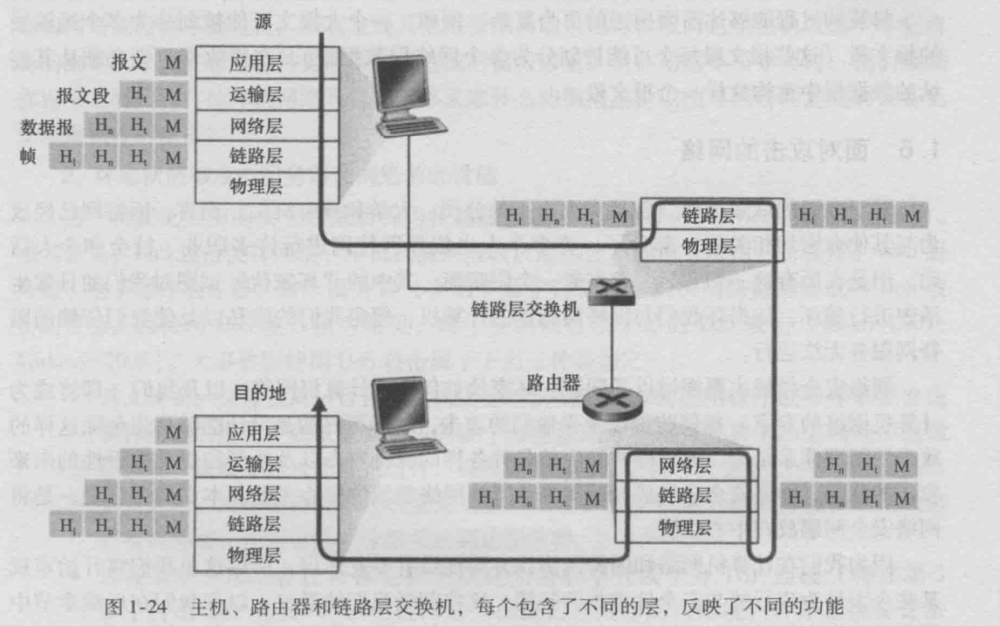
一个分组包含**首部**字段和**有效荷载**字段。

#### 安全
- 恶意软件malware
  - 自我复制
  - 扩散形式
    - 病毒
    需要用户交互
    - 蠕虫
    无需任何明显用户交互
- 拒绝服务攻击DoS
  - 弱点攻击
  制作精细的报文->服务器停止运行/主机崩溃
  - 带宽洪泛
  大量分组->拥塞，合法分组无法到达
  - 连接洪泛
  创建大量TCP连接->停止接收合法连接

  DDoS：分布式DoS，利用受害主机和僵尸网络
  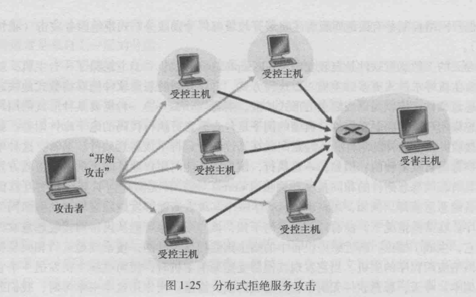

- 嗅探分组
  - 记录流经的分组副本
  - 被动的，不向信道注入分组，难以检测
- 伪装成信任用户 
E.g. IP哄骗：将具有虚假源地址的分组注入因特网

### 应用层
- 应用程序体系结构
  - **客户机-服务器**
  客户机间不直接通信
  - **对等P2P**
  自扩展性、成本有效

- 不同端系统进程间通信：**套接字**——应用程序与网络之间的API
- 应用程序开发者对运输层的控制权限仅限于：**选择运输层协议；设定几个运输层参数如最大缓存、最大报文长度**
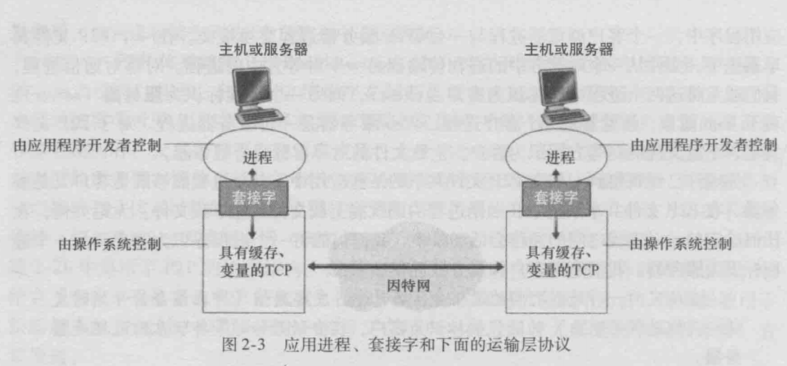

- 进程寻址
  - **主机地址**
  IP地址
  - **在目的主机中的接收进程标识符**
  端口号

#### 可供使用的运输层服务
- 可靠数据传输
- 吞吐量
- 定时
- 安全性

#### 因特网提供的运输服务
- TCP服务
  - **面向连接**
  - **可靠**数据传输
  无差错、按适当顺序
  **拥塞机制**：为因特网带来整体好处
  >TCP安全：安全套接字层SSL，对TCP的加强，在应用层实现，加密、数据完整性和端点鉴别
- UDP服务
不提供不必要服务的轻量级运输协议
  - **无连接**
  - **不可靠**
  无拥塞机制

  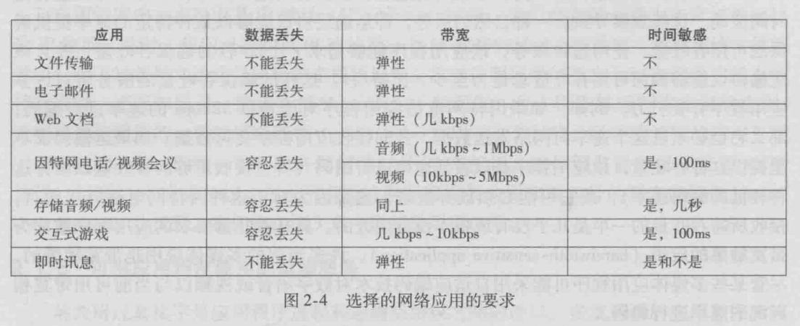
  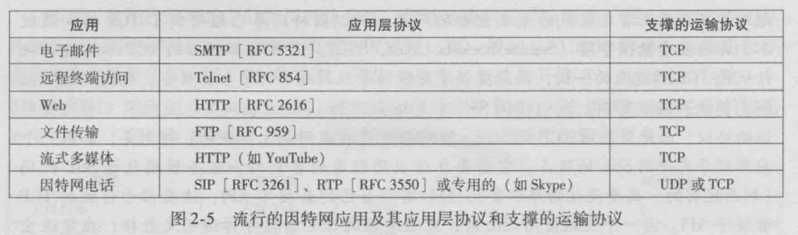

#### 应用层协议
- 定义了
  - 交换的报文类型（请求/响应）
  - **语法**
  - **语义**
  - **时序**

- Web Page
由**对象**组成。包含一个HTML基本文件和几个引用对象。
HTML基本文件通过对象的URL地址引用页面中其他的对象（存放对象的服务器**主机名**和对象的**路径名**）

##### HTTP
定义了Web客户向Web服务器**请求**Web页面的**方式**，以及服务器向客户**传送**的方式
  - 使用**TCP**作为运输协议
  - **无状态**：不保存关于客户的任何信息

- 非持续连接
每个请求/响应对经一个单独的TCP连接发送
  - 客户和服务器中分配TCP缓冲区和保持TCP变量->负担
  - 每个对象经受2 RTT的交付时延
- 持续连接
所有请求和响应经相同的TCP连接发送
>假设请求同一台服务器上的1个HTML基本文件和10个JPEG图形对象，非持续连接产生11个TCP连接，而持续连接只要1个。

- 往返时间RTT
一个短分组从客户到服务器再返回客户所花费的时间
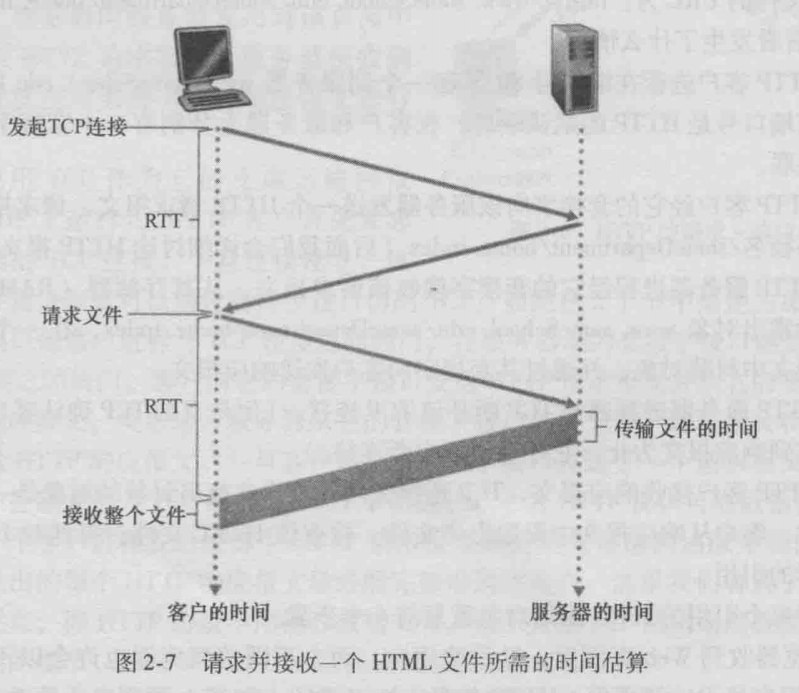'
2*RTT+服务器传输HTML文件的时间

- 报文格式
  - 请求报文
  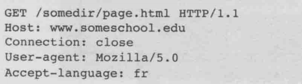
  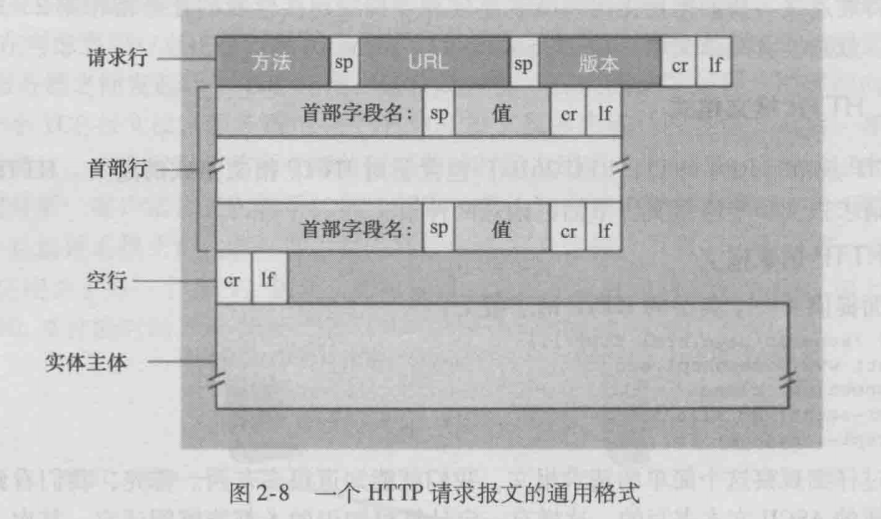
    - **请求行**
      - 方法字段：GET POST PUT DELETE
      - URL
      - HTTP版本
    - **首部行**
      Host 对象所在的主机
      Connection 持续/非持续
      User-agent 用户代理（浏览器类型）
      Accept-language 想得到的对象语言版本
    - **实体体 entity body**
      **GET**时实体体为空，POST才使用，依赖于表单字段中的输入值
      **HEAD**方法与GET类似，但不返回请求对象
      **PUT**允许用户上传对象到指定Web服务器指定路径
  - 响应报文
  
  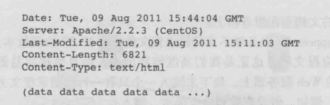
  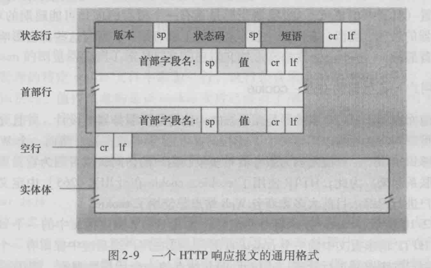
    - 初始**状态行**
      - 协议版本
      - 状态码
        - 200 OK
        - 301 Moved Permanetly 请求对象被永久移除，新的URL定义在Location首部行
        - 400 Bad Request 通用差错代码，请求不能被服务器理解
        - 404 Not Found 
        - 505 Http Version Not Supported 不支持的协议版本
      - 状态信息
    - **首部行**
    - **实体体**

- 用户与服务器的交互：**cookie**
cookie技术的4个组件
  - 在HTTP**响应报文**中的一个cookie首部行
  - 在HTTP**请求报文**中的一个cookie首部行
  - 在**用户端系统**中保留有一个cookie文件，并由用户的**浏览器**进行管理
  - 位于Web站点的一个**后端数据库**
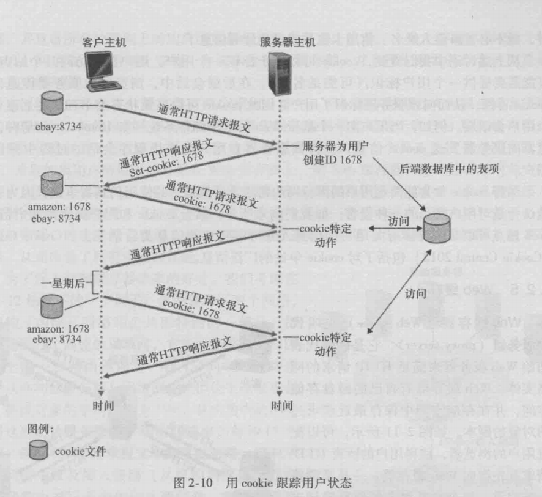
cookie可以用于**标识一个用户**。用户首次访问一个站点时，可能需要提供一个用户标识（可能是名字）。在后继会话中，浏览器向服务器传递一个cookie首部，从而向该服务器标识了用户。因此cookie可以在无状态的HTTP之上建立一个用户会话层。

- **Web缓存（代理服务器）**
代表初始web服务器满足HTTP请求
  - 有自己的磁盘存储空间
  - 保存最近请求过的对象的**副本**
  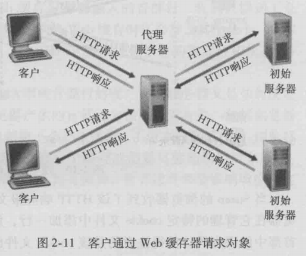
    1. 浏览器建立到web cache的TCP连接，发送HTTP请求
    2. web cache检查是否存在，若存在返回HTTP相应，若不存在打开初始服务器的TCP连接，发送HTTP请求，初始服务器响应
    3. web cache接收响应，存储对象副本，向客户浏览器返回HTTP响应（通过现有TCP连接）
  - 大大减少客户请求的响应时间
  - 减少一个机构的接入链路到因特网的通信量

  当响应时延长时，一可以增加接入链路速率，但代价很高，二即**不升级链路带宽而是安装一个web缓存器**。
  web缓存器通过**CDN（内容分发网络**起着重要作用。

- **条件GET**
web cache中存储的可能是陈旧的，缓存器如何保证最新——条件GET。
  - 请求报文使用**GET**方法
  - 包含**If-Modified-Since**首部行
  1. 由HTTP响应报文可知，返回对象中包括"**Last-Modified**"，web cache一起保存。
  2. 当发送条件GET时，用其**填充**"If-Modified-Since"的值。
  3. 服务器接收请求，若没有修改过，则返回**304 Not Modified**状态码，并且**不包含**所请求对象。

##### 文件传输协议：FTP
- 提供用户标识和口令
- TCP连接
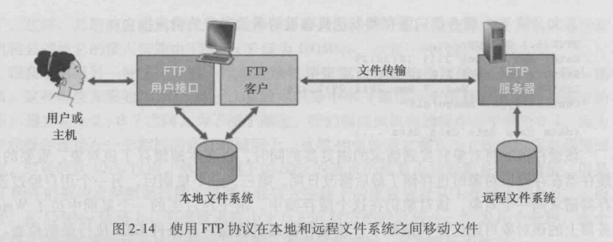
- FTP使用**两个并行的**TCP连接 → **带外**传送 
 >HTTP传输文件使用一个TCP → **带内**
  - **控制**连接
    - 传输控制信息
    - 用户标识、口令、改变远程目录的命令、存放put和获取get文件的命令
    - **贯穿**整个会话期间
  - **数据**连接
    - 实际发送一个文件
    - 会话中的每一次文件传输都需建立一个新的数据连接（**非持续**的）

>FTP服务器必须在整个会话期间**保留用户的状态**，联系特定的用户账户与控制连接。限制了同时维护的会话总数。
而HTTP是无状态的。

- FTP的命令和回答
  - 以7 bit ASCII格式在控制连接上传送
  - 命令
    - 4个大写字母ASCII字符 + 可选参数
    
    命令|参数|含义|备注
    |:-:|:-:|:-:|:-:|
    USER|username|向server发送用户**标识**||
    PASS|password|向server发送用户**口令**||
    LIST|-|请求server回传**文件列表**|文件列表经**新建的数据连接**传送|
    RETR|filename|即get|引起发起一个**数据连接**并发送文件|
    STOR|filename|即put||

  - 回答
    - 3 bit 数字 + 可选信息

    回答|信息|含义|
    |:-:|:-:|:-:|
    331|Username OK,Password required|用户名OK，需要口令
    125|Data connection already open;transfer starting|数据连接已打开，开始传送
    425|Can't open data connection|无法打开数据连接
    452|Error writing file|写文件差错

##### 电子邮件 
 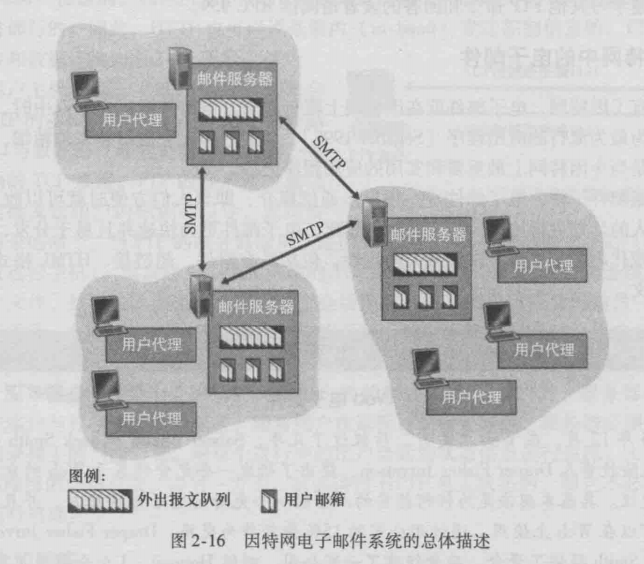
- 组成部分
  - **用户代理** user agent
  允许用户阅读、回复、转发、保存和撰写报文
  - **邮件服务器** mail server
    - 核心
    - 每个接收方在某个邮件服务器上有**邮箱**
    - 发送发不能交付邮件时，在**报文队列**保持该报文并以后尝试。若仍不成功，则删除并以电子邮件形式通知发送方。
  - **简单邮件传输协议** SMTP

  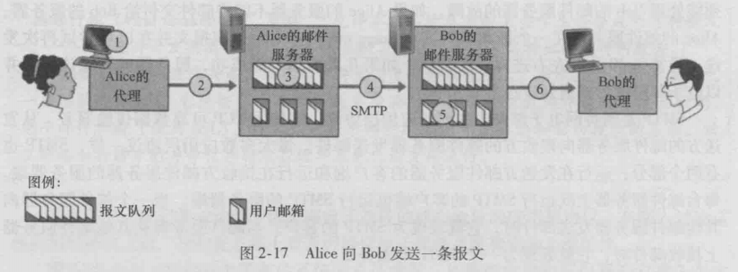
  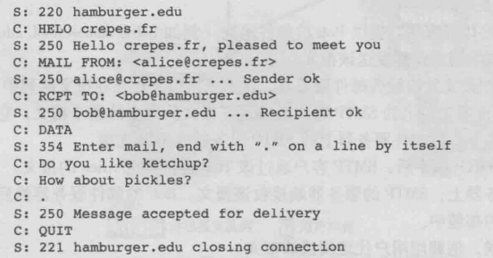
  5条命令：HRLO 、MAIL FROM、RCPT TO、DATA、QUIT
    - 25端口
    - 用SMTP传送邮件之前，需要将二进制多媒体数据编码为**ASCII码**（而HTTP不用）
    - SMTP不使用中间服务器发送邮件，双方邮件服务器**直接相连**。
    - **持续连接**
    >- HTTP是一个**拉协议（pull protocol）**，TCP连接由想接收文件的机器发起。
    SMTP是**推协议(push protocol)**，TCP连接由要发送该文件的机器发起。
    >- SMTP要求每个报文使用7比特ASCII码格式
    >- HTTP把每个对象封装到HTTP响应报文中，SMTP把所有报文对象放在一个报文中。

- 报文格式
首部 报文体

- **邮件访问协议**
典型的用户通常在本地运行一个**用户代理程序**，访问存储在总是保持开机的**共享邮件服务器**上。通常由用户的ISP维护。
  - SMTP是一个推协议，接收方如何取回邮件？
引入特殊邮件访问协议：**PoP3**（第三版邮局协议）、**IMAP**（因特网邮件访问协议）、**HTTP**

  - PoP3
    - 110端口
    - 阶段
      - **特许**authorization
      用户代理发送用户名和口令（明文），鉴别
      命令（user、pass）
      - **事务处理**
      取回报文，做/取消删除标记，获取邮件统计信息
      命令&回答（+OK、-ERR）
      下载并删除/下载并保留
      - **更新**
      quit命令之后
      删除标记的报文
    - 不在会话过程中携带状态信息
    -  PoP3不能使用一个在远程服务器上的层次文件夹，在任何机器上对所有报文进行访问。因为它没有提供任何**创建远程文件夹并为报文指派文件夹**的方法。
  - IMAP
    - 把每个报文与一个文件夹联系起来。
    - 可以创建文件夹、移动邮件、在远程文件夹中查询邮件、按指定条件查询
    - **维护了用户状态信息**
    - **允许用户代理获取报文组件的命令**
    只读一个报文的首部或多部分MIME报文的一部分
  
  - 基于Web
  用户代理即浏览器，和远程邮箱之间的通信通过HTTP进行

