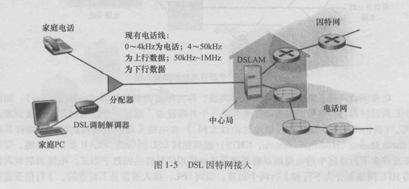
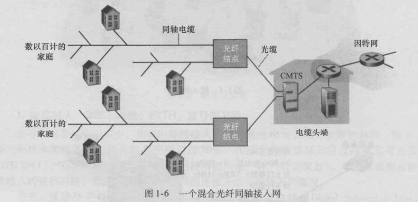
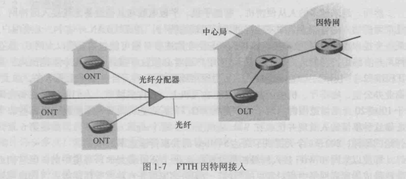

# 《计算机网络：自顶向下方法》读书笔记
## ch01 计算机网络和因特网
### 因特网
#### 端系统
- 端系统通过通信链路和分组交换机连接
  - 通信链路
  同轴电缆、铜线、光纤、无限电频谱
  - 分组交换机
    - 路由器
    网络核心
    - 链路层交换机
    接入网
- 端系统通过因特网服务提供商（ISP）接入
  - 每个ISP由多个分组交换机和多段通信链路组成
  - 低层ISP通过国家的、高层的ISP互联
  - 高层ISP由高速路由器组成
  - ISP运行IP协议：路由器和端系统之间发送和接受的分组格式
- 协议
格式、次序、动作
#### 接入网
将端系统连接到其边缘路由器的物理链路
- 家庭接入
  - 宽带住宅接入
    - 数字用户线DSL
    利用电话线，双绞铜线
    - 电缆
    利用电视线，光缆+同轴电缆，共享广播媒体
    - 光纤到户
    主动、被动
    
    
    
- 企业
  - 以太网
  - WiFi