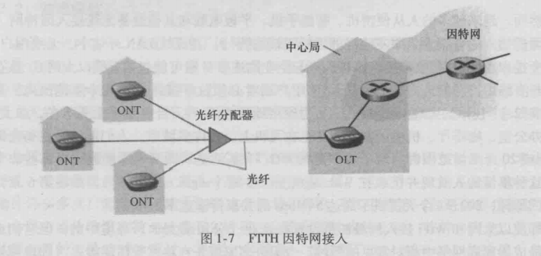

# 《计算机网络：自顶向下方法》读书笔记
## ch01 计算机网络和因特网
### 因特网
#### 端系统
- 端系统通过**通信链路**和**分组交换机**连接
  - 通信链路
  同轴电缆、铜线、光纤、无限电频谱
  - 分组交换机
    - 路由器
    网络核心
    - 链路层交换机
    接入网
- 端系统通过 **因特网服务提供商(ISP)** 接入
  - 每个ISP由多个分组交换机和多段通信链路组成
  - 低层ISP通过国家的、高层的ISP互联
  - 高层ISP由高速路由器组成
  - ISP运行**IP协议**：路由器和端系统之间发送和接受的分组格式
- 协议
**格式、次序、动作**
#### 接入网
将端系统连接到其边缘路由器的物理链路
- 家庭接入
  - 宽带住宅接入
    - **数字用户线DSL**
    利用电话线，双绞铜线
    - **电缆**
    利用电视线，光缆+同轴电缆，共享广播媒体
    - **光纤到户**
    主动、被动
    
    
    
- 企业
  - **以太网**
  一种局域网技术，双绞铜线
  
  - **WiFi**
  用户连接到接入点，接入点连接到企业网
  
- 广域无线接入
应用与移动电话相同的基础设施，通过蜂窝网提供商运营的基站收发分组。
  - 3G
  - LTE
#### 物理媒体
- 导引型
  - 固体媒体
  - 双绞铜线、同轴电缆、光纤
- 非导引型
  - 空气或外层空间
  - 陆地无线电信道、卫星无线电信道

#### 网络核心
由**分组交换机和链路**构成的网状网络
  通过网络链路和交换机移动数据的基本办法：**电路交换 分组交换**
- 分组交换
端系统交换**报文（Message）**，被分为较小的数据块——**分组（packet**），通过通信链路和分组交换机（路由器/链路层交换机），以**最大**传输速率通过。
  - **存储转发**
  交换机在能开始向输出链路传输该分组的第一个bit之前，必须接收到整个分组。
  
  **(N+P-1)\*L/R**
  - **排队时延和分组丢失**
    - 分组交换机有输出缓存，若分组到达时，交换机正忙，则必须在缓存中等待——**排队时延**
    - 缓存有限，满时——**分组丢失**
  - **转发表和路由选择协议**
    - 端系统：**IP地址**
    - 路由器：**转发表**
    源向目的发送一个分组时，其首部包含目的的IP，目的地址作为转发表的**索引**决定出链路。
    路由选择协议**自动**设置转发表
  - 电路交换
    - 会话期间**预留**了资源（缓存、链路传输速率）——静默期浪费资源
    >分组交换中不预留，按需使用，结果是不得不等待
    - **频分复用FDM**
    链路的频谱由所有连接**共享**，连接期间每条连接**专用**一个频段，频段的宽度——**带宽**
    - **时分复用TDM**
    时间被划分为固定区间的**帧**，每帧被划分为固定数量的**时隙**
    每条连接占每个帧指定一个时隙
    一条电路的**传输速率=帧速率 \* 一个时隙中的bit数量**
    > 链路传输8000帧/s，每个时隙8bit，电路传输速率=64kbps

    
    
  - 对比
    - 分组交换
      - 缺：不适合实时服务（时延可变、不可预测）
      - 优：更好的带宽共享，更简单有效，成本低
#### 网络的网络
- 存在点PoP
提供商网络中一台或多台路由器（在相同位置）群组
存在于等级结构所有层次（除底层接入ISP）
- 多宿
任何ISP（除第一级）可以与多个提供商ISP相连
- 对等
位于**相同**等级结构层次的**邻近**一对ISP能够对等，**直接**将它们的网络连到一起，使它们之间的所有流量能够直接连接而不是通过上游的中间ISP传输。
- 因特网交换点IXP
汇合点，多个ISP在这里共同对等。
>生态系统：接入ISP、区域ISP、第一层ISP、PoP、多宿、对等和IXP
- 内容提供商网络
通过创建自己的网络，减少向顶层ISP支付的费用，对其服务最终如何交付给端用户有了更多的控制。
  
#### 分组交换网中的时延、丢包、吞吐量
- 时延
**节点总时延 = 节点处理时延+排队时延+传输时延+传播时延**

  >- **传输时延**：将所有分组的比特传输向链路所需要的时间
分组长度L，传输速率R bps，传输时延L/R
**与路由器间距离无关**
  >- **传播时延**：一个bit从一台路由器向另一台路由器传播需要的时间
传播速率s，路径长度d，传播时延d/s
传播速率取决于**物理媒介**

  - **排队时延**
取决于**流量到达该队列的速率**、链路的**传输速率**和到达流量的**性质**（周期性/突发性）
  >分组到达队列的平均速率a pkt/s，传输速率R bps，所有分组L bit。
则bit到达队列的平均速率La bps。
  - **流量强度La/R**
    - 若>1，则入>出,队列趋于无界增加，排队时延趋向无穷
    - 若≤1，到达流量性质影响排队时延。
      - **周期性**到达：每L/R秒到达一个，无排队时延
      - **突发**形式到达：平均排队时延大。
  > E.g.每(L/R)N秒同时到达N个分组，第一个无排队时延，第二个L/R秒排队时延，第n个有（n-1）L/R秒排队时延。

- 吞吐量
接收文件的速率
取决于数据流过链路的传输速率和干扰流量。当没有干扰流量时，吞吐量近似于最小传输速率。

#### 协议分层
- 优：概念化、结构化
- 缺：一层可能冗余较低层的功能；某层的功能可能需要仅在其他某层才出现的信息（违背层次分离）

层次|端点|分组|协议
|:--:|:--:|:--:|:--:|
应用层 |两个端系统上的应用程序交换信息| 报文message |HTTP、FTP、SMTP、DNS
运输层 |应用程序端点之间 |报文段segment |TCP、UDP
网络层 |主机之间 |数据包datagram |IP、路由选择协议
链路层 |结点之间（主机或路由器）| 帧frame |DOCSIS协议（以太网、WiFi、电缆接入网）、PPP
物理层 |结点之间| 比特bit | 与实际传输媒体相关 
- OSI
附加表示层、会话层
  - 表示层：是通信的应用程序能够解释交换数据的含义（数据压缩、数据加密、数据描述）
  - 会话层：数据交换定界和同步功能（建立检查点和恢复方案）
由程序开发者决定这些功能是否重要