# 计算机网络知识点
## 运输层
IP协议能将主机AB互通，传输层？ 通信的断点实际上是主机上的进程。
- 复用
不同进程使用同一个运输层协议传送数据
- 分用
接收方的运输层在去掉报文首部后能正确交付目的进程

网络层为主机之间提供逻辑通信，传输层为应用进程之间提供端到端的逻辑通信。
软件端口是一种地址

### UDP
#### 特点
- 无连接
- 尽最大努力交付
- 面向报文
UDP对应用层交下来的报文**既不合并也不拆分**，因此要求报文长度合适
- 没有拥塞控制
在网络拥塞时不会使源主机的速率降低
- 多对多通信
- 首部开销小（8 byte）

#### 首部格式
- 源端口
- 目的端口
- 长度
- 检验和

### TCP
#### 特点
- **面向连接**
- **点对点**
- **可靠交付**
无差错、不丢失、不重复、按序到达
- **全双工通信**
有发送缓存和接受缓存
- **面向字节流**

#### 连接
- TCP连接的端点：套接字socket = （IP地址：端口号）
每一条TCP连接唯一的被通信两端的两个**套接字**确定

理想传输条件：1.传输信道不产生差错 2.不论发送方速率多快，接收方总来得及处理
#### 停止-等待协议
- 无差错
发送 接受 确认
- 有差错
超时重传：
  - 发送方必须暂时保留发出分组的副本
  - 分组和确认分组必须编号
  - 超时计时器重传时间大于平均往返时间
- 确认丢失和确认迟到

若确认丢失，发送重传，接收方要丢弃这个分组并回发确认
若确认迟到，发送方丢弃确认

**自动重传请求ARQ**：信道利用率低

#### 连续ARQ协议
滑窗协议：累计确认，对按序到达的最后一个分组确认
回退N

#### 首部格式
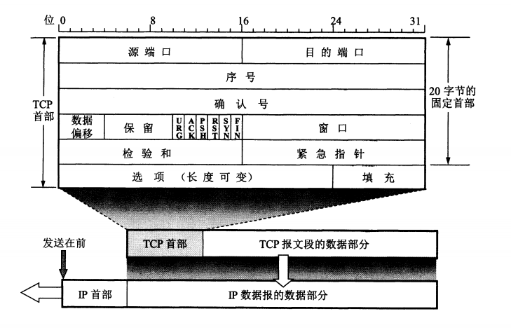

- 序号
每个TCP连接中的字节流的每个字节**按顺序编号**，起始序号在**连接建立**时设置。首部中的序号字段是本报文段所发送数据的**第一个字节的序号**。
> 报文段序号301，携带数据100字节，则下一报文段的序号为401
- 确认号
希望收到的**下一个**报文段的序号
> B收到A的501号报文段，长度200字节，则确认号应该为701

**若确认号=N，则序号N-1为止的所有数据均已正确收到**
- ACK
只有当ACK为1时，确认号才有意义
- SYN
SYN=1 , ACK=0 ：连接请求报文段
SYN=1 , ACK=1 ：同意建立连接的响应报文
- FIN
FIN=1 表示该报文发送方数据已发送完毕，要求释放连接

- 窗口
  - 本方的**接收窗口**，表示从确认号起允许对方发送的数据量。
  - 作为让对方设置其发送窗口的依据。
  - 动态变化。

- 最大报文段长度MSS
**每一个TCP**报文段中**数据字段**的最大长度，数据字段+首部字段=总长度

#### 可靠传输
- 滑动窗口
A：发送方 B：接收方
在没有接收到B的确认的情况下，A可以**连续**的把窗口内的数据发出去。已经发出的数据未收到确认前**暂时保留**（为了超时重传）
- 超时重传
- 选择确认

#### 流量控制
- 滑动窗口
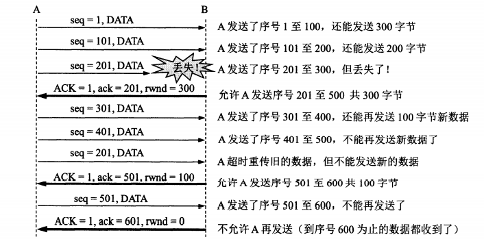
当收到0窗口通知时，启动**持续计时器**，到时发送探测报文段，若还是0则重启计时，

#### 拥塞控制
防止过多的数据注入到网络中
全局性的过程
基于窗口的拥塞控制：发送方窗口=cwnd拥塞窗口
- **慢开始**
一开始发送方设**cwnd=1**（个报文段）
发送方每收到一个确认cwnd += 1，因此每经过一个传输轮次（RTT），cwnd**翻倍**
- **拥塞避免(加性增)**
每经过一个RTT，cwnd += 1，而非翻倍
开始时机：cwnd >= ssthresh(慢开始门限)
拥塞时调整门限ssthreash= cwnd/2，并设cwnd=1
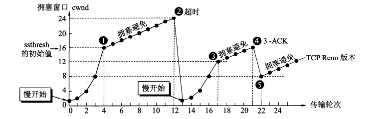
- **快重传**
报文段丢失，并非拥塞
**接收方立即发出确认**，而不是等数据捎带，即使收到失序的也要对**已收到**的进行确认
**发送方**一连收到**3个重复**的确认则立即重传
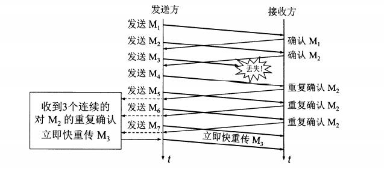
- **快恢复（乘性减）**
丢失个别报文段而非拥塞，则执行快恢复:
cwnd /= 2 ;
ssthresh = cwnd.
并开始执行拥塞避免。

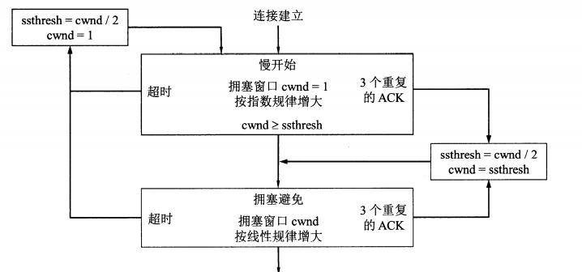

#### 主动队列管理AQM
**网络层**的拥塞控制：路由器的分组丢弃策略。当队列已满时，以后再到达的分组都会被丢弃（**尾部丢弃**），导致分组丢失、超时重传，且TCP进入慢开始状态。由于连接中的报文段会复用IP数据报，则尾部丢弃会导致许多TCP连接同一时间慢开始（**全局同步**）。
- ARQ
**主动**：不是路由器队列最大长度之后才丢弃，而是到一个警戒值就丢弃。

#### 传输管理
##### 连接建立
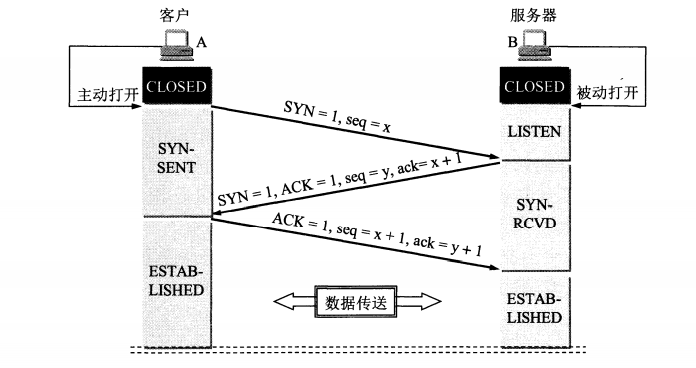
- **同步**报文段**不能**携带数据，**消耗**一个序号
- **确认**报文段**可以**携带数据，如果**不携带**，则**不消耗**序号
- 第三次握手？
防止**已失效**的连接请求报文段突然又传送到B
> A请求连接，在网络结点**滞留**，延误到**连接释放后**某时刻传到B，B回发确认，若没有第三次握手，则B认为连接已建立，一直等待接收A的数据，但A已释放连接，不会对B进行确认。**B的资源被浪费。**
##### 连接释放
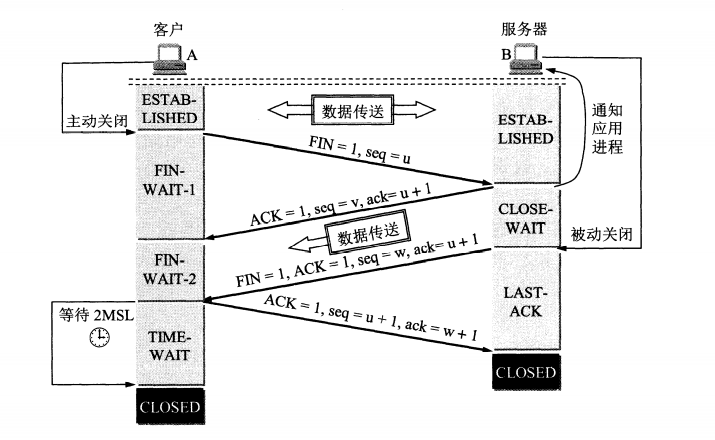

- FIN报文段消耗一个序号
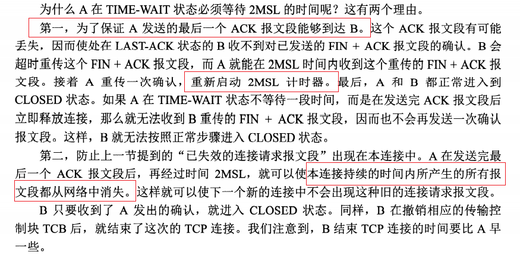
- 保活计时器
服务器每收到一次客户数据，重置保活计时器，若超时没收到数据，发送谈些报文段，之后每过一段时间重发探测报文段，若10个之后客户仍无响应，则认为客户端故障，关闭连接。

- 三次握手如果**第三次失败**
失败了服务端收到不确认包，会**超时重发5次**，若还是没有收到确认包，或者收到了数据包，则服务端直接发送reset重置包结束本次连接

- 四次挥手结束时多一次请求
客户端单方面无数据发送认为可以结束了，但是服务端不一定没有数据发送，所以服务端要将**确认信息和自身发起断开**分作两步
- 四次挥手先ACK再FIN？
主动方 不会因为没有收到应答而**重发**断开连接的请求（即FIN报文）。'

## 网络层
### IP协议
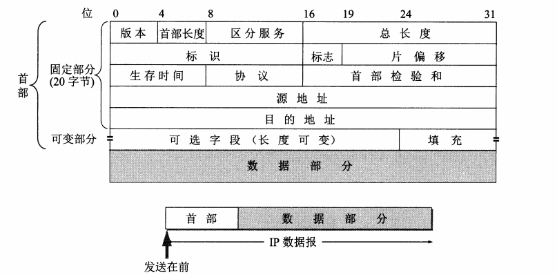
### IP分片
IP层下面的每一个数据链路层协议都规定了一个数据帧中的数据字段的最大长度（**最大传送单元MTU**），IP数据包封装成数据帧时不能超过MTU，因此过长的数据报要**分片**。
- 标识 16 bit
相同的标识值使分片后的数据报正确组装。
- 标志 3 bit
  - MF(More Fragment)
    - 1 还有分片
    - 0 最后一个
  - DF(Don't Fragment)
    - 0 允许分片
- 片偏移
某片在原分组中的相对位置，以8字节为偏移单位。
> 数据报长度3820字节，数据部分3800，长度不超过1420字节的片。
固定首部为20，则分片不超过1400，分3片：1400,1400,1000。
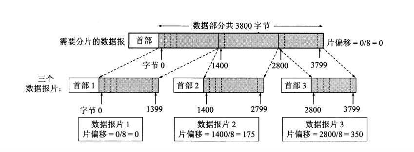
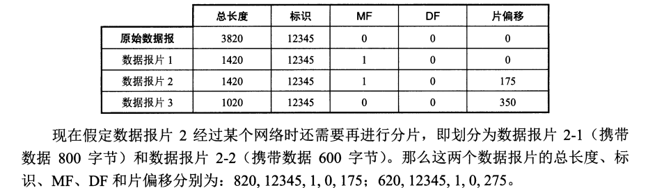

