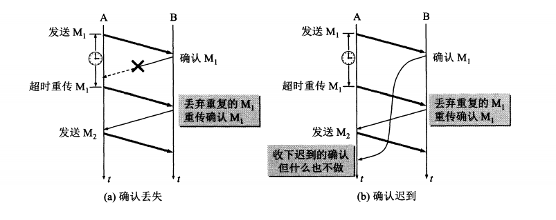

# 计算机网络知识点

## 运输层
IP协议能将主机AB互通，传输层？ 通信的断点实际上是主机上的进程。
- 复用
不同进程使用同一个运输层协议传送数据
- 分用
接收方的运输层在去掉报文首部后能正确交付目的进程

网络层为主机之间提供逻辑通信，传输层为应用进程之间提供端到端的逻辑通信。
软件端口是一种地址

### UDP
#### 特点
- 无连接
- 尽最大努力交付
- 面向报文
UDP对应用层交下来的报文**既不合并也不拆分**，因此要求报文长度合适
- 没有拥塞控制
在网络拥塞时不会使源主机的速率降低
- 多对多通信
- 首部开销小（8 byte）

#### 首部格式
- 源端口
- 目的端口
- 长度
- 检验和

### TCP
#### 特点
- **面向连接**
- **点对点**
- **可靠交付**
无差错、不丢失、不重复、按序到达
- **全双工通信**
有发送缓存和接受缓存
- **面向字节流**

#### 连接
- TCP连接的端点：套接字socket = （IP地址：端口号）
每一条TCP连接唯一的被通信两端的两个**套接字**确定

理想传输条件：1.传输信道不产生差错 2.不论发送方速率多快，接收方总来得及处理
#### 停止-等待协议
- 无差错
发送 接受 确认
- 有差错
  超时重传：
  - 发送方必须暂时保留发出分组的副本
  - 分组和确认分组必须编号
  - 超时计时器重传时间大于平均往返时间
- 确认丢失和确认迟到

若确认丢失，发送重传，接收方要丢弃这个分组并回发确认
若确认迟到，发送方丢弃确认

**自动重传请求ARQ**：信道利用率低

#### 连续ARQ协议
滑窗协议：累计确认，对按序到达的最后一个分组确认
回退N

#### 首部格式

- 序号
每个TCP连接中的字节流的每个字节**按顺序编号**，起始序号在**连接建立**时设置。首部中的序号字段是本报文段所发送数据的**第一个字节的序号**。
> 报文段序号301，携带数据100字节，则下一报文段的序号为401
- 确认号
希望收到的**下一个**报文段的序号
> B收到A的501号报文段，长度200字节，则确认号应该为701

**若确认号=N，则序号N-1为止的所有数据均已正确收到**
- ACK
只有当ACK为1时，确认号才有意义
- SYN
SYN=1 , ACK=0 ：连接请求报文段
SYN=1 , ACK=1 ：同意建立连接的响应报文
- FIN
FIN=1 表示该报文发送方数据已发送完毕，要求释放连接

- 窗口
  - 本方的**接收窗口**，表示从确认号起允许对方发送的数据量。
  - 作为让对方设置其发送窗口的依据。
  - 动态变化。

- 最大报文段长度MSS
**每一个TCP**报文段中**数据字段**的最大长度，数据字段+首部字段=总长度

#### 可靠传输
- 滑动窗口
A：发送方 B：接收方
在没有接收到B的确认的情况下，A可以**连续**的把窗口内的数据发出去。已经发出的数据未收到确认前**暂时保留**（为了超时重传）
- 超时重传
- 选择确认

#### 流量控制
- 滑动窗口

当收到0窗口通知时，启动**持续计时器**，到时发送探测报文段，若还是0则重启计时，

#### 拥塞控制
防止过多的数据注入到网络中
全局性的过程
基于窗口的拥塞控制：发送方窗口=cwnd拥塞窗口
- **慢开始**
一开始发送方设**cwnd=1**（个报文段）
发送方每收到一个确认cwnd += 1，因此每经过一个传输轮次（RTT），cwnd**翻倍**
- **拥塞避免(加性增)**
每经过一个RTT，cwnd += 1，而非翻倍
开始时机：cwnd >= ssthresh(慢开始门限)
拥塞时调整门限ssthreash= cwnd/2，并设cwnd=1

- **快重传**
报文段丢失，并非拥塞
**接收方立即发出确认**，而不是等数据捎带，即使收到失序的也要对**已收到**的进行确认
**发送方**一连收到**3个重复**的确认则立即重传

- **快恢复（乘性减）**
丢失个别报文段而非拥塞，则执行快恢复:
cwnd /= 2 ;
ssthresh = cwnd.
并开始执行拥塞避免。

#### 主动队列管理AQM
**网络层**的拥塞控制：路由器的分组丢弃策略。当队列已满时，以后再到达的分组都会被丢弃（**尾部丢弃**），导致分组丢失、超时重传，且TCP进入慢开始状态。由于连接中的报文段会复用IP数据报，则尾部丢弃会导致许多TCP连接同一时间慢开始（**全局同步**）。
- ARQ
**主动**：不是路由器队列最大长度之后才丢弃，而是到一个警戒值就丢弃。

#### 传输管理
##### 连接建立

- **同步**报文段**不能**携带数据，**消耗**一个序号
- **确认**报文段**可以**携带数据，如果**不携带**，则**不消耗**序号
- 第三次握手？
防止**已失效**的连接请求报文段突然又传送到B
> A请求连接，在网络结点**滞留**，延误到**连接释放后**某时刻传到B，B回发确认，若没有第三次握手，则B认为连接已建立，一直等待接收A的数据，但A已释放连接，不会对B进行确认。**B的资源被浪费。**
##### 连接释放

- FIN报文段消耗一个序号

- 保活计时器
服务器每收到一次客户数据，重置保活计时器，若超时没收到数据，发送探测报文段，之后每过一段时间重发探测报文段，若10个之后客户仍无响应，则认为客户端故障，关闭连接。

- 三次握手如果**第三次失败**
失败了服务端收到不确认包，会**超时重发5次**，若还是没有收到确认包，或者收到了数据包，则服务端直接发送reset重置包结束本次连接

- 四次挥手结束时多一次请求
客户端单方面无数据发送认为可以结束了，但是服务端不一定没有数据发送，所以服务端要将**确认信息和自身发起断开**分作两步
- 四次挥手先ACK再FIN？
主动方 不会因为没有收到应答而**重发**断开连接的请求（即FIN报文）。'

## 网络层
### IP协议

### IP分片
IP层下面的每一个数据链路层协议都规定了一个数据帧中的数据字段的最大长度（**最大传送单元MTU**），IP数据包封装成数据帧时不能超过MTU，因此过长的数据报要**分片**。
- 标识 16 bit
相同的标识值使分片后的数据报正确组装。
- 标志 3 bit
  - MF(More Fragment)
    - 1 还有分片
    - 0 最后一个
  - DF(Don't Fragment)
    - 0 允许分片
- 片偏移
某片在原分组中的相对位置，以8字节为偏移单位。
> 数据报长度3820字节，数据部分3800，长度不超过1420字节的片。
固定首部为20，则分片不超过1400，分3片：1400,1400,1000。

## 应用层
### DNS
- 主机->本地域名服务器： **递归查询**
若主机询问域名的IP地址，本地域名服务器不知，则本地域名服务器又会作为DNS客户身份向其他根域名发起查询。返回结果要么是IP地址，要么是报错。
- 本地域名服务器->根域名服务器： **迭代查询**
当根域名服务器收到本地域名服务器请求时，返回的要么是IP地址，要么是**下一步应当向哪个域名服务器请求**，让本地域名服务器自己进行后续查询。

### HTTP
无状态
#### session
标识客户端。
服务端存储负担太大->不存储，给客户端办颁发token包含userId，客户端每次访问携带token。
防止伪造？-> 服务器对数据生成数字签名，私钥加密，每次对数据重新执行流程，对比数字签名

#### Cookie
cookie 是一个非常具体的东西，指的就是**浏览器**里面能永久**存储**的一种数据，仅仅是浏览器实现的一种数据存储功能。

cookie由**服务器生成**，发送给浏览器，浏览器把cookie**以kv形式**保存到某个目录下的文本文件内，下一次请求同一网站时会把该cookie发送给服务器。由于cookie是存在客户端上的，所以浏览器加入了一些限制确保cookie不会被恶意使用，同时不会占据太多磁盘空间，所以每个域的cookie数量是有限的

### HTTPS
HTTPS = HTTP + 加密 + 认证 + 完整性保护
http是明文传输，不验证通信方，容易被篡改、伪造、窃听
- 内容加密：混合加密
- 身份认证：证书
- 完整性保护：数字签名->数字摘要+公私钥加密

**为什么需要非对称加密？只用对称加密行吗？**
使用对称加密能够安全通信，但是密钥如何传输？=>非对称加密传输密钥

**只用非对称加密？**
开始服务器以**明文**方式把公钥传给客户端
客户端->服务器：公钥加密，服务器用私钥解密，只有服务器拥有私钥能解开，安全
服务器->客户端：客户端只有公钥，服务器用私钥加密，但是公钥是之前用明文传输的，可能被劫持，不安全

**双向非对称？**
可以，但耗时

**混合加密**
开始服务器以**明文**方式把公钥传给客户端
客户端生成随机对称密钥，用公钥加密，发给服务器
服务器私钥解密，得到对称密钥，双方通过对称加密通信

问题：**中间人攻击**
> 某网站有用于非对称加密的公钥A、私钥A’。
浏览器向网站服务器请求，服务器把公钥A明文给传输浏览器。
**中间人劫持到公钥A，保存下来，把数据包中的公钥A替换成自己伪造的公钥B（它当然也拥有公钥B对应的私钥B’）**。
浏览器生成一个用于对称加密的密钥X，用公钥B（浏览器无法得知公钥被替换了）加密后传给服务器。
**中间人劫持后用私钥B’解密得到密钥X，再用公钥A加密后传给服务器。**
服务器拿到后用私钥A’解密得到密钥X。

**根本原因是浏览器无法确认收到的公钥是不是网站自己的.**
解决：**数字证书**
网站在使用HTTPS前，需要向CA机构申领一份数字证书，数字证书里含有证书持有者信息、公钥信息等。服务器把证书传输给浏览器，浏览器从证书里获取公钥就行了，证书就如身份证，证明“该公钥对应该网站”。

证书本身防止被篡改？**数字签名**

数字签名生成：
1. CA机构拥有非对称加密的私钥和公钥。
2. CA机构对证书明文数据T进行hash。
3. 对hash后的值用**私钥**加密，得到数字签名S。

客户端验证
1. 拿到证书，得到明文T，签名S。
2. 用CA机构的公钥对S解密（由于是浏览器信任的机构，所以浏览器保有它的公钥。），得到S’。
3. 用证书里指明的hash算法对明文T进行hash得到T’。
4. 显然通过以上步骤，T’应当等于S‘，除非明文或签名被篡改。所以此时比较S’是否等于T’，等于则表明证书可信。

权威机构的公钥**不需要传输**，因为权威机构会和主流的浏览器或操作系统合作，将他们的公钥内置在浏览器或操作系统环境中。

- **怎样防止的中间人篡改证书？**
中间人劫持到证书后，对内容进行篡改，由于其数字签名是私钥加密的，中间人没有私钥，无法获得数字签名，篡改后会导致内容hash后与数字签名不一致。
- **中间人掉包证书？**
不能，证书本身包含网站信息，客户端对比请求的域名和证书是否一致。
- **每次进行HTTPS请求时都必须在SSL/TLS层进行握手传输密钥吗？**
每次请求都经历一次密钥传输过程非常耗时，那怎么达到只传输一次呢？服务器会为每个浏览器（或客户端软件）维护一个**session ID**，在TLS握手阶段传给浏览器，浏览器生成好密钥传给服务器后，服务器会把该密钥存到相应的session ID下，之后浏览器每次请求都会携带session ID，服务器会根据session ID找到相应的密钥并进行解密加密操作，这样就不必要每次重新制作、传输密钥了！