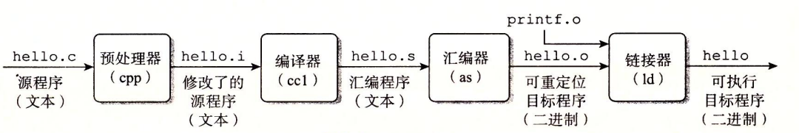
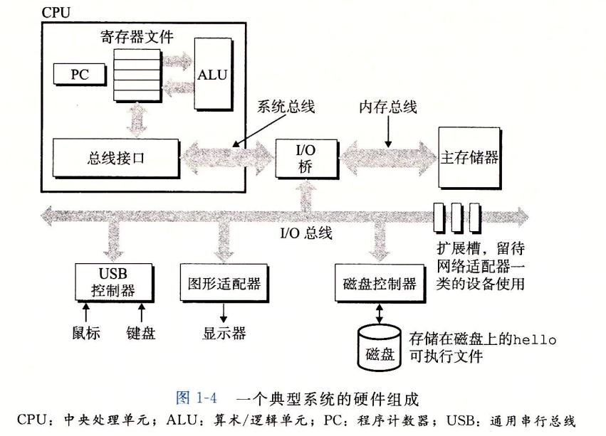
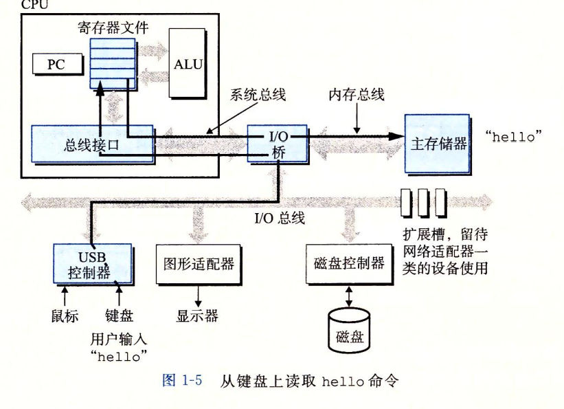
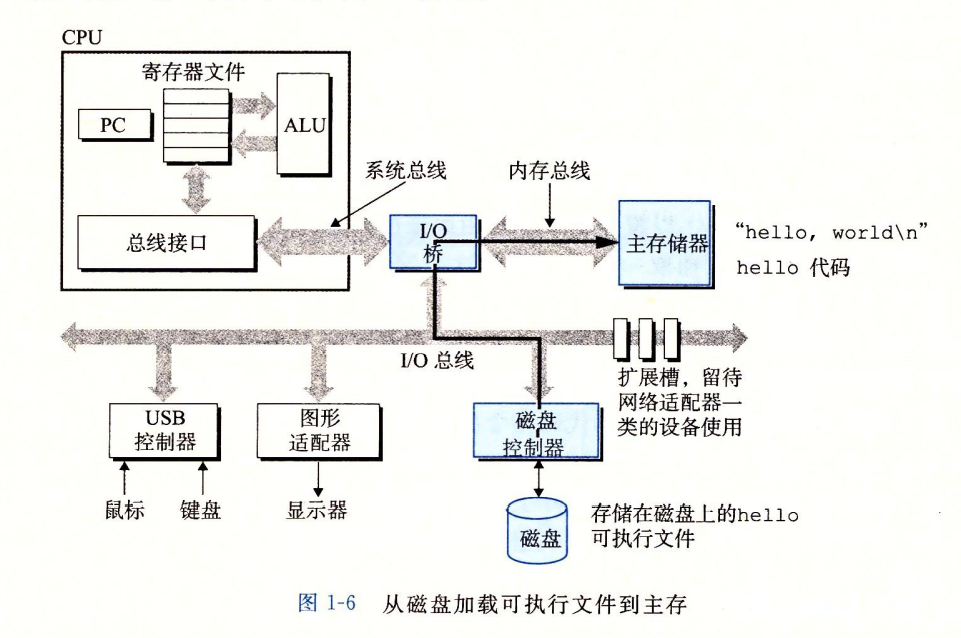
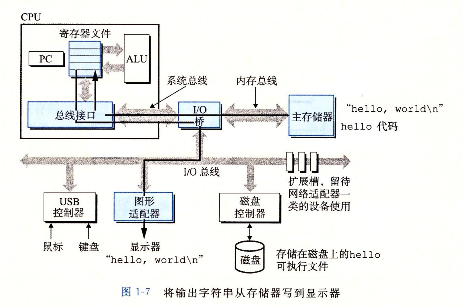
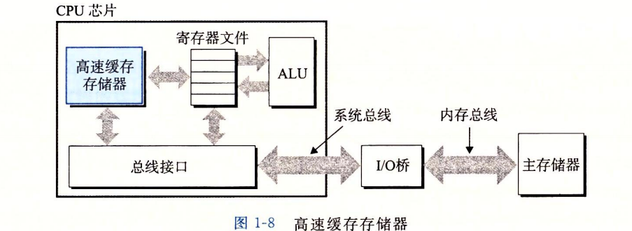
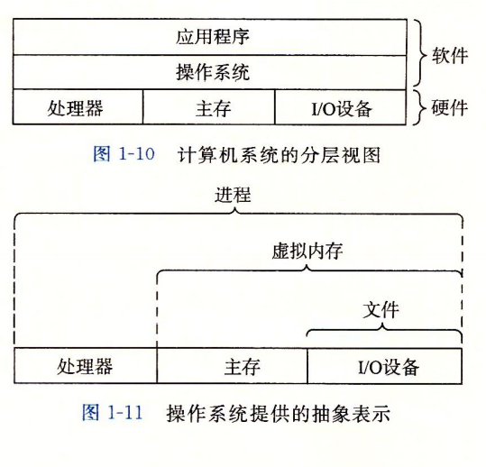
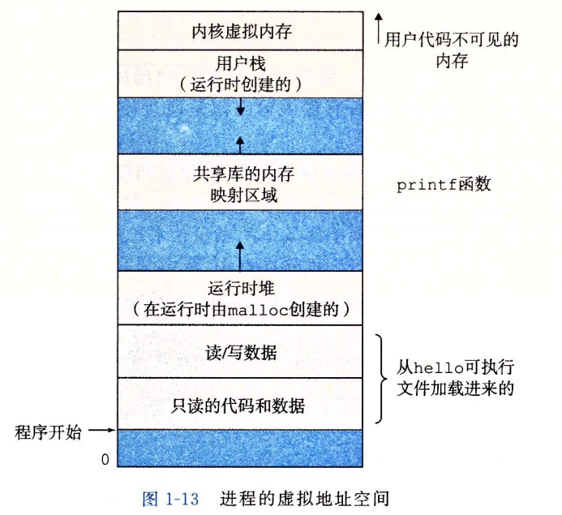

# 计算机系统
[TOC]
## 一
### 程序编译

### 系统组成

- **总线**
一组电子管道，传送定长的字节块（字）【4byte or 8 byte】
- **IO设备**
每个IO设备都通过控制器或者适配器与IO总线相连
- **主存**
临时存储设备，存放程序数据
  - 物理上：动态随机存取存储器DRAM
  - 逻辑上：线性字节数组，以地址为索引
- **处理器**
解释或执行存储在主存中指令的引擎
核心是大小为**一个字**的寄存器：**程序计数器PC**。任何时刻都指向主存中的某条机器语言指令（即含有该指令的**地址**）

#### 运行hello world程序
1. shell 等待输入，输入"./hello"，shell读入寄存器，再放到内存
2. 输入回车，命令结束，shell执行一系列指令加载hello文件。将hello文件中的代码和数据从磁盘复制到主存

3. DMA（直接存储器读取）技术可以直接从磁盘到达主存（不通过处理器）。

4. 执行main，"hello world"从主存复制到寄存器，再复制到显示设备显示到屏幕

#### 高速缓存
L1位于处理器芯片，L2通过特殊总线连接到处理器。

### 操作系统
#### 基本功能
- 防止硬件被失控的应用程序滥用；
- 向应用程序提供简单一致的机制来控制硬件设备。

文件是对IO设备的抽象；虚拟内存是对主存和磁盘IO设备的抽象；进程是对处理器、主存和IO设备的抽象。

