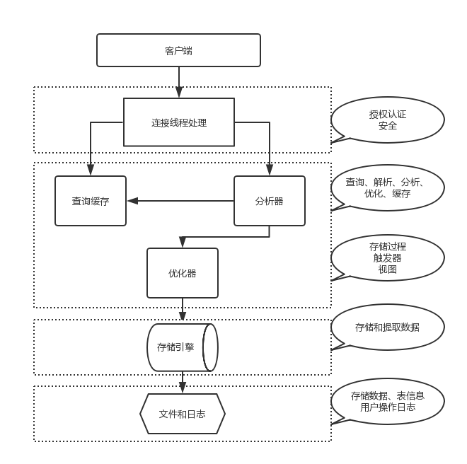
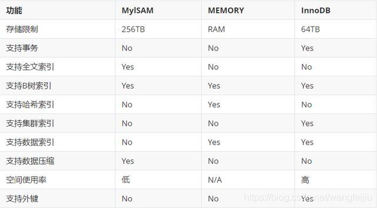

# 数据库
[TOC]
## MySQL体系
https://blog.csdn.net/wangfeijiu/article/details/112454405

### 逻辑架构


- 处理客户端连接、授权认证、安全校验等
- 服务器server层，负责对SQL解释、分析、优化、执行操作引擎等
- 存储引擎，负责MySQL中数据的存储和提取


### 一条SQL执行的过程




- 流程
  - **线程**监听和接受请求
  - **SQL接口**负责处理收到的SQL语句
  - **查询解析器**对SQL语句进行解析，拆解为几个步骤
  - **查询优化器（Optimizer）**来选择一个最优的查询路径（什么样的步骤和顺序，去执行哪些操作）
  - **执行器**根据据优化器选择执行计划，调用**存储引擎**接口
  - **存储引擎**真正执行SQL语句，按照一定的步骤去查询内存缓存数据，更新磁盘数据，查询磁盘数据，等等。


查询优化器：“**选取-投影-联接**”策略
```sql
 select uid,name from user where gender = 1;
```
select 查询先根据 **where** 语句进行选取，而不是先将表全部查询出来以后再进行条件过滤
select查询先根据 uid 和 name 进行**属性投影**，而不是将属性全部取出以后再进行过滤
将这两个查询**条件联**接起来生成最终查询结果.


#### 更新数据流程


### 存储引擎
MySQL**插件式表存储引擎**，存储引擎是基于表的。




- 存储引擎为MyISAM：
*.frm：与表相关的元数据信息都存放在frm文件，包括表结构的定义信息等
*.MYD：MyISAM DATA，用于存储MyISAM表的数据
*.MYI：MyISAM INDEX，用于存储MyISAM表的索引相关信息
- 存储引擎为InnoDB：
*.frm：与表相关的元数据信息都存放在frm文件，包括表结构的定义信息等
*.ibd：InnoDB DATA，表数据和索引的文件。该表的索引(B+树)的每个非叶子节点存储索引，叶子节点存储索引和索引对应的数据

#### InnoDB
InnoDB 是一个**事务安全**的存储引擎，它具备**提交、回滚以及崩溃恢复**的功能以保护用户数据。InnoDB 的**行级别锁定**保证数据一致性提升了它的多用户并发数以及性能。InnoDB 将用户数据存储在**聚集索引**中以减少基于主键的普通查询所带来的 I/O 开销。为了保证数据的完整性，InnoDB 还支持**外键约束**。默认使用**B+TREE**数据结构存储索引。

- **特点**
  - 支持事务，支持4个事务隔离（ACID）级别
  - 行级锁定（更新时锁定当前行）
  - 读写阻塞与事务隔离级别相关
  - 既能缓存索引又能缓存数据
  - 支持外键
  - InnoDB更消耗资源，读取速度没有MyISAM快
  - 在InnoDB中存在着缓冲管理，通过缓冲池，将索引和数据全部缓存起来，加快查询的速度；
  - 对于InnoDB类型的表，其数据的物理组织形式是聚簇表。所有的数据按照主键来组织。数据和索引放在一块，都位于B+数的叶子节点上；

- 磁盘


- InnoDB存储架构

  

  - 系统从磁盘读取数据到硬盘以磁盘块block为基本单位
  - InnoDB存储引擎以页为基本单位（默认16kb）
  - 每次InnoDB将**若干个地址连续的磁盘块**的数据读入内存
- 物理
InnoDB表由**共享表空间**、**日志文件组**（更准确地说，应该是Redo文件组）、**表结构定义文件**组成。
数据、索引、表的内部数据字典信息都将保存在表空间文件中。表结构定义文件以frm结尾，这个是与存储引擎无关的，任何存储引擎的表结构定义文件都一样，为.frm文件。
- 逻辑
表空间又由段、区、页组成。1 extent = 64 pages


**页**


- 数据页（BTreeNode）
- Undo页（undo Log page）
- 系统页（System page）
- 事务数据页（Transaction SystemPage）

页之间是双向链表，页里面的数据是单向链表，这种结构组成了主键索引B+树，组成了叶子节点数据。


##### 索引结构
  - B树

    
    非叶子结点的指针：P[1], P[2], …, P[M]；其中P[1]指向关键字小于K[1]的子树，P[M]指向关键字大于K[M-1]的子树，其它P[i]指向关键字属于(K[i-1], K[i])的子树； 
    > B-树的搜索，从根结点开始，对结点内的关键字（有序）序列进行**二分查找**，如果命中则结束，否则进入查询关键字所属范围的儿子结点；重复，直到所对应的儿子指针为空，或已经是叶子结点；

    1.关键字集合分布在**整颗树**中；
    2.任何一个关键字出现且只出现在一个结点中；
    3.搜索有可能在**非叶子结点**结束；
    4.其搜索性能等价于在关键字全集内做一次二分查找；
    5.自动层次控制；
  - B+树

    
    
    - 非叶子结点的子树指针P[i]，指向关键字值属于[K[i], K[i+1])的子树（B-树是开区间）；
    - 为所有叶子结点增加一个**链指针**；
    - 所有关键字都在**叶子结点**出现；
    > **B+树只有达到叶子结点才命中**

     1.所有关键字都出现在**叶子结点的链表中**（稠密索引），且链表中的关键字恰好是**有序**的；
     2.不可能在非叶子结点命中；
     3.**非叶子结点**相当于是叶子结点的**索引**（稀疏索引），**叶子结点**相当于是**存储（关键字）数据**的数据层；
     4.更适合文件索引系统；
    
B+树的分裂：当一个结点满时，分配一个新的结点，并将原结点中1/2的数据复制到新结点，最后在父结点中增加新结点的指针；B+树的分裂只影响原结点和父结点，而不会影响兄弟结点，所以它不需要指向兄弟的指针；
B*树在B+树的基础上为非叶子结点加了链表指针。

**B+树更适合做索引？**
1. B+ 树的**磁盘读写代价更低**
B+ 树的数据都集中在叶子节点，分支节点 只负责指针（索引）；B 树的分支节点既有指针也有数据 。这将导致B+ 树的层高会小于B 树的层高，也就是说B+ 树平均的Io次数会小于B 树。
2. B+ 树的**查询效率更加稳定**
B+ 树的数据都存放在叶子节点，故任何关键字的查找必须走一条从根节点到叶子节点的路径。所有关键字的查询路径相同，每个数据查询效率相当。
3. B+树更**便于遍历**
由于B+树的数据都存储在叶子结点中，分支结点均为索引，遍历只需要扫描一遍叶子节点即可；B树因为其分支结点同样存储着数据，要找到具体的数据，需要进行一次中序遍历按序来搜索。
4. B+树更擅长**范围查询**
B+树叶子节点存放数据，数据是按顺序放置的双向链表。B树范围查询只能中序遍历。
5. B+ 树占用**内存空间小**
B+ 树索引节点没有数据，比较小。在内存有限的情况下，相比于B树索引可以加载更多B+ 树索引


**Hash索引**
- 哈希索引就是采用一定的哈希算法，把键值换算成新的哈希值，检索时不需要类似B+树那样从根节点到叶子节点逐级查找，只需一次哈希算法即可立刻定位到相应的位置，速度非常快。
- Hash索引仅仅能满足"=",“IN"和”<=>"查询，**不能使用范围查询**。也不支持任何范围查询，例如WHERE price > 100。
- 由于Hash索引比较的是进行Hash运算之后的Hash值，所以它只能用于**等值的过滤**，不能用于基于范围的过滤，因为经过相应的Hash算法处理之后的Hash值的大小关系，并不能保证和Hash运算前完全一样。

**Hash索引与B+索引**
- 如果是等值查询，那么哈希索引明显有绝对优势，因为只需要经过一次算法即可找到相应的键值；这有个前提，键值都是唯一的。如果键值不是唯一的，就需要先找到该键所在位置，然后再根据链表往后扫描，直到找到相应的数据；

- 如果是范围查询检索，这时候哈希索引就毫无用武之地了，因为原先是有序的键值，经过哈希算法后，有可能变成不连续的了，就没办法再利用索引完成范围查询检索；

- 哈希索引也没办法利用索引完成排序，以及like ‘xxx%’ 这样的部分模糊查询（这种部分模糊查询，其实本质上也是范围查询）；

- 哈希索引也不支持多列联合索引的最左匹配规则；

- B+树索引的关键字检索效率比较平均，不像B树那样波动幅度大，在有大量重复键值情况下，哈希索引的效率也是极低的，因为存在所谓的哈希碰撞问题。

##### 聚簇索引、非聚簇索引
InnoDB使用B+Tree数据结构存储索引，根据索引物理结构可将索引划分为聚簇索引和非聚簇索引（也可称辅助索引或二级索引）。一个表中只能存在一个聚簇索引（主键索引），但可以存在多个非聚簇索引。

B+树 叶子节点包含数据表中行记录就是聚簇索引（索引和数据是一块的）。


B+树 叶子节点没包含数据表中行记录就是非聚簇索引（索引和数据是分开的）。


**MyISAM主键索引**


索引和数据是分开的 索引的data部分只是索引的地址值。.MYI就是MyISAM表的索引文件，MYD是MyISAM表的数据文件。


innodb引擎的4大特性
插入缓冲（insert buffer),二次写(double write),自适应哈希索引(ahi),预读(read ahead)

## 事务


## 查询优化
### 使用索引


### 联合索引
对多个字段同时建立的索引。联合索引是有顺序的，ABC，ACB是完全不同的两种联合索引。

以联合索引(a,b,c)为例，建立这样的索引相当于建立了索引a、ab、abc三个索引。

一个索引顶三个索引当然是好事，但是每多一个索引都会增加写操作的开销和磁盘空间的开销，需要谨慎使用。
https://zhuanlan.zhihu.com/p/29118331

#### 最左匹配
(A,B,C) 这样3列，mysql会首先匹配A，然后再B，C。如果用(B,C)这样的数据来检索的话，就会找不到A使得索引失效。如果使用(A,C)这样的数据来检索的话，就会先找到所有A的值然后匹配C，此时联合索引是失效的。把最常用的，筛选数据最多的字段放在左侧。

#### 原理
联合索引(A,B,C)是一棵B+Tree，其非叶子节点存储的是**第一个关键字的索引**，而叶节点存储的则是三个关键字A、B、C三个关键字的数据，且按照A、B、C的顺序进行排序。

当执行以下查询的时候，是无法使用这个联合索引的。

select * from STUDENT where B='b';

因为联合索引中是先根据A进行排序的。如果A没有先确定，直接对B和C进行查询的话，就相当于乱序查询一样，因此索引无法生效，查询是全表查询。

## 页分裂
https://www.cnblogs.com/ZhuChangwu/p/14041410.html


https://www.zhihu.com/question/21760988/answer/1760780564


https://www.zhihu.com/question/279538775/answer/1760623006


