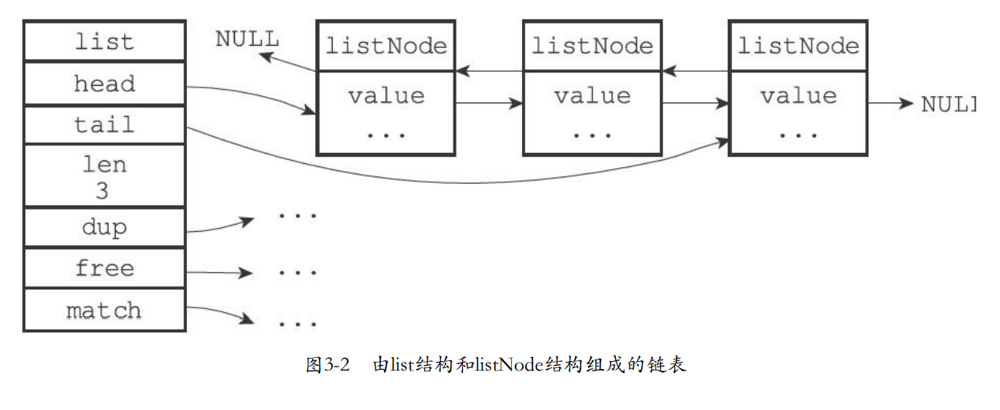
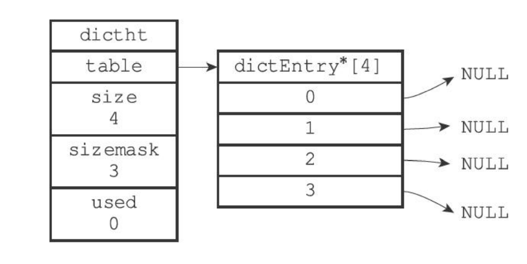

# Redis
## 数据结构
### 简单动态字符串
C字符串只用于表示字面量
```c
struct sdshdr {
    //已使用字节数
    int len;
    //未使用字节数
    int free;
    //字节数组
    char buf[];
}
```
遵循C字符串以空字符结尾的惯例，可以重用一部分C函数库

#### 与C字符串的区别
- 常数复杂度获取字符串长度
设置和更新SDS长度是API自动完成的
- 杜绝缓冲区溢出
进行修改前先检查空间是否满足需求
- 减少修改字符串带来的内存重分配次数
  - 空间预分配
  如果修改后 < 1MB,free = len
  如果修改后 >= 1MB,free = 1MB
  - 惰性空间释放
  缩短时不立即回收空间，用free保存
- 二进制安全
C字符串除了结尾不能有空字符串，且必须复合某种编码
SDS的API都二进制安全的，以二进制的方式处理放在buf中的数据，不会做任何过滤、限制或假设。
- 兼容部分C字符串函数

对比项|C字符串|SDS
-|-|-
获取自字符串长度的复杂度|O(N)|O(1)
API|不安全，缓冲区可能溢出|安全
修改字符串N次，内存重分配|必然N次|至多N次
保存数据|只能文本|文本或二进制
使用<string.h>|全部函数|部分函数


### 链表
使用：列表键的底层实现之一，发布与订阅、慢查询、监视器、多个客户端状态信息、客户端输出缓冲区等

链表节点listNode
```c
typedef struct listNode{
    //前置节点
    struct listNode * prev;
    //后置节点
    struct listNode * next;
    //节点值
    void * value;
}listNode;
```

持有链表list
```c
typedef struct list{
    //头结点
    listNode * head;
    //尾结点
    listNode * tail;
    //节点数
    unsigned long len;
    //节点值复制
    void *(*dup)(void * ptr);
    //节点值释放
    void (*free)(void * ptr);
    //节点值比较
    int (*match)(void * ptr,void *key);
}
```

#### 特点
- 双端
- 无环
head的prev和tail的next指向null
- 带表头指针和表尾指针
- 带链表长度计数器
- 多态
链表节点使用(void*)指针保存节点值，且可以通过dup、free、match设置结点类型特定函数。


### 字典（符号表、关联数组、映射）
使用：数据库的底层实现，其增删改查基于字典操作。哈希键的底层实现之一。
- 哈希表dictht
```c
typedef struct dictht{
    //哈希表数组
    dictEntry **table;
    //哈希表大小
    unsigned long size;
    //掩码，用于计算索引值，等于size -  1
    unsigned long sizemask;
    //已有节点数
    unsigned long used; 
}dictht;
```



- 哈希表节点dictEntry
```c
typedef struct dictEntry{
    //键
    void *key;
    //值
    union{
        void *val;
        unint64 _tu64;
        int64 _ts64;
    }v;
    //指向下一个节点
    struct dictEntry *next;

}dictEntry;
```
**拉链法解决冲突，头插入**

- 字典dict
```c
typedef struct dict{
    //类型特定函数
    dictTyp * type;
    //私有数据
    void * privdata;
    //哈希表
    dictht ht[2];
    //rehash索引，-1时不进行rehash
    int rehashidx;
}dict;
```
type和privdata为多态字典设置。type指向dictType，每个dictType保存一组用于操作特定类型键值对的函数，privdata保存需要传入的可选参数。
一般使用ht[0]哈希表，ht[1]在rehash的时候使用。
字典作为数据库或哈希键的底层实现用MurmurHash2算法计算哈希值。

#### rehash
1. 为h[1]分配空间
若扩展，ht[1] = 第一个>= h[0].used*2的2^n
若收缩，ht[1] = 第一个>= h[0].used的2^n
2. 将保存在ht[0]中的所有键值对rehash到h[1]上（渐进式）
3. 将ht[0]释放，将ht[1]设为ht[0]，创建新的ht[1]

扩展收缩时机：
- 服务器没在执行BGSAVE命令或BGREWRITEAOF命令，且负载因子 >= 1
- ...正在执行，且负载因子 >= 5
> 在执行BGSAVE命令或BGREWRITEAOF命令时，Redis服务器要创建子进程，而大多数OS采用COW优化子进程执行效率。所以在子进程存在期间提高负载因子，尽可能避免扩展操作，避免不必要的内存写入操作，最大限度的节约内存。
- 负载因子 < 0.1时收缩

负载因子 =  ht[0].used / ht[0].size


**渐进式**
增删改查的同时将ht[0]在rehashidx位置上的所有键值对rehash到ht[1]上，完成后rehashidx++
删除、查找、更新在两个哈希表上进行，添加只在ht[1]上进行