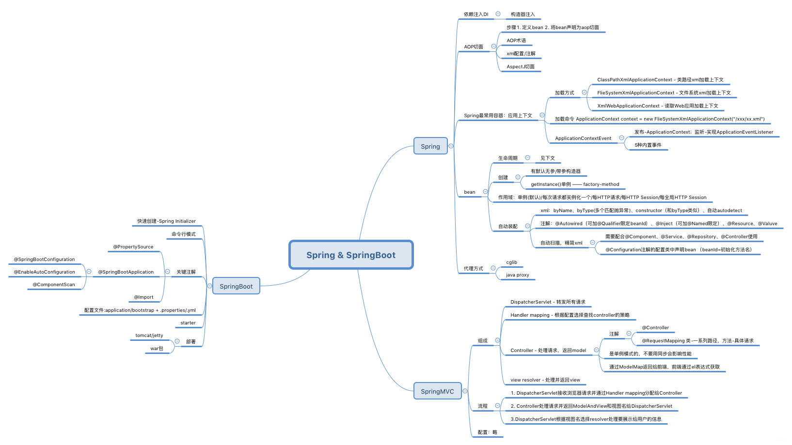
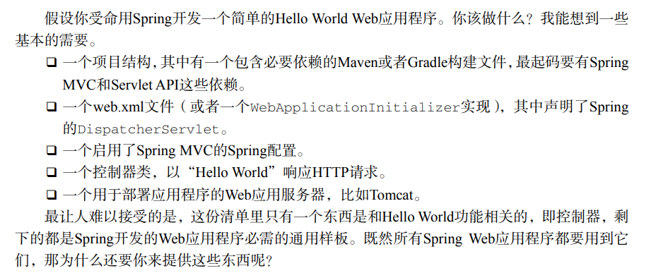
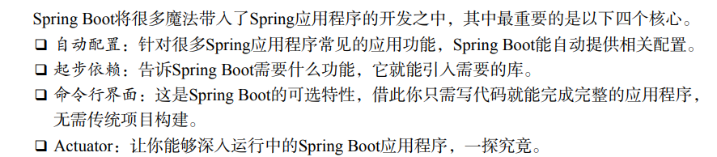
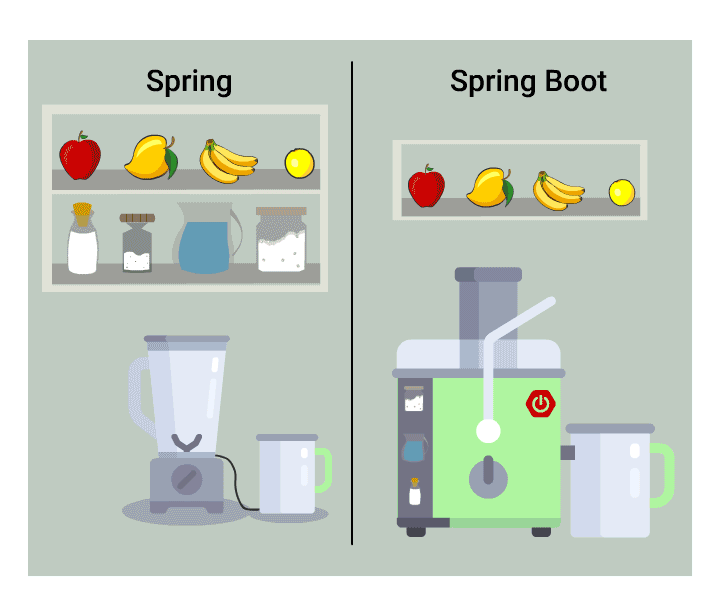
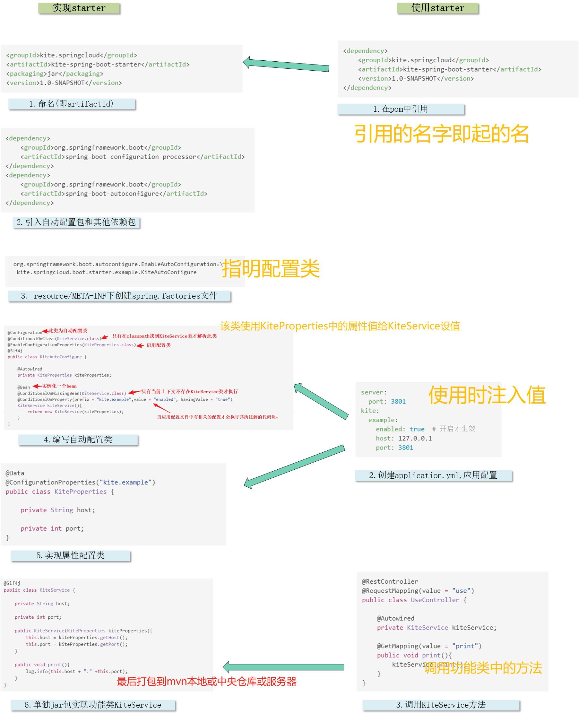
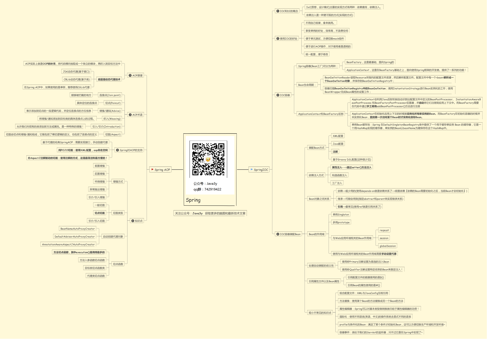

# 框架原理

[TOC]


## Spring 和 SpringBoot


https://www.cnblogs.com/wuyuegb2312/p/13150201.html
- 区别


Spring Boot基本上是Spring框架的**扩展**，简化了应用的开发和部署。
1. 创建独立的Spring应用。
2. 嵌入式Tomcat、Jetty、 Undertow容器（无需部署war文件）
3. **提供的starters 简化构建配置**
4. 尽可能自动配置spring应用
5. 提供生产指标,例如指标、健壮检查和外部化配置
6. 完全没有代码生成和XML配置要求




> 事务管理和Spring MVC，还是需要用XML或Java进行显式**配置**。启用第三方库时也需要显式配置，比如基于Thymeleaf的Web视图。配置Servlet和过滤器（比如Spring的DispatcherServlet）同样需要在web.xml或Servlet初始化代码里进行显式配置。组件扫描减少了配置量，Java配置让它看上去简洁不少，但Spring还是需要不少配置。
所有这些配置都代表了开发时的损耗。因为在思考Spring特性配置和解决业务问题之间需要进行思维切换，所以写配置挤占了写应用程序逻辑的时间。除此之外，项目的**依赖管理**也是件吃力不讨好的事情。决定项目里要用哪些库就已经够让人头痛的了，你还要知道这些库的哪个版本和其他库不会有冲突，这难题实在太棘手。并且，依赖管理也是一种损耗，添加依赖不是写应用程序代码。

对使用者来说，换用Spring Boot以后，**项目初始化**方法变了，**配置文件**变了，另外就是**不需要单独安装Tomcat这类容器服务器**了，maven打出jar包直接跑起来就是个网站，但你最核心的业务逻辑实现与业务流程实现没有任何变化。所以，用最简练的语言概括就是：
- Spring 是一个“引擎”； 
- Spring MVC 是基于Spring的一个 MVC 框架 ；
- Spring Boot 是基于Spring4的条件注册的一套快速开发整合包。



springboot提供默认的配置，然后提供可插拔的设计，就是各种 starter ，来方便开发者使用这一系列的技术.

**总结：SpringBoot的特点在于starter**

### Spring Boot 的 starter
在springboot中使用一个组件需要三步：1.在pom文件中引入需要的包；   2.在应用配置文件中加入相应的配置； 3.使用接口开发

#### starter是什么
它首先是一个**包**，一个集合，它把需要用的其他功能组件囊括进来，放到自己的 **pom** 文件中。
然后它是一个**连接**，把它**引入的组件**和我们的**项目**做一个连接，并且在中间帮我们**省去复杂的配置**，力图做到使用最简单。

#### 实现一个starter
  -  starter 命名 ;
  -  自动配置类，用来初始化相关的 bean ;
  -  指明自动配置类的配置文件 spring.factories ;
  -  自定义属性实体类，声明 starter 的应用配置属性 ;




1. *命名(artifactId)*
官方命名为spring-boot-starter-{name}
非官方的为{name}-spring-boot-starter
我们把自定的 starter 命名为 kite-spring-boot-starter，命名在 pom 文件里。
```xml
<groupId>kite.springcloud</groupId>
<artifactId>kite-spring-boot-starter</artifactId>
<packaging>jar</packaging>
<version>1.0-SNAPSHOT</version>
```
2. *引入自动配置包及其它相关依赖包*
实现 starter 主要依赖自动配置注解，所以要在 pom 中引入自动配置相关的两个 jar 包
```xml
<dependency>
    <groupId>org.springframework.boot</groupId>
    <artifactId>spring-boot-configuration-processor</artifactId>
</dependency>
<dependency>
    <groupId>org.springframework.boot</groupId>
    <artifactId>spring-boot-autoconfigure</artifactId>
</dependency>
```

3. *创建 spring.factories 文件*
在 resource/META-INF 目录下创建名称为 spring.factories 的文件，为什么在这里？**当 Spring Boot 启动的时候，会在 classpath 下寻找所有名称为 spring.factories 的文件，然后运行里面的配置指定的自动加载类，将指定类(一个或多个)中的相关 bean 初始化。**
例如本例中的配置信息是这样的：
<pre lang="text">
<code>
 org.springframework.boot.autoconfigure.EnableAutoConfiguration=\
  kite.springcloud.boot.starter.example.KiteAutoConfigure
</code>
</pre>

等号前面是固定的写法，后面就是我们自定义的自动配置类了，如果有多个的话，用英文逗号分隔开。

4. *编写自动配置类*
自动配置类是用来初始化 starter 中的相关 bean 的。可以说是实现 starter 最核心的功能。
```java
@Configuration
@ConditionalOnClass(KiteService.class)
@EnableConfigurationProperties(KiteProperties.class)
@Slf4j
public class KiteAutoConfigure {

    @Autowired
    private KiteProperties kiteProperties;

    @Bean
    @ConditionalOnMissingBean(KiteService.class)
    @ConditionalOnProperty(prefix = "kite.example",value = "enabled", havingValue = "true")
    KiteService kiteService(){
        return new KiteService(kiteProperties);
    }
}
```
@Configuration 这个不用解释，表示这是个自动配置类，我们平时做项目时也会用到，一般是用作**读取配置文件**的时候。

@ConditionalOnClass(KiteService.class) ：

只有在 classpath 中找到 KiteService 类的情况下，才会解析此自动配置类，否则不解析。

@EnableConfigurationProperties(KiteProperties.class)：

启用配置类。

@Bean：实例化一个 bean 。

@ConditionalOnMissingBean(KiteService.class)：

与 @Bean 配合使用，只有在当前上下文中**不存在**某个 bean 的情况下才会执行所注解的代码块，也就是当前上下文还没有 KiteService 的 bean 实例的情况下，才会执行 kiteService() 方法，从而实例化一个 bean 实例出来。

@ConditionalOnProperty：

当应用配置文件中有相关的配置才会执行其所注解的代码块。

这个类的整体含义就是: **当 classpath 中存在 KiteService 类时解析此配置类**，什么情况下才会在 classpath 中存在呢，就是**项目引用了相关的 jar 包。并且在上下文中没有 KiteService 的 bean 实例的情况下，new 一个实例出来，并且将应用配置中的相关配置值传入**。

5. *实现属性配置类*
```java
@Data
@ConfigurationProperties("kite.example")
public class KiteProperties {

    private String host;

    private int port;
}
```
配置类很简单，只有两个属性，一个 host ，一个 port 。配置参数以 kite.example 作为前缀。稍后我们在使用这个 starter 的时候会看到如何声明配置属性。

6. *实现相关功能类*
也就是前面一直提到的 KiteService，其实严格来讲，这个业务功能类不应该放在 starter 中，应该放在单独的 jar 包里

```java
@Slf4j
public class KiteService {

    private String host;

    private int port;

    public KiteService(KiteProperties kiteProperties){
        this.host = kiteProperties.getHost();
        this.port = kiteProperties.getPort();
    }

    public void print(){
        log.info(this.host + ":" +this.port);
    }
}
```
7. *打包*

通过 maven 命令将这个 starter 安装到**本地 maven 仓库**
> mvn install

也可以通过 mvn package deploy 发布到你的**私服**
或者发布到**中央仓库**。

#### 使用
1. 创建项目，在 pom 中引用
```xml
<dependency>
    <groupId>kite.springcloud</groupId>
    <artifactId>kite-spring-boot-starter</artifactId>
    <version>1.0-SNAPSHOT</version>
</dependency>
```
2. 应用配置项

创建 application.yml ，配置如下:
```yml
server:
  port: 3801
kite:
  example:
    enabled: true  # 开启才生效
    host: 127.0.0.1
    port: 3801
```
3. 调用 KiteService 的服务方法
```java
@RestController
@RequestMapping(value = "use")
public class UseController {

    @Autowired
    private KiteService kiteService;

    @GetMapping(value = "print")
    public void print(){
        kiteService.print();
    }
}
```

## Spring知识点 




## BeanDefinition
Bean定义，Spring据此创建Bean对象。
@Component、@Bean、\<bean/>都会解析为BeanDefinition
- beanClass
表示Bean类型
- scope
作用域：singleton / prototype
- isLazy
是否需要懒加载（原型Bean不起作用）
懒加载：第一次getBean时生成
非懒加载：Spring启动过程中生成
- dependsOn
创建之前依赖的其他Bean
- primary
是否是主Bean
一个类有多个Bean，如果在依赖注入时发现有多个Bean，会判断是否有主Bean，若存在直接注入
- initMethodName
初始化方法
初始化逻辑由程序员控制

## BeanFactory
Spring容器,创建、获取Bean
BeanFactory利用BeanDefinition产出Bean对象
- ListableBeanFactory
- ConfigurableBeanFactory
- AutowireCampableBeanFactory
- AbstractBeanFactory
- DefaultListableBeanFactory

## Bean生命周期
### Bean的创建
- BeanDefinition
Bean定义
- 构造方法推断
选出一个构造方法
- 实例化
构造方法反射得到对象
可以用BeanPostProcessor机制对实例化进行干预
- 属性填充
给属性进行自动填充
自动注入、依赖注入
- 初始化
对其他属性赋值、校验
程序员可以利用初始化机制对Bean进行加工，如赋值和校验
- 初始化后
AOP、生成代理对象（BeanPostProcessor）


## @Autowired
某个属性是否需要注入
- 加在属性上
在**属性填充**这一步，基于实例化出来的对象，对该对象中加了@Autowired的属性自动赋值
Spring 根据属性类型去容器中找出所有Bean对象，如果有多个，再根据属性名字确定一个，如果required为true，且根据属性信息找不到对象则抛异常。
- 加在方法上
根据参数类型、参数名字在容器中找到对象当做方法入参，自动反射调用该方法  
- 加在构造方法上
在**构造方法推断**这一步选择该方法进行实例化，在反射调用构造方法之前先根据参数类型、名称找到Bean对象当做入参

## @Resource

## @Value

## BeanPostProcessor