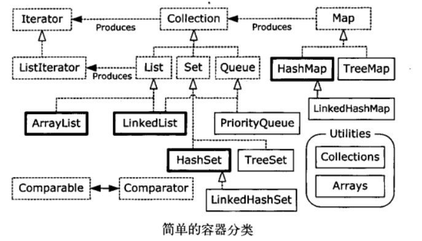

[TOC]
## C++
### 值传递、指针传递和引用传递
- 值传递相当于实际参数的副本，在函数内部修改其值不会影响主调函数的值。
- 指针传递是将实参的地址传入，通过修改指针指向的地址的值来改变实参的值。指针本身占用主存空间，指针的指向可以改变。
- 引用传递即传递实参的别名，操作形参就是操作实参。
```c
 int x=1;
 int *y=&x; //用于指针传递，y有自己独立的内存地址，存储的内容是x的地址，*y是x的值
 int &z=x; //用于引用传递，可以理解为z就是x，x就是z，只不过名字不一样
```
> [值传递和引用传递-----函数参数传递的两种方式](https://www.cnblogs.com/codingmengmeng/p/5865510.html)


## JAVA
### 对象序列化
对象的复用。保存在内存中的各种对象的状态，并且可以把保存的对象状态再读出来。
- 使用情况
  - 当你想把的内存中的对象保存到一个文件中或者数据库中时候；
  - 当你想用序列化在网络上传送对象的时候；
  - 当你想通过RMI传输对象的时候；
#### 接口Serializable
  - 是一个标志，没有任何方法，以二进制的方式有限的持久化对象，不会调用任何的构造器
  >空接口如何实现序列化？
  事实上它只是一个标志，真正的序列化工作不需要它完成，而是在ObjectOutputStream的writeObject0()会判断是否为Serializable的实例
  
   - 在恢复序列化一个对象的时候要保证它的CLASSPATH下有**其类的.class文件**，否则会抛出ClassNotFound
   - 如果仅仅只是让某个类实现Serializable接口，而没有其它任何处理的话，则就是使用默认序列化机制。使用默认机制，在序列化对象时，**不仅会序列化当前对象本身，还会对该对象引用的其它对象也进行序列化**，同样地，这些其它对象引用的另外对象也将被序列化，以此类推。所以，如果一个对象包含的成员变量是容器类对象，而这些容器所含有的元素也是容器类对象，那么这个序列化的过程就会较复杂，开销也较大。

  - 可以为成员添加**transient**关键字，不让Serializable自动序列化，如private String tansient password
  > **static修饰的也不会被序列化**
  - 添加writeObject()方法与readObject()方法(private)，则会优先调用。（不是通过覆盖或者重写机制，而是利用**反射**机制）
  
> 序列化一个对象:
> 1. 创建OutputStream 对象，封装到 ObjectOutputStream 对象内。
> 2. 此时，调用writeObject()，并将其发送给OutputStream。
> 相反的过程是将一个InputStream 封装到 ObjectInputStream 内，然后调用 readObject()。

#### Externalizable替代接口Serializable
  - 继承于Serializable，控制具体的序列化过程，**不会自动序列化**，序列化的细节需要由程序员去完成。
  - 当读取对象时，会调用被序列化类的无参构造器去创建一个新的对象，然后再将被保存对象的字段的值分别填充到新对象中。由于这个原因，实现Externalizable接口的类必须要提供一个**无参的构造器**，且它的**访问权限为public**。


#### serialVersionUID
1. serialVersionUID是序列化前后的唯一标识符
2. 默认如果没有人为显式定义过serialVersionUID，那编译器会为它自动声明一个
3. **一旦像更改了类的结构或者信息，则类的serialVersionUID也会跟着变化**
serialVersionUID序列化ID，可以看成是序列化和反序列化过程中的“暗号”，在反序列化时，JVM会把字节流中的序列号ID和被序列化类中的序列号ID做比对，只有两者一致，才能重新反序列化，否则就会报异常来终止反序列化的过程。 

####  为什么要序列化？
  - 序列化的原本意图是希望对一个Java对象作一下“变换”，变成字节序列，这样一来方便持久化存储到磁盘，避免程序运行结束后对象就从内存里消失
  - 变换成字节序列也更便于网络运输和传播

#### 序列化可能会破坏单例模式

```java
public class Singleton implements Serializable {

    private static final long serialVersionUID = -1576643344804979563L;

    private Singleton() {
    }

    private static class SingletonHolder {
        private static final Singleton singleton = new Singleton();
    }

    public static synchronized Singleton getSingleton() {
        return SingletonHolder.singleton;
    }
}


public class Test2 {

    public static void main(String[] args) throws IOException, ClassNotFoundException {

        ObjectOutputStream objectOutputStream =
                new ObjectOutputStream(
                    new FileOutputStream( new File("singleton.txt") )
                );
        // 将单例对象先序列化到文本文件singleton.txt中
        objectOutputStream.writeObject( Singleton.getSingleton() );
        objectOutputStream.close();

        ObjectInputStream objectInputStream =
                new ObjectInputStream(
                    new FileInputStream( new File("singleton.txt") )
                );
        // 将文本文件singleton.txt中的对象反序列化为singleton1
        Singleton singleton1 = (Singleton) objectInputStream.readObject();
        objectInputStream.close();

        Singleton singleton2 = Singleton.getSingleton();

        // 运行结果竟打印 false ！
        System.out.println( singleton1 == singleton2 );
    }

}
```
运行后我们发现：反序列化后的单例对象和原单例对象并**不相等**了。
解决办法是：在单例类中**手写readResolve()函数**，直接返回单例对象：
```java
private Object readResolve() {
    return SingletonHolder.singleton;
}
```

### final关键字
- 数据
一旦被赋值，就不可改变它的值。
  - 基本类型：数值不变
  - 对象引用：引用恒定不变
  - 参数：不能更改参数引用指向的对象
  主要用于向匿名内部类传递数据
- 方法
不可被覆盖
  - 在继承中使方法的行为不变
  - 效率
  在java**早期实现**中，如果将一个方法指明为final，就是同意编译器将针对该方法的调用都转化为内嵌调用。如果是内嵌调用，虚拟机不再执行正常的方法调用（参数压栈，跳转到方法处执行，再调回，处理栈参数，处理返回值），而是**直接将方法展开**，以方法体重的实际代码替代原来的方法调用。这样减少了方法调用的开销。（现在由JVM决定是否内联）
  private隐式上就是final
- 类
不可被继承

### 继承与初始化
- 类的初始化在初次使用时加载。即创建第一个对象时，或者static初始化时。
- static对象及static代码段在加载时依赖书写顺序。
- 初始化顺序：
A extends B
加载B类，加载A类，B的static初始化，A的static初始化。创建对象：B的构造器调用，实例变量按次序初始化。执行构造器的其余部分。A的构造器调用，...。


### 内部类
每个内部类都能独立的继承自一个接口的实现，无论外围类是否已经继承 。
- 闭包
通过**接口+内部类**实现，广泛用于**回调**函数中。
  - 在JAVA中，内部类可以访问到外围类的变量、方法或者其它内部类等所有成员，即使它被定义成private了，但是外部类不能访问内部类中的变量。这样通过内部类就可以提供一种**代码隐藏和代码组织**的机制，并且这些被组织的代码段还可以自由地访问到包含该内部类的外围上下文环境。
  
  - 回调的核心就是：回调方将本身即this传递给调用方.这样调用方就可以在调用完毕之后告诉回调方它想要知道的信息。


即通过Caller调用传入对象的increment方法时，实际上传入了匿名内部类对象，而该内部类实际上调用了外围类的increment方法。
此外，Callee2类通过重写调用了increment方法，而如果它必须实现Incrementable接口，就**必须存在两个同名方法，而作用表现不同。** 它本身的increment方法并不是实现Incrementable。此时可以通过内部类来实现Incrementable。并且无需修改给外围类添加东西，也不需要修改接口。
> 内部类Closure返回了一个Callee2的钩子（而非引用），是很安全的，**外部只能调用Callee2的increment方法**，而不能获取到其他信息。

闭包、框架

### 容器
在编写代码的时候并不知道会产生多少对象，因而数组无法存放。
Collection是所有序列容器类的根接口，容器之间的共性通过迭代器实现，即实现Collection的类需要实现Iterator。

#### List
- ArrayList
随机访问快，插入删除慢
- LinkedList
插入删除快，随机访问慢
- Set
通过值确定归属性
  - HashSet
  散列函数
  - TreeSet
  红黑树
  - LinkedHashSet
### 注解
三种标准注解（@Override、@Deprecated、@SuppressWarnings）和四种元注解


使用注解根据数据库表生成JavaBean
### 并发
#### 多线程
##### 实现方式
- **Runnable接口**
实现**Runnable接口**并实现run()方法
- **Thread类**
把Runnable对象传入**Thread类**，通过调用start方法启动
- **Executor**
在客户端和任务之间提供一个间接层，无须显示管理线程生命周期

  ```java
  ExecutorService exec = Executors.newCachedThreadPool();
  for(int i = 0; i < 5; ++i){
    exec.execute(new Liftoff()); //Liftoff实现了Runnable接口
  }
  exec.shutdown();
  ```
  - CachedThreadPool为每个任务创建一个线程
  - FixedThreadPool预先分配线程数量，可能时复用
  - SingleThreadExecuto线程数量为1，如果提交多个任务，则排队。并且按提交顺序完成。 
  
- **Callable接口**
希望任务在完成时有返回值。类型参数表示的是从call()方法中返回的值，必须使用ExecutorService.submit()方法调用。submit()方法返回Future对象，对Callable返回结果的特定类型进行了从参数化，可以用isDone()查询Future是否完成，用get()获取结果（若未完成则阻塞）。


##### Join方法
A调用B.join()，A被挂起直到B结束

#### ThreadLocl
在线程内部维护其自己的变量，别的线程不可见。
比如Spring在为保证所有对数据库的CRUD都在一个数据库连接上进行，会设置为ThreadLocl。

### 锁


### 对象的创建（new）
1. 检查该指令的参数在**常量池**是否存在**类的符号引用**，检查该类是否被**加载、解析和初始化**，若没有首先**类加载**。
2. 为新生对象**分配内存**。把确定大小的内存从**Java堆**中划分出来。
  - 指针碰撞
  规整内存，指针向空闲方向挪动
  > 线程安全？正在给A分配内存，还未修改指针，B又使用原指针分配。
  解决：同步：**CAS+失败重试**保证更新操作的原子性；按照线程划分在不同空间：**本地线程分配缓冲TLAB**（现在线程的本地缓冲区分配，只有缓冲区用完，才需要同步锁定）。
   - 空闲列表
  内存不规整，列表记录哪些内存块可用
3. 将分配内存初始化为零值。
4. 对对象进行必要的设置（对象头），包括是哪个类的实例、哈希码、如何找到类的元数据等
5. 构造函数


### 对象的内存布局
- 对象头

  - 对象自身运行时数据
  **Mark Word**：哈希码（HashCode）、GC分代年龄、锁状态标志、线程持有的锁、偏向线程ID、偏向时间戳等
  - 类型指针
  指向类型元数据的指针
- 实例数据
代码中定义的各种类型的字段内容，longs/doubles、ints、shorts/chars、bytes/booleans、oops（Ordinary Object Pointers，OOPs）
- 对象填充
占位符，任何对象的大小都必须是8字节的整数倍。

### 对象的访问定位
通过**栈上**的reference数据操作**堆上**的具体对象
- **使用句柄**
  - 堆中划分出一块内存作为句柄池，reference存储句柄地址，句柄包含对象实例数据与类型数据各自具体的地址信息
  - 稳定句柄，对象被移动时只会改变句柄中的实例数据指针，而不必改变reference本身
  
- **直接指针**
  - reference直接存储对象地址
  - 速度快，定位一次


### 垃圾回收
#### 对象已死？
- 引用计数法
难以解决循环引用的问题
- **可达性分析算法**
通过一系列称为**GC Roots**的根对象作为起始节点集，从这些节点开始，根据**引用关系**向下搜索，搜索过程所走过的路径称为**引用链**（Reference Chain），如果某个对象到GC Roots间没有任何引用链相连，或者用图论的话来说就是从GC Roots到这个对象**不可达**时，则证明此对象是不可能再被使用的。

  - 可以作为GC Root的对象：
    - **栈中**（本地变量表）引用的对象：参数、局部变量、临时变量
    - **方法区**类静态属性引用对象：静态变量
    - **方法区**常量引用的对象：字符串常量池的引用
    - JNI引用的对象
    - 内部引用：基本数据类型的Class对象，异常对象，系统类加载器
    - 所有被同步锁（sychronized）持有的对象
    - 反应虚拟机内部情况的JMXBean、JVMTI中注册的回调、本地代码缓存等

#### 引用
如果reference类型的数据中存储的数值代表的是另外一块内存的起始地址，就称该reference数据是代表某块内存、某个对象的引用。
- 强引用Strongly
类似“Object obj=new Object()” 不会回收被引用的对象
- 软引用Soft
还有用，但非必须用。 将要发生内存溢出时回收。
- 弱引用Weak
只能生存到下一次GC，无论内存是否足够
- 虚引用Phantom
是否有该引用不影响其生存周期。为一个对象设置虚引用关联的唯一目的只是为了能在这个对象被收集器回收时收到一个系统通知

#### 回收
在可达性分析中不可达的对象，并非直接死亡。
需经历**两次标记**的过程：
  - 没有与GC Root相连的引用链。
  - 是否有必要执行finalize()方法
    - 若对象没覆盖finalize()方法 or 虚拟机已经调用过  => 没必要
    - 若有必要，放入F-Queue队列，稍后由一条由虚拟机自动建立的、低调度优先级的Finalizer线程去执行它们的finalize()方法。
    - 之后收集器进行第二次标记。
    若对象在finalize中重新与Gc Root引用链建立连接，则被移出
  > 任何一个对象的finalize()方法都只会被系统自动调用一次

 #### 回收方法区
 - 废弃的常量

 - 不再使用的类型
   - 该类所有实例被回收
   - 加载该类的类加载器被回收
   - 该类对应的Class对象没有在任何地方被引用，无法通过反射访问

#### 垃圾收集算法
- 分代回收
  - 弱分代假说
  绝大多数对象都是朝生夕死的 => 新生代
  - 强分代假说
  熬过越多次GC的对象越难消亡  => 老年代
  - 跨代引用假说
  跨代引用相对于同代引用来说仅占极少数(存在相互引用关系的两个对象倾向于同生共死)

- GC收集器设计的一致原则：收集器将Java堆划分出不同区域，将回收对象根据其**年龄（对象熬过GC过程的次数**分配到不同区间存储。
> 如果一个区域中大多数对象都是朝生夕灭，把它们集中放在一起，每次回收时只关注如何保留**少量存活**而不是去标记那些大量将要被回收的对象，就能以较低代价回收到大量的空间；如果剩下的都是难以消亡的对象，那把它们集中放在一块，虚拟机便可以使用**较低的频率**来回收这个区域，这就同时兼顾了垃圾收集的时间开销和内存的空间有效利用。


- 收集
  - 部分收集
    - 新生代收集
    - 老年代收集
    - 混合收集
  - 整堆收集
  整个堆和方法区


- 标记-清除算法

- 标记-复制算法
适用新生代

- 标记-整理算法
适用老年代


### 类加载
Java虚拟机把描述类的数据从Class文件加载到内存，并对数据进行**校验、转换解析和初始化**，最
终形成可以被虚拟机直接使用的Java类型，这个过程被称作虚拟机的**类加载机制**。
#### 时机

- 加载、验证、准备、初始化和卸载这五个阶段的顺序是确定的
- 解析可以在初始化阶段之后开始
- 必须立即初始化的情况
  - 遇到new、getstatic、putstatic或invokestatic这四条字节码指令时
    - 使用**new**实例化对象
    - 读取或者设置一个类型的**静态字段**
    - 调用一个类的**静态方法**
  - **反射**
  - 初始化类先初始化**父类**
  - 执行的**主类**（含main()）先初始化
  - 当使用JDK 7新加入的动态语言支持时，如果一个java.lang.invoke.MethodHandle实例最后的解析结果为REF_getStatic、REF_putStatic、REF_invokeStatic、REF_newInvokeSpecial四种类型的方法句柄，并且这个方法句柄对应的类没有进行过初始化，则需要先触发其初始化。
  - 当一个接口中定义了JDK 8新加入的默认方法（被**default**关键字修饰的接口方法）时，如果有这个接口的实现类发生了初始化，那该接口要在其之前被初始化。


#### 类加载器
对于任意一个类，都必须由加载它的**类加载器**和这个**类本身**一起共同确立其在Java虚拟机中的唯一性，每一个类加载器，都拥有一个**独立的类名称空间**。
这句话可以表达得更通俗一些：比较两个类是否“相等”，只有在这两个类是由**同一个类加载器**加载的前提下才有意义，否则，即使这两个类来源于同一个Class文件，被同一个Java虚拟机加载，只要加载它们的类加载器不同，那这两个类就必定不相等。

- 双亲委派模型
  - 启动类加载器
  C++实现，虚拟机的一部分
  - 其他类加载器
  Java语言实现，独立存在虚拟机外部，继承自抽象类ClassLoader
    - 扩展类加载器
    - 应用程序类加载器

  

**工作过程**：如果一个类加载器收到了类加载的请求，它首先不会自己去尝试加载这个类，而是把这个请求**委派给父类加载器**去完成，每一个层次的类加载器都是如此，因此所有的加载请求最终都应该传送到**最顶层的启动类加载器**中，只有当父加载器反馈自己无法完成这个加载请求（它的搜索范围中没有找到所需的类）时，子加载器才会尝试自己去完成加载。

**OSGi实现模块化热部署**
- 自定义的类加载器机制
每一个程序模块（OSGi中称为Bundle）都有一个自己的类加载器，当需要更换一个Bundle时，就把Bundle连同类加载器一起换掉以实现代码的热替换。
- 网状结构
当收到类加载请求时，OSGi将按照下面的顺序进行类搜索：
1）将以java.*开头的类，委派给父类加载器加载。
2）否则，将委派列表名单内的类，委派给父类加载器加载。
3）否则，将Import列表中的类，委派给Export这个类的Bundle的类加载器加载。
4）否则，查找当前Bundle的ClassPath，使用自己的类加载器加载。
5）否则，查找类是否在自己的Fragment Bundle中，如果在，则委派给Fragment Bundle的类加载器加载。
6）否则，查找Dynamic Import列表的Bundle，委派给对应Bundle的类加载器加载。
7）否则，类查找失败。


### Java内存模型


- 所有变量都存储在**主内存**
- 每条线程有自己的工作内存，保存该线程使用的变量的**主内存副本**
- 线程对边领的所有操作必须在**工作内存**中进行，而不能直接读写主内存
- 不同线程不能直接访问对方工作内存，**值传递通过主内存完成**


#### volatile
- 可见性
一个线程修改，其他线程立即可见
> 但并非线程安全，因为不保证原子性
- 禁止指令重排序优化
有volatile修饰的变量，赋值后多执行了一个“lock addl$0x0，(%esp)”操作，这个操作的作用相当于一个内存屏障（Memory Barrier或Memory Fence，指重排序时不能把后面的指令重排序到内存屏障之前的位置。
这句指令中的“addl$0x0，(%esp)”（把ESP寄存器的值加0）显然是一个空操作，关键在于lock前缀，它的作用是将本处理器的缓存写入了内存，该写入动作也会引起别的处理器或者别的**内核无效化**（Invalidate）其缓存，这种操作相当于对缓存中的变量做了一次前面介绍Java内存模式中所说的“store和write”操作。所以通过这样一个空操作，可让前面volatile变量的修改对其他处理器立即可见。

#### 原子性、可见性、有序性
- 原子性
 - 基本数据类型的读写访问都是原子操作
  - synchronized块之间也具备原子性
- 可见性
  - 可见性就是指当一个线程修改了共享变量的值时，其他线程能够立即得知这个修改。
  - 除了**volatile**之外，Java还有两个关键字**synchronized和final**能实现可见性。
  同步块的可见性是由“对一个变量执行unlock操作之前，必须先把此变量同步回主内存中（执行store、write操作）”这条规则获得的。
  final关键字的可见性是指：被final修饰的字段在构造器中一旦被**初始化完成**，并且构造器没有把“this”的引用传递出去（this引用逃逸是一件很危险的事情，其他线程有可能通过这个引用访问到“初始化了一半”的对象），那么在其他线程中就能看见final字段的值。
- 有序性
**volatile和synchronized**两个关键字来保证线程之间操作的有序性
  - volatile关键字本身就包含了禁止指令重排序的语义
  - synchronized则是由“一个变量在同一个时刻只允许一条线程对其进行lock操作”这条规则获得的，这个规则决定了**持有同一个锁的两个同步块只能串行地进入**。

#### 先行发生原则


### 线程的实现
- 内核线程实现（1:1）
Java主流实现
- 用户线程实现（1：N）
- 混合实现（N：M）

#### 内核线程实现
由**内核来完成线程切换**，内核通过操纵调度器（Scheduler）对线程进行调度，并负责将线程的任务映射到各个处理器上。每个内核线程可以视为内核的一个分身，这样操作系统就有能力同时处理多件事情，支持多线程的内核就称为多线程内核（Multi-Threads Kernel）。
程序一般不会直接使用内核线程，而是使用内核线程的一种高级接口——**轻量级进程**（Light Weight Process，LWP），轻量级进程就是我们通常意义上所讲的线程，由于每个轻量级进程都由一个内核线程支持，因此只有先支持内核线程，才能有轻量级进程。这种轻量级进程与内核线程之间1：1的关系称为一对一的线程模型。

由于内核线程的支持，每个轻量级进程都成为一个独立的调度单元，**即使其中某一个轻量级进程在系统调用中被阻塞了，也不会影响整个进程继续工作**。
**局限性**
首先，由于是基于内核线程实现的，所以各种线程操作，如创建、析构及同步，都需要进行*系统调用*。而系统调用的代价相对较高，需要在用户态（User Mode）和内核态（Kernel Mode）中来回切换。其次，每个轻量级进程都需要有一个内核线程的支持，因此轻量级进程要消耗一定的**内核资源**（如内核线程的栈空间），因此一个系统支持轻量级进程的**数量是有限**的。

#### 用户线程实现

用户线程的优势在于不需要系统内核支援，劣势也在于没有系统内核的支援，所有的线程操作都需要由用户程序自己去处理。

#### 混合实现

用户空间创建，内核调度


### Java线程调度
- 协同式
主动切换
- 抢占式
系统调度

#### 状态转换
Java语言定义了6种线程状态
- **新建New**
创建未启动
- **运行Runnable**
包括操作系统线程状态中的Running和Ready，也就是处于此状态的线程有可能正在执行，也有可能正在等待着操作系统为它分配执行时间。
- **无限期等待Waiting**
需要被唤醒。以下方法会进入此状态：
  - 没有设置Timeout参数的Object::wait()方法；
  - 没有设置Timeout参数的Thread::join()方法；
  - LockSupport::park()方法。
- **限期等待Timed waiting**
一段时间后系统自动唤醒
  - Thread::sleep()方法；
  - 设置了Timeout参数的Object::wait()方法；
  - 设置了Timeout参数的Thread::join()方法；
  - LockSupport::parkNanos()方法；
  - LockSupport::parkUntil()方法。
- **阻塞Blocked**
等待着获取到一个**排它锁**，这个事件将在另外一个线程放弃这个锁的时候发生。
- **结束Terminated**


### 线程安全
- 定义
当多个线程同时访问一个对象时，如果不用考虑这些线程在运行时环境下的调度和交替执行，也不需要进行额外的同步，或者在调用方进行任何其他的协调操作，调用这个对象的行为都可以获得**正确的结果**，那就称这个对象是线程安全的。

#### Java中的线程安全
Java的共享数据分为：
- 不可变
  - final修饰的基本数据类型
  - 对象中带有状态的变量声明为final
> E.g. String、枚举类型及java.lang.Number的部分子类，如Long和Double等数值包装类型、BigInteger和BigDecimal等大数据类型。但同为Number子类型的原子类AtomicInteger和AtomicLong则是可变的
- 绝对线程安全
完全满足定义
- 相对线程安全
对这个对象单次的操作是线程安全的
> E.g. Vector、HashTable、Collections的synchronizedCollection()方法包装的集合等
- 线程兼容
线程兼容是指对象本身并不是线程安全的，但是可以通过在调用端正确地使用同步手段来保证对象在并发环境中可以安全地使用。
> E.g.与Vector和HashTable相对应的集合类**ArrayList和HashMap**等。
- 线程对立
线程对立是指不管调用端是否采取了同步措施，都无法在多线程环境中并发使用代码。
> E.g.Thread类的**suspend()和resume()** 方法。如果有两个线程同时持有一个线程对象，一个尝试去中断线程，一个尝试去恢复线程，在并发进行的情况下，无论调用时是否进行了同步，目标线程都存在**死锁风险**——假如suspend()中断的线程就是即将要执行resume()的那个线程，那就肯定要产生死锁了。也正是这个原因，suspend()和resume()方法都已经被声明废弃了。常见的线程对立的操作还有System.setIn()、Sytem.setOut()和System.runFinalizersOnExit()等。


#### 线程安全的实现
- 互斥同步
**同步**是指在多个线程并发访问共享数据时，保证共享数据在同一个时刻只被一条（或者是一些，当使用信号量的时候）线程使用。而**互斥**是实现同步的一种**手段**，临界区（Critical Section）、互斥量（Mutex）和信号量（Semaphore）都是常见的互斥实现方式。因此在“互斥同步”这四个字里面，互斥是因，同步是果；互斥是方法，同步是目的。

  - **synchronized**
在Java里面，最基本的互斥同步手段就是synchronized关键字，这是一种块结构（BlockStructured）的同步语法。synchronized关键字经过Javac编译之后，会在同步块的前后分别形成**monitorenter和monitorexit**这两个字节码指令。这两个字节码指令都需要一个reference类型的参数来指明要锁定和解锁的对象。如果Java源码中的synchronized明确指定了对象参数，那就以这个对象的引用作为reference；如果没有明确指定，那将根据synchronized修饰的方法类型（如实例方法或类方法），来决定是取代码所在的对象实例还是取类型对应的Class对象来作为线程要持有的锁。
根据《Java虚拟机规范》的要求，在执行monitorenter指令时，首先要去**尝试获取对象的锁**。如果这个对象没被锁定，或者当前线程已经持有了那个对象的锁，就把**锁的计数器的值增加一**，而在执行monitorexit指令时会将**锁计数器的值减一**。一旦计数器的值为零，锁随即就被释放了。如果获取对象锁失败，那当前线程就应当被**阻塞等待**，直到请求锁定的对象被持有它的线程释放为止。
从功能上看，根据以上《Java虚拟机规范》对monitorenter和monitorexit的行为描述，我们可以得出两个关于synchronized的直接推论，这是使用它时需特别注意的：
    - 被synchronized修饰的同步块对同一条线程来说是**可重入的**。这意味着同一线程反复进入同步块也不会出现自己把自己锁死的情况。
    - 被synchronized修饰的同步块在持有锁的线程执行完毕并释放锁之前，会**无条件地阻塞后面其他线程的进入**。这意味着无法像处理某些数据库中的锁那样，强制已获取锁的线程释放锁；也无法强制正在等待锁的线程中断等待或超时退出。

  从执行成本的角度看，持有锁是一个**重量级**（Heavy-Weight）的操作。在主流Java虚拟机实现中，Java的线程是映射到操作系统的**原生内核线程**之上的，如果要阻塞或唤醒一条线程，则需要操作系统来帮忙完成，这就不可避免地陷入用户态到核心态的转换中，进行这种状态转换需要耗费很多的处理器时间。
    - **JUC(java.util.concurrent)包**
    java.util.concurrent.locks.Lock接口。重入锁（ReentrantLock）是Lock接口最常见的一种实现：等待可中断、可实现公平锁及锁可以绑定多个Condition。

- 非阻塞同步
互斥同步面临的主要问题是进行线程阻塞和唤醒所带来的性能开销（悲观），无论是否存在竞争都先枷锁。
基于冲突检测的乐观并发策略（CAS）
- 无同步方案
不涉及共享数据，则天生线程安全
  - 可重入代码（Reentrant Code）
  这种代码又称纯代码（Pure Code），是指可以在代码执行的任何时刻中断它，转而去执行另外一段代码（包括递归调用它本身），而在控制权返回后，原来的程序不会出现任何错误，也不会对结果有所影响。
  - 线程本地存储（Thread Local Storage）
  如果一段代码中所需要的数据必须与其他代码共享，那就看看这些共享数据的代码是否能保证在同一个线程中执行。
  E.g. java.lang.ThreadLocal类

#### 锁优化
- **适应性自旋（Adaptive Spinning）**
如果在同一个锁对象上，自旋等待**刚刚成功获得过锁，并且持有锁的线程正在运行中**，那么虚拟机就会认为这次自旋也很有可能再次成功，进而允许自旋等待**持续相对更长的时间**，比如持续100次忙循环。
另一方面，如果对于某个锁，自旋**很少**成功获得过锁，那在以后要获取这个锁时将有可能直接**省略掉**自旋过程，以避免浪费处理器资源。
有了自适应自旋，随着程序运行时间的增长及性能监控信息的不断完善，虚拟机对程序锁的状况预测就会越来越精准，虚拟机就会变得越来越“聪明”了。
- **锁消除（Lock Elimination）**
如果判断到一段代码中，在堆上的所有数据都不会逃逸出去被其他线程访问到，那就可以把它们当作栈上数据对待，认为它们是线程私有的，同步加锁自然就无须再进行。
- **锁膨胀（Lock Coarsening）**
是如果一系列的连续操作都对同一个对象反复加锁和解锁，甚至加锁操作是出现在循环体之中的，那即使没有线程竞争，频繁地进行互斥同步操作也会导致不必要的性能损耗。
如果虚拟机探测到有这样一串零碎的操作都**对同一个对象加锁**，将会把加锁同步的范围扩展（粗化）到整个操作序列的外部。
- **轻量级锁（Lightweight Locking）**
在代码即将进入同步块的时候，如果此同步对象没有被锁定（锁标志位为“01”状态），虚拟机首先将在当前线程的栈帧中建立一个名为**锁记录（Lock Record）** 的空间，用于存储锁对象目前的Mark Word的拷贝（官方为这份拷贝加了一个Displaced前缀，即Displaced Mark Word）

然后，虚拟机将使用**CAS操作**尝试把对象的Mark Word更新为指向Lock Record的指针。如果这个更新动作成功了，即代表该线程拥有了这个对象的锁，并且对象Mark Word的锁标志位（Mark Word的最后两个比特）将转变为“00”，表示此对象处于轻量级锁定状态。

如果这个更新操作失败了，那就意味着至少存在一条线程与当前线程竞争获取该对象的锁。虚拟机首先会检查对象的Mark Word是否指向当前线程的栈帧，如果是，说明当前线程已经拥有了这个对象的锁，那直接进入同步块继续执行就可以了，否则就说明这个锁对象已经被其他线程抢占了。**如果出现两条以上的线程争用同一个锁的情况，那轻量级锁就不再有效，必须要膨胀为重量级锁**，锁标志的状态值变为“10”，此时Mark Word中存储的就是指向重量级锁（互斥量）的指针，后面等待锁的线程也必须进入阻塞状态。
- **偏向锁（Biased Locking）**
如果说轻量级锁是在无竞争的情况下使用CAS操作去消除同步使用的互斥量，那偏向锁就是在无竞争的情况下把整个同步都消除掉，连CAS操作都不去做了。
这个锁会偏向于**第一个获得它的线程**，如果在接下来的执行过程中，该锁一直没有被其他的线程获取，则持有偏向锁的线程将永远不需要再进行同步。
