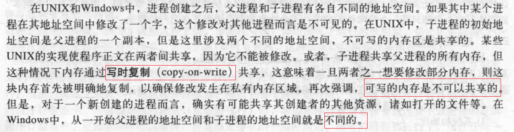
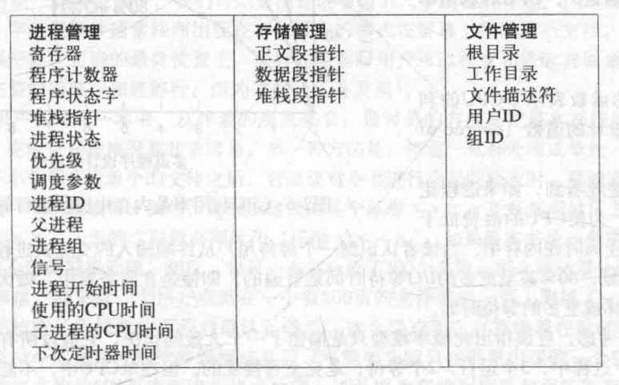
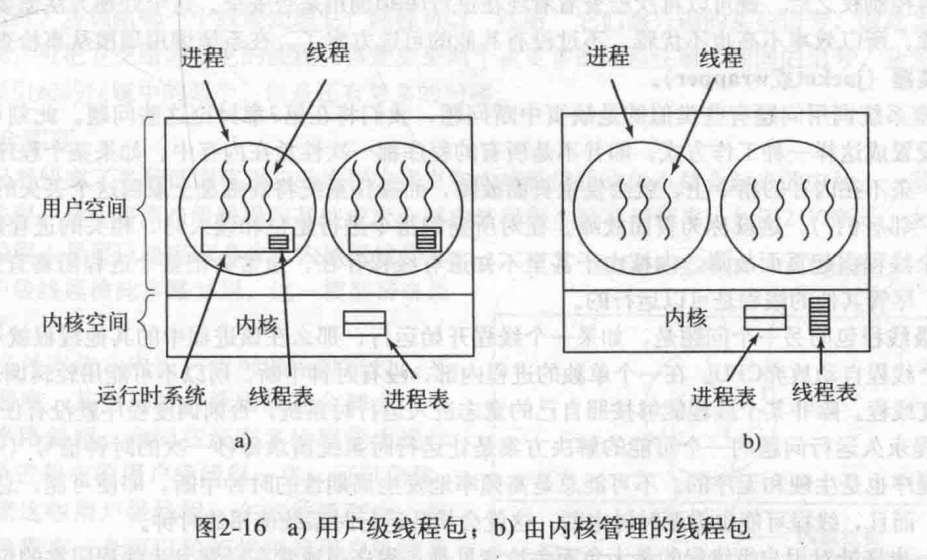
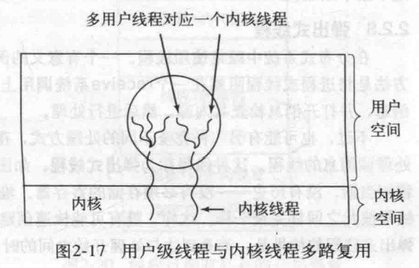
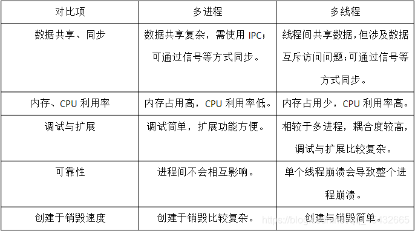
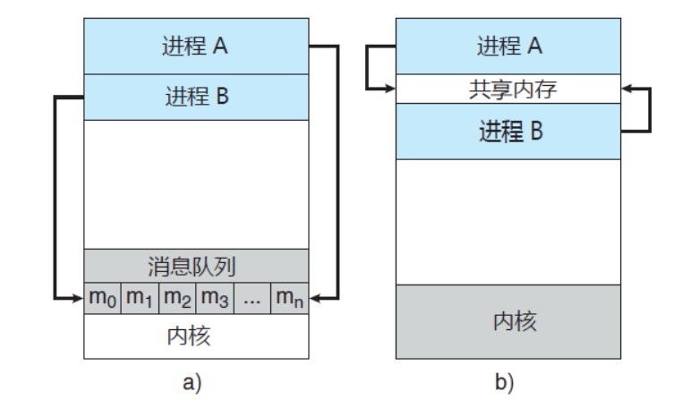
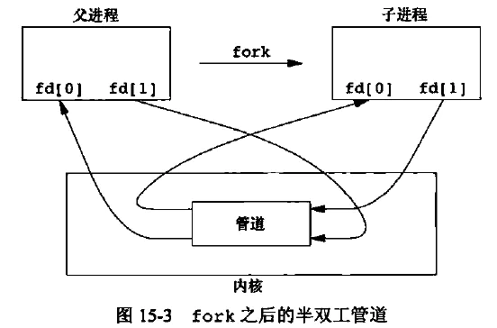
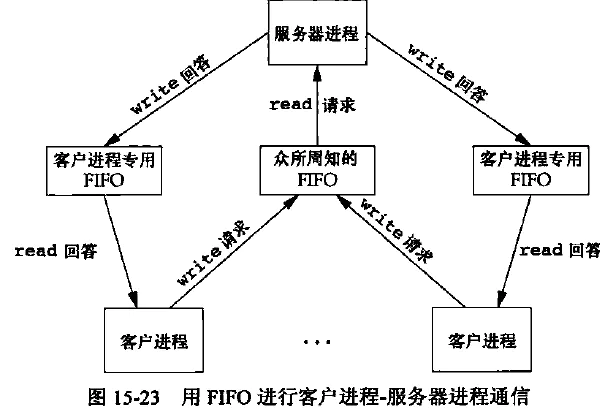
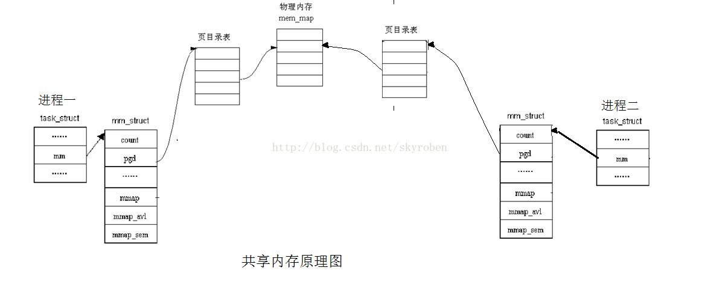

# 操作系统
[TOC]
## 概述
### 基本功能
- 进程/线程管理
- 存储管理
- 文件管理
- 设备管理
- 用户接口
### 特征
- 并发
- 共享
- 虚拟
- 随机
### CPU状态
用户态 =》 非特权指令
内核态 =》 特权指令
不同级别的指令能运行的指令集不同
用户态到内核态的唯一途径：中断、异常、陷入机制
内核态到用户态：设置程序状态字PSW
#### 中断、异常
- 随机的
- 自动处理
- 可恢复
硬件完成响应，软件完成处理过程
硬件取指令，执行完之后扫描有无中断，若有则保存寄存器信息到系统堆栈（主要是程序状态字PSW、程序计数器PC），根据中断码，查中断向量表，找到处理程序入口，设置PC。中断返回，恢复现场。
## 进程
正在执行的程序
**PCB**：OS 感知进程的方式，放在一起形成进程表
资源分配和调度的单元

CPU可以调度线程

### 进程的创建
- 因素
  - 系统初始化
  前台进程、后台进程、守护进程
  - 运行的进程执行了创建进程的系统调用
  Unix:**fork**  创建与调用进程**相同**的副本，子进程调用execve以运行新进程
  Windows: **CreateProcess**  既创建，又装入正确程序
  > 两步创建进程：在fork之后execve之前允许子进程处理其文件描述符，完成标准输入输出错误文件的**重定向**

  

  - 用户请求新进程
  双击
  - 一个批处理作业的初始化

### 进程的终止
- 正常退出
- 出错退出
- 严重错误
- 被其他进程杀死

### 进程的实现
OS维护一个进程表，每个进程占用一个表项（PCB）

中断过程：

### 线程
1. 并行实体拥有共享同一个**地址空间和所有可用数据**的能力，而多进程模型无法表达。
2. 比进程更容易创建和撤销
3. CPU和IO活动交叠进行，线程可以加快速度

- **用户级线程**
**用户空间维护线程表**，内核感知不到。用户提供调度算法，切换速度快。
但：CPU分配到进程，因此即使多核也不能将线程分配到不同CPU，且若一个线程阻塞，系统看不到线程，会将整个进程阻塞。
> 如果某个调用会阻塞，就提前通知。UNIX版本中，select允许调用者通知预期的read是否会阻塞。若安全才read调用，若阻塞则运行另一个线程。
- **核心级线程**
**操作系统既维护进程表又维护线程表**
线程表是进程状态信息的子集
创建或撤销线程的开销比较大
- **混合线程**
**内核负责调度，用户空间负责创建**。实现：多路复用，将用户线程对应到内核线程。

#### 线程调度
- 用户级线程
CPU调度整个进程，在进程运行期间，线程调度程序来控制执行，而线程不存在时钟中断，因此可以按照意愿运行。如果运行完了该进程的所有时间片，则CPU会选择另一进程。

- 内核级线程
就像调度进程一样。不同进程的线程可能会交替执行。

用户级线程的切换需要少量的机器指令，但一个线程阻塞在IO会将整个进程挂起，而内核级线程需要完整的上下文切换、修改内存影响、使高速缓存失效。

### 多线程和多进程
进程把相关的资源集中，**地址空间**存放程序正文、数据以及其他资源，包括打开文件、子进程、即将发生的定时器、信号处理程序等。

线程中有一个**程序计数器（记录接着要执行哪一条指令）**，**寄存器（保存线程当前的工作变量）**，**堆栈（记录执行历史，每一帧保存一个已调用但未返回的过程）**。

-  Windows 
创建进程的开销（时间）很大，因此 Windows 鼓励**多线程**。因此 Windows 多线程学习重点是要大量面对**资源争抢与同步**方面的问题。
-  Linux
创建进程的开销很小，因此 Linux 鼓励**多进程**。这带来新的问题是：进程间通信。因此，Linux 下的学习重点大家要学习**进程间通讯**的方法。
> 某些服务器框架依靠大量创建进程来干活，甚至是对每个用户请求就创建一个进程，这些服务器在 Windows 下运行的效率就会很差。

现代的体系，一般 CPU 会有**多个核心**，而多个核心可以同时运行多个不同的线程或者进程。当每个 CPU 核心运行一个进程的时候，由于**每个进程的资源都独立**，所以 CPU 核心之间切换的时候无需考虑上下文。 当每个 CPU 核心运行一个线程的时候，由于**每个线程需要共享资源**，所以这些资源必须从 CPU 的一个核心被**复制**到另外一个核心，才能继续运算，这占用了额外的开销。换句话说，**在 CPU 为多核的情况下，多线程在性能上不如多进程**。

- 如果一个程序既要处理大量运算、数据，又要能很好的显示界面、及时响应消息，多线程

- 当运行的个体之间（线程/进程）保持独立性，互补影响时（一个进程挂了，其它的还在），多进程

### 进程间通信
竞争：两个或两个以上的进程读写某些共享数据，最后的结果取决于进程运行的精确时序。
用于忙等待的锁称为自旋锁

#### IPC目的
1）**数据传输**：一个进程需要将它的数据发送给另一个进程，发送的数据量在一个字节到几兆字节之间。
2）**共享数据**：多个进程想要操作共享数据，一个进程对共享数据的修改，别的进程应该立刻看到。
3）**通知事件**：一个进程需要向另一个或一组进程发送消息，通知它（它们）发生了某种事件（如进程终止时要通知父进程）。
4）**资源共享**：多个进程之间共享同样的资源。为了作到这一点，需要内核提供锁和同步机制。
5）**进程控制**：有些进程希望完全控制另一个进程的执行（如Debug进程），此时控制进程希望能够拦截另一个进程的所有陷入和异常，并能够及时知道它的状态改变。

#### 基本模型
两种基本模型：消息队列  &&  共享内存

#### 方式

##### 管道
利用传输介质（内存或文件）
面向字符流写入读出，先入先出，自带互斥、同步机制
生命周期随进程
  - **无名管道**
  **半双工，只能在父子或兄弟进程间使用**
  没有磁盘节点，仅仅作为一个**内存对象**，用完就销毁了。因此没有显示的打开过程，实际在创建时自动打开，并且生成内存iNode，其内存对象和普通文件的一致，所以读写操作用的同样的接口，但是专用的。因为不能显式打开（没有任何标示），所以只能用在父子进程，兄弟进程， 或者其他继承了祖先进程的管道文件对象的两个进程间使用【具有共同祖先的进程】

  - **命名管道**
  **可在不相关进程间使用**
  在**文件目录树中有一个文件标示（FIFO）** 实际不占据磁盘空间，数据缓存在**内存**上。它与普通文件类似，都遵循打开，读，写，关闭的过程，但读写的内部实现和普通文件不同，和无名管道一样。

> 管道的实质是一个**内核缓冲区**，进程以先进先出的方式从缓冲区存取数据：管道一端的进程顺序地将进程数据写入缓冲区，另一端的进程则顺序地读取数据，该缓冲区可以看做一个循环队列，读和写的位置都是自动增加的，一个数据只能被读一次，读出以后再缓冲区都不复存在了。当缓冲区读空或者写满时，有一定的规则控制相应的读进程或写进程是否进入等待队列，当空的缓冲区有新数据写入或慢的缓冲区有数据读出时，就唤醒等待队列中的进程继续读写。

##### 系统IPC（信号量、消息队列、共享内存）

  - **消息队列**
进程不能访问别的进程的空间，OS设置消息缓冲区
陷入内核、复制消息、消息入队、复制消息
生命周期随**内核**
    - 与信号量相比，都以内核对象确保多进程访问同一消息队列。但消息队列**发送实际数据**，信号量进行进程同步控制。
    - 与管道相比，管道发送的数据没有类型，读取数据端无差别从管道中按照前后顺序读取；消息队列**有类型**，读端可以根据数据类型读取**特定**的数据。

  - **共享内存**
  同一块物理内存映射到进程的地址空间，**读写者解决互斥**
  采用共享内存进行通信的一个主要好处是**效率高**，因为进程可以**直接读写内存**，而不需要任何数据的拷贝，对于像管道和消息队里等通信方式，则需要再内核和用户空间进行**四次**的数据拷贝，而共享内存则只拷贝**两次**：一次从输入文件到共享内存区，另一次从共享内存到输出文件。
   > 消息队列、共享内存和管道都是**内核对象**，所执行的操作也都是**系统调用**，而这些数据最终是要存储在内存中执行的。因此不可避免的要经过4次数据的拷贝。但是共享内存不同，当执行mmap或者shmget时，会在**内存中开辟空间**，然后再将这块空间**映射**到用户进程的**虚拟地址空间**中，即返回值为一个指向逻辑地址的指针。当用户使用这个指针时，例如赋值操作，会引起一个从逻辑地址到物理地址的转化，会将数据直接写入对应的物理内存中，省去了拷贝到内核中的过程。当读取数据时，也是类似的过程，因此总共有两次数据拷贝。

  - **信号量** 
  它是一个**计数器**，记录资源能被多少个进程同时访问。用于控制多进程对临界资源的访问（同步)），并且是非负值。主要作为进程间以及同一进程的不同线程间的**同步手段**。
- **套接字**
- **远程过程调用**

## IO模型

- 阻塞IO
- 非阻塞IO
- IO多路复用
  - select
  - poll
  - epoll
- 异步IO

> [IO模型](https://zhuanlan.zhihu.com/p/115912936)