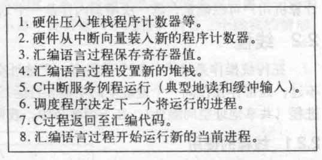
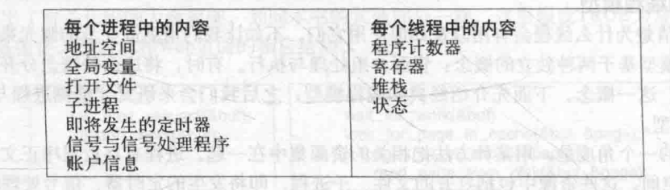

# 操作系统
[TOC]
## 概述
### 基本功能
- 进程/线程管理
- 存储管理
- 文件管理
- 设备管理
- 用户接口
### 特征
- 并发
- 共享
- 虚拟
- 随机
### CPU状态
用户态 =》 非特权指令
内核态 =》 特权指令
不同级别的指令能运行的指令集不同
用户态到内核态的唯一途径：中断、异常、陷入机制
内核态到用户态：设置程序状态字PSW
#### 中断、异常
- 随机的
- 自动处理
- 可恢复
硬件完成响应，软件完成处理过程
硬件取指令，执行完之后扫描有无中断，若有则保存寄存器信息到系统堆栈（主要是程序状态字PSW、程序计数器PC），根据中断码，查中断向量表，找到处理程序入口，设置PC。中断返回，恢复现场。
## 进程
正在执行的程序
**PCB**：OS 感知进程的方式，放在一起形成进程表
资源分配和调度的单元

CPU可以调度线程

### 进程的创建
- 因素
  - 系统初始化
  前台进程、后台进程、守护进程
  - 运行的进程执行了创建进程的系统调用
  Unix:**fork**  创建与调用进程**相同**的副本，子进程调用execve以运行新进程
  Windows: **CreateProcess**  既创建，又装入正确程序
  > 两步创建进程：在fork之后execve之前允许子进程处理其文件描述符，完成标准输入输出错误文件的**重定向**

  

  - 用户请求新进程
  双击
  - 一个批处理作业的初始化

### 进程的终止
- 正常退出
- 出错退出
- 严重错误
- 被其他进程杀死

### 进程的实现
OS维护一个进程表，每个进程占用一个表项（PCB）

中断过程：

### 线程
1. 并行实体拥有共享同一个**地址空间和所有可用数据**的能力，而多进程模型无法表达。
2. 比进程更容易创建和撤销
3. CPU和IO活动交叠进行，线程可以加快速度

- **用户级线程**
**用户空间维护线程表**，内核感知不到。用户提供调度算法，切换速度快。
但：CPU分配到进程，因此即使多核也不能将线程分配到不同CPU，且若一个线程阻塞，系统看不到线程，会将整个进程阻塞。
> 如果某个调用会阻塞，就提前通知。UNIX版本中，select允许调用者通知预期的read是否会阻塞。若安全才read调用，若阻塞则运行另一个线程。
- **核心级线程**
**操作系统既维护进程表又维护线程表**
线程表是进程状态信息的子集
创建或撤销线程的开销比较大
- **混合线程**
**内核负责调度，用户空间负责创建**。实现：多路复用，将用户线程对应到内核线程。

### 多线程和多进程
进程把相关的资源集中，**地址空间**存放程序正文、数据以及其他资源，包括打开文件、子进程、即将发生的定时器、信号处理程序等。

线程中有一个**程序计数器（记录接着要执行哪一条指令）**，**寄存器（保存线程当前的工作变量）**，**堆栈（记录执行历史，每一帧保存一个已调用但未返回的过程）**。

-  Windows 
创建进程的开销（时间）很大，因此 Windows 鼓励**多线程**。因此 Windows 多线程学习重点是要大量面对**资源争抢与同步**方面的问题。
-  Linux
创建进程的开销很小，因此 Linux 鼓励**多进程**。这带来新的问题是：进程间通信。因此，Linux 下的学习重点大家要学习**进程间通讯**的方法。
> 某些服务器框架依靠大量创建进程来干活，甚至是对每个用户请求就创建一个进程，这些服务器在 Windows 下运行的效率就会很差。

现代的体系，一般 CPU 会有**多个核心**，而多个核心可以同时运行多个不同的线程或者进程。当每个 CPU 核心运行一个进程的时候，由于**每个进程的资源都独立**，所以 CPU 核心之间切换的时候无需考虑上下文。 当每个 CPU 核心运行一个线程的时候，由于**每个线程需要共享资源**，所以这些资源必须从 CPU 的一个核心被**复制**到另外一个核心，才能继续运算，这占用了额外的开销。换句话说，**在 CPU 为多核的情况下，多线程在性能上不如多进程**。

- 如果一个程序既要处理大量运算、数据，又要能很好的显示界面、及时响应消息，多线程

- 当运行的个体之间（线程/进程）保持独立性，互补影响时（一个进程挂了，其它的还在），多进程

### 进程间通信
- **消息传递**
进程不能访问别的进程的空间，OS设置消息缓冲区
陷入内核、复制消息、消息入队、复制消息
- **共享内存**
同一块物理内存映射到进程的地址空间，读写者解决互斥
- **管道**
利用传输介质（内存或文件）
字符流写入读出，先入先出，互斥、同步
- **套接字**
- **远程过程调用**

## IO模型

- 阻塞IO
- 非阻塞IO
- IO多路复用
  - select
  - poll
  - epoll
- 异步IO

> [IO模型](https://zhuanlan.zhihu.com/p/115912936)