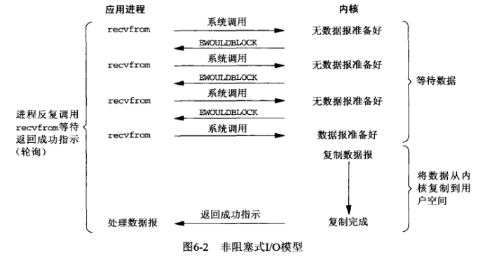

# 操作系统
[TOC]
## 概述
### 基本功能
- 进程/线程管理
- 存储管理
- 文件管理
- 设备管理
- 用户接口
### 特征
- 并发
- 共享
- 虚拟
- 随机
### CPU状态
用户态 =》 非特权指令
内核态 =》 特权指令
不同级别的指令能运行的指令集不同
用户态到内核态的唯一途径：中断、异常、陷入机制
内核态到用户态：设置程序状态字PSW
#### 中断、异常
- 随机的
- 自动处理
- 可恢复
硬件完成响应，软件完成处理过程
硬件取指令，执行完之后扫描有无中断，若有则保存寄存器信息到系统堆栈（主要是程序状态字PSW、程序计数器PC），根据中断码，查中断向量表，找到处理程序入口，设置PC。中断返回，恢复现场。
## 进程
正在执行的程序
**PCB**：OS 感知进程的方式，放在一起形成进程表
资源分配和调度的单元

CPU可以调度线程

### 进程的创建
- 因素
  - 系统初始化
  前台进程、后台进程、守护进程
  - 运行的进程执行了创建进程的系统调用
  Unix:**fork**  创建与调用进程**相同**的副本，子进程调用execve以运行新进程
  Windows: **CreateProcess**  既创建，又装入正确程序
  > 两步创建进程：在fork之后execve之前允许子进程处理其文件描述符，完成标准输入输出错误文件的**重定向**

  

  - 用户请求新进程
  双击
  - 一个批处理作业的初始化

### 进程的终止
- 正常退出
- 出错退出
- 严重错误
- 被其他进程杀死


### 进程的实现
OS维护一个进程表，每个进程占用一个表项（PCB）


中断过程：


### 线程
1. 并行实体拥有共享同一个**地址空间和所有可用数据**的能力，而多进程模型无法表达。
2. 比进程更容易创建和撤销
3. CPU和IO活动交叠进行，线程可以加快速度

- **用户级线程**
**用户空间维护线程表**，内核感知不到。用户提供调度算法，切换速度快。
但：CPU分配到进程，因此即使多核也不能将线程分配到不同CPU，且若一个线程阻塞，系统看不到线程，会将整个进程阻塞。
> 如果某个调用会阻塞，就提前通知。UNIX版本中，select允许调用者通知预期的read是否会阻塞。若安全才read调用，若阻塞则运行另一个线程。
- **核心级线程**
**操作系统既维护进程表又维护线程表**
线程表是进程状态信息的子集
创建或撤销线程的开销比较大
- **混合线程**
**内核负责调度，用户空间负责创建**。实现：多路复用，将用户线程对应到内核线程。


#### 线程调度
- 用户级线程
CPU调度整个进程，在进程运行期间，线程调度程序来控制执行，而线程不存在时钟中断，因此可以按照意愿运行。如果运行完了该进程的所有时间片，则CPU会选择另一进程。

- 内核级线程
就像调度进程一样。不同进程的线程可能会交替执行。

用户级线程的切换需要少量的机器指令，但一个线程阻塞在IO会将整个进程挂起，而内核级线程需要完整的上下文切换、修改内存影响、使高速缓存失效。


### 多线程和多进程
进程把相关的资源集中，**地址空间**存放程序正文、数据以及其他资源，包括打开文件、子进程、即将发生的定时器、信号处理程序等。

线程中有一个**程序计数器（记录接着要执行哪一条指令）**，**寄存器（保存线程当前的工作变量）**，**堆栈（记录执行历史，每一帧保存一个已调用但未返回的过程）**。


-  Windows 
创建进程的开销（时间）很大，因此 Windows 鼓励**多线程**。因此 Windows 多线程学习重点是要大量面对**资源争抢与同步**方面的问题。
-  Linux
创建进程的开销很小，因此 Linux 鼓励**多进程**。这带来新的问题是：进程间通信。因此，Linux 下的学习重点大家要学习**进程间通讯**的方法。
> 某些服务器框架依靠大量创建进程来干活，甚至是对每个用户请求就创建一个进程，这些服务器在 Windows 下运行的效率就会很差。

现代的体系，一般 CPU 会有**多个核心**，而多个核心可以同时运行多个不同的线程或者进程。当每个 CPU 核心运行一个进程的时候，由于**每个进程的资源都独立**，所以 CPU 核心之间切换的时候无需考虑上下文。 当每个 CPU 核心运行一个线程的时候，由于**每个线程需要共享资源**，所以这些资源必须从 CPU 的一个核心被**复制**到另外一个核心，才能继续运算，这占用了额外的开销。换句话说，**在 CPU 为多核的情况下，多线程在性能上不如多进程**。

- 如果一个程序既要处理大量运算、数据，又要能很好的显示界面、及时响应消息，多线程

- 当运行的个体之间（线程/进程）保持独立性，互不影响时（一个进程挂了，其它的还在），多进程


### 进程间通信
竞争：两个或两个以上的进程读写某些共享数据，最后的结果取决于进程运行的精确时序。
用于忙等待的锁称为自旋锁

#### IPC目的
1）**数据传输**：一个进程需要将它的数据发送给另一个进程，发送的数据量在一个字节到几兆字节之间。
2）**共享数据**：多个进程想要操作共享数据，一个进程对共享数据的修改，别的进程应该立刻看到。
3）**通知事件**：一个进程需要向另一个或一组进程发送消息，通知它（它们）发生了某种事件（如进程终止时要通知父进程）。
4）**资源共享**：多个进程之间共享同样的资源。为了作到这一点，需要内核提供锁和同步机制。
5）**进程控制**：有些进程希望完全控制另一个进程的执行（如Debug进程），此时控制进程希望能够拦截另一个进程的所有陷入和异常，并能够及时知道它的状态改变。

#### 基本模型
两种基本模型：消息队列  &&  共享内存


#### 方式

##### 管道
利用传输介质（内存或文件）
面向字符流写入读出，先入先出，自带互斥、同步机制
生命周期随进程
  - **无名管道**
    **半双工，只能在父子或兄弟进程间使用**
    没有磁盘节点，仅仅作为一个**内存对象**，用完就销毁了。因此没有显示的打开过程，实际在创建时自动打开，并且生成内存iNode，其内存对象和普通文件的一致，所以读写操作用的同样的接口，但是专用的。因为不能显式打开（没有任何标示），所以只能用在父子进程，兄弟进程， 或者其他继承了祖先进程的管道文件对象的两个进程间使用【具有共同祖先的进程】


  - **命名管道**
    **可在不相关进程间使用**
    在**文件目录树中有一个文件标示（FIFO）** 实际不占据磁盘空间，数据缓存在**内存**上。它与普通文件类似，都遵循打开，读，写，关闭的过程，但读写的内部实现和普通文件不同，和无名管道一样。


> 管道的实质是一个**内核缓冲区**，进程以先进先出的方式从缓冲区存取数据：管道一端的进程顺序地将进程数据写入缓冲区，另一端的进程则顺序地读取数据，该缓冲区可以看做一个循环队列，读和写的位置都是自动增加的，一个数据只能被读一次，读出以后再缓冲区都不复存在了。当缓冲区读空或者写满时，有一定的规则控制相应的读进程或写进程是否进入等待队列，当空的缓冲区有新数据写入或慢的缓冲区有数据读出时，就唤醒等待队列中的进程继续读写。

##### 系统IPC（信号量、消息队列、共享内存）

  - **消息队列**
进程不能访问别的进程的空间，OS设置消息缓冲区
陷入内核、复制消息、消息入队、复制消息
生命周期随**内核**
    - 与信号量相比，都以内核对象确保多进程访问同一消息队列。但消息队列**发送实际数据**，信号量进行进程同步控制。
    - 与管道相比，管道发送的数据没有类型，读取数据端无差别从管道中按照前后顺序读取；消息队列**有类型**，读端可以根据数据类型读取**特定**的数据。

  - **共享内存**
    同一块物理内存映射到进程的地址空间，**读写者解决互斥**
    采用共享内存进行通信的一个主要好处是**效率高**，因为进程可以**直接读写内存**，而不需要任何数据的拷贝，对于像管道和消息队里等通信方式，则需要再内核和用户空间进行**四次**的数据拷贝，而共享内存则只拷贝**两次**：一次从输入文件到共享内存区，另一次从共享内存到输出文件。
   > 消息队列、共享内存和管道都是**内核对象**，所执行的操作也都是**系统调用**，而这些数据最终是要存储在内存中执行的。因此不可避免的要经过4次数据的拷贝。但是共享内存不同，当执行mmap或者shmget时，会在**内存中开辟空间**，然后再将这块空间**映射**到用户进程的**虚拟地址空间**中，即返回值为一个指向逻辑地址的指针。当用户使用这个指针时，例如赋值操作，会引起一个从逻辑地址到物理地址的转化，会将数据直接写入对应的物理内存中，省去了拷贝到内核中的过程。当读取数据时，也是类似的过程，因此总共有两次数据拷贝。


  - **信号量** 
    它是一个**计数器**，记录资源能被多少个进程同时访问。用于控制多进程对临界资源的访问（同步)），并且是非负值。主要作为进程间以及同一进程的不同线程间的**同步手段**。
- **套接字**
- **远程过程调用**

## IO模型

### 阻塞IO
应用程序调用操作系统的recv函数，recv函数默认会等待数据接收完成并复制到用户空间之后返回结果，而如果数据没有准备好的话，那么应用程序就一直处于等待状态，直到有数据返回，此时应用程序的线程处于阻塞状态，无法执行其他操作


等待IO的时候阻塞当前线程，如服务端接受用户请求，会导致有几个请求就得开几个线程。

### 非阻塞IO
应用程序调用操作系统的recv函数，recv函数设置flags值为立即返回，那么如果内核发现没有数据时就立即返回，应用程序得到结果之后不再等待，而是先处理其他业务，然后轮训不断尝试获取数据，直到数据成功返回，此时应用程序不处于阻塞状态，可以先处理其他操作




以上模式都无法解决C10K问题（即单机1万个并发连接问题）。
并发情况下服务器很可能一瞬间会收到几十上百万的请求，这种情况下应用B就需要创建几十上百万的线程去读取数据，同时又因为应用线程是不知道什么时候会有数据读取，为了保证消息能及时读取到，那么这些线程自己必须不断的向内核发送recvfrom 请求来读取数据。


### IO多路复用

**一个线程检查n个socket**
多路复用IO调用select函数之后也会阻塞进程，但是**真正的IO操作线程没有被阻塞**，所以实质上是同步非阻塞IO


java中把需要检查的socket注册到selector中，主线程阻塞在selector的select方法中，当选择器某个socket就绪，唤醒主线程获取socket处理。底层是调用select
#### select
  每次调用都会引起内核态和用户态的切换，要传递需要检查的fd的id集合（socket也看做文件的一种）。没有就绪的socket时会阻塞调用线程，知道有数据才唤醒。


-  监听数小于1024
  因为传参fd_set是一个**bitmap位图**结构，默认1024bit。
  标记就绪socket，唤醒线程，线程还要遍历一遍找到已就绪的socket
- select是如何发现哪个socket已就绪呢？
    **中断。**
    socket有三部分，读缓冲、写缓冲和等待队列。
    1. 如果没有发现就绪的socket，会把当前进程加入到socket的**等待队列**中，调用线程会被切下CPU（**阻塞**）
    2. 当数据通过网线发送到网卡，网卡会通过**DMA写到内存**，这个过程CPU不参与。
    3. 数据传输完毕后触发**中断**程序，会把当前运行的进程切下CPU，执行自己的中断逻辑。
    4. 根据内存中的数据包分析属于哪个socket（根据端口号），把数据读到对应socket的读**缓冲区**。
    5. 之后检查该socket的**等待队列**，如果有等待的就切上CPU（唤醒）。
    6. 此时再执行select函数就发现有就绪的socket，做**标记**。
### poll
  **链表**，原理跟select差不多
#### epoll
- select和poll的缺点
  - 函数调用参数拷贝
  需要调用者提供需要监听的**fd集合**，且主线程while(true)调用，每次都要把这些参数在内核空间拷贝和用户空间之间拷贝。
  - 返回后不知道哪些socket就绪
  返回值是int型，只能表示有几个socket就绪或者出错，导致线程被唤醒后还要再一次系统调用，检查一遍是哪个socket就绪。

epoll在内核空间用一个数据结构**eventpoll**存储。eventpoll一块用来存放需要**监听的fd集合**，一块存放**已就绪的fd**。（红黑树）

提供两个函数**epoll_ctl和epoll_wait**。
  - epoll_ctl根据eventpoll-id增删改关心的fd（维护监听列表）
  - epoll_wait根据传入的eventpoll-id监听fd，直到有就绪才返回（维护就绪列表），调用的时候会epoll_event事件数组指针，返回前会把就绪的socket拷贝到对应的eventpoll对象中。默认阻塞，可以通过设置等待时间为0变为非阻塞。


epoll的过程与select类似，它会把**eventpoll对象**加入关注的socket等待队列里，在有就绪的socket后会把当前的socket加到eventpoll的就绪链表尾部，之后检查eventpoll的等待队列（eventpoll 还有一块空间是eventpoll 的等待队列，这个等待队列保存的就是调用epoll_wait的进程），如果有，则把对应进程唤醒。之后继续执行。


epoll有**EPOLL LT和EPOLL ET**两种触发模式，LT是默认的模式，ET是“高速”模式。
- LT（水平触发）模式
只要这个fd还有数据可读，**每次** epoll_wait都会返回它的事件，提醒用户程序去操作
> 水平触发（LT）的意思是只要存在高电平就一直触发事件，执行epoll_wait时，只要检测到有数据就返回。如果缓冲区中存在没有读完的数据，下一次执行epoll_wait还会继续触发事件，无需等到下一次数据来。
- ET（边缘触发）模式
**只会提示一次**，直到**下次再有数据流入**之前都不会再提示了，无 论fd中是否还有数据可读。所以在ET模式下，read一个fd的时候一定要把它的buffer读光，也就是说一直读到read的返回值小于请求值，或者 遇到EAGAIN错误。
> 边缘触发（ET）的意思是当电平出现变化的时候才触发事件，如果设置了边缘触发，执行epoll_wait时，内核检测到数据到达后立马返回到应用层。但是这仅仅只返回这一次，如果缓冲区中的数据没有读取完，再次执行epoll_wait时不会继续触发，需要下一次来数据了才能触发。也就是说，一次数据不会重复发送到应用层，不管你是否读完了。


还有一个特点是，epoll使用“事件”的就绪通知方式，通过epoll_ctl注册fd，一旦该fd就绪，内核就会采用类似callback的回调机制来激活该fd，epoll_wait便可以收到通知。

**epoll为什么要有EPOLL ET触发模式？**

如果采用EPOLL LT模式的话，系统中一旦有大量你不需要读写的就绪文件描述符，它们每次调用epoll_wait都会返回，这样会大大降低处理程序检索自己关心的就绪文件描述符的效率。
而采用EPOLL ET这种边沿触发模式的话，当被监控的文件描述符上有可读写事件发生时，epoll_wait()会通知处理程序去读写。如果这次没有把数据全部读写完(如读写缓冲区太小)，那么下次调用epoll_wait()时，它不会通知你，也就是它只会通知你一次，直到该文件描述符上出现第二次可读写事件才会通知你！！！这种模式比水平触发效率高，系统不会充斥大量你不关心的就绪文件描述符。

epoll内核和用户空间**共享一块内存**。


### 异步IO

> [IO模型](https://zhuanlan.zhihu.com/p/115912936)


## 零拷贝
linux系统中**用户空间和内核空间是隔离的**，用户空间程序不能随意的访问内核空间数据，只能通过**中断或者异常**的方式进入内核态，一般情况下，我们使用copy_to_user和copy_from_user等内核api来实现用户空间和内核空间的数据拷贝。
用户空间到内核空间的拷贝：


用户态进程正常访问内核态数据需要首先通过系统调用等方式陷入内核，进行数据拷贝，然后再次回到用户态，用户态和内核态直接的进出需要进行**2次上下文切换**。

### IO方式
1. 中断


①用户进程发起数据读取请求
②系统调度为该进程分配cpu
③cpu向io控制器(ide,scsi)发送io请求
④用户进程等待io完成，让出cpu
⑤系统调度cpu执行其他任务
⑥数据写入至io控制器的缓冲寄存器
⑦缓冲寄存器满了向cpu发出中断信号
⑧cpu读取数据至内存
- 缺点：中断次数取决于缓冲寄存器的大小
2. DMA


①用户进程发起数据读取请求
②系统调度为该进程分配cpu
③cpu向DMA发送io请求
④用户进程等待io完成，让出cpu
⑤系统调度cpu执行其他任务
⑥数据写入至io控制器的缓冲寄存器
⑦DMA不断获取缓冲寄存器中的数据（需要cpu时钟）
⑧传输至内存（需要cpu时钟）
⑨所需的全部数据获取完毕后向cpu发出中断信号
- 优点：减少cpu中断次数，不用cpu拷贝数据

**传统方式读取数据并进行网络传输**


①一个read系统调用后，DMA执行了一次数据拷贝，从**磁盘到内核**空间
②read结束后，发生第二次数据拷贝，由cpu将数据从**内核空间拷贝至用户空间**
③send系统调用，cpu发生第三次数据拷贝，由cpu将数据从**用户空间拷贝至内核空间**(socket缓冲区)
④send系统调用结束后，DMA执行第四次数据拷贝，将数据从**内核拷贝至协议引擎**
- 这四个过程中，**每个过程都发生一次上下文切换**

linux2.1中添加了“**数据被copy到Socket buffer**”的动作，于是不必切换回用户态，减少一次数据拷贝.

javaNIO可以直接调用transferTo()的方法，就可以实现这种现象。

- **内存缓冲数据**，主要是为了提高性能，内核可以预读部分数据，当所需数据小于内存缓冲区大小时，将极大的提高性能。

### 零拷贝的优化
 **零拷贝**是为了消除这个过程中冗余的拷贝


①DMA从磁盘拷贝至内核缓冲区
②cpu将数据从内核缓冲区拷贝至内核空间(socket缓冲区)
③DMA将数据从内核拷贝至协议引擎
- 这三个过程中共发生**2次上下文切换**，分别为发起读取文件和发送数据
- 发生了**三次数据拷贝**，其中有一次为cpu完成

在Linux2.4 内核做了优化，取而代之的是只包含关于数据的**位置和长度**的信息的描述符被追加到了socket buffer 缓冲区中。**DMA引擎直接把数据从内核缓冲区传输到协议引擎（protocol engine）**，从而消除了最后一次CPU copy。经过上述过程，数据只经过了2次copy就从磁盘传送出去了。这个才是真正的Zero-Copy
**带收集的DMA**


①DMA从磁盘拷贝至内核缓冲区
②将数据的位置和长度的信息的描述符增加至内核空间(socket缓冲区)
③DMA将数据从内核拷贝至协议引擎

> 注意：这里的零拷贝其实是根据内核状态划分的，在这里没有经过CPU的拷贝，数据在用户态的状态下，经历了零次拷贝，所以才叫做零拷贝，但不是说不拷贝。


### mmap  减少一次拷贝
像显存这样的设备如果也采用这样的方式就显的效率非常底下，因为用户经常需要在屏幕上进行绘制，要消除这种复制的操作就需要应用程序直接能够访问显存，但是显存被映射到**内核空间**，应用程序是没有访问权限的，如果显存也能同时映射到用户空间那就不需要拷贝操作了，于是字符设备中提供了**mmap接口**，可以**将内核空间映射的那块物理内存再次映射到用户空间**，这样用户空间就可以直接访问不需要任何拷贝操作，这就是0拷贝技术。

mmap将内核空间映射的物理内存重新映射到了用户空间，物理页面共享，不需要上下文切换。
核心函数：**remap_pfn_range函数**，会查找进程的页表，然后填写页表，会将映射的物理页帧号和访问权限填写到进程的对应页表中，这会遍历进程的各级页表找到最终的页表项然后进行填写。


- mmap只是在虚拟内存分配了地址空间，只有在**第一次访问**虚拟内存的时候才分配物理内存。
在mmap之后，并没有在将文件内容加载到物理页上，只上在虚拟内存中分配了地址空间。当进程在访问这段地址时，通过查找页表，发现虚拟内存对应的页没有在物理内存中缓存，则产生**缺页**，由内核的缺页异常处理程序处理，将文件对应内容，以页为单位加载到物理内存.
申请的同时建立物理页面到用户空间的映射，之后可以正常访问而不会产生缺页异常。


**3次拷贝，一次CPU两次DMA，4次上下文切换**

- 缺陷：

1）mmap 隐藏着一个陷阱，当 mmap 一个文件时，如果这个文件被另一个进程所截获，那么 write 系统调用会因为访问非法地址被 SIGBUS 信号终止，SIGBUS 默认会杀死进程并产生一个 coredump，如果服务器被这样终止了，那损失就可能不小了。

解决这个问题通常使用文件的租借锁：首先为文件申请一个租借锁，当其他进程想要截断这个文件时，内核会发送一个实时的 RT_SIGNAL_LEASE 信号，告诉当前进程有进程在试图破坏文件，这样 write 在被 SIGBUS 杀死之前，会被中断，返回已经写入的字节数，并设置 errno 为 success。

通常的做法是在 mmap 之前加锁，操作完之后解锁

#### mmap在write和read时会发生什么
- write
1.进程(用户态)将需要写入的数据直接copy到对应的mmap地址(内存copy)
2.若mmap地址未对应物理内存，则产生缺页异常，由内核处理
3.若已对应，则直接copy到对应的物理内存
4.由操作系统调用，将脏页回写到磁盘（通常是异步的）
因为物理内存是有限的，mmap在写入数据超过物理内存时，操作系统会进行页置换，根据淘汰算法，将需要淘汰的页置换成所需的新页，所以mmap对应的内存是可以被淘汰的（若内存页是"脏"的，则操作系统会先将数据回写磁盘再淘汰）。这样，就算mmap的数据远大于物理内存，操作系统也能很好地处理，不会产生功能上的问题。

- read


从图中可以看出，mmap要比普通的read系统调用少了一次copy的过程。因为read调用，进程是无法直接访问kernel space的，所以在read系统调用返回前，内核需要将数据从内核复制到进程指定的buffer。但mmap之后，进程可以直接访问mmap的数据(page cache)。

**mmap不适用于变长文件**

### sendfile
系统调用sendfile()在代表输入文件的描述符in_fd和代表输出文件的描述符out_fd之间传送文件内容（字节）。描述符out_fd必须指向一个套接字，而in_fd指向的文件必须是可以mmap的。这些局限限制了sendfile的使用，**使sendfile只能将数据从文件传递到套接字上**，反之则不行。
**数据传输只发生在内核空间**


**页缓存到socket缓存之间的拷贝如何减少？**
之前我们是把页缓存的数据拷贝到socket缓存中，实际上，我们仅仅需要把缓冲区**描述符**传到socket缓冲区，再把**数据长度**传过去，这样**DMA控制器**直接将页缓存中的数据打包发送到网络中就可以了。
> sendfile系统调用利用DMA引擎将文件内容拷贝到内核缓冲区去，然后将带有文件位置和长度信息的缓冲区描述符添加socket缓冲区去，这一步**不会将内核中的数据拷贝到socket缓冲区**中，DMA引擎会将内核缓冲区的数据拷贝到协议引擎中去，避免了最后一次拷贝。

**带DMA的sendfile**


- 收集拷贝功能是需要硬件以及驱动程序支持的。
- 只能适用于那些不需要用户态处理的应用程序。

### splice
splice 去掉 sendfile 的使用范围限制，可以用于任意两个文件描述符中传输数据。
但是 splice 也有局限，它使用了 Linux 的**管道缓冲机制**，所以，它的两个文件描述符参数中至少有一个必须是管道设备。


sendfile是将磁盘数据加载到kernel buffer后，需要一次CPU copy,拷贝到socket buffer。
而splice是更进一步，连这个CPU copy也不需要了，直接将两个内核空间的buffer进行set up pipe。

splice 提供了一种**流控制**的机制，通过预先定义的水印（watermark）来阻塞写请求，有实验表明，利用这种方法将数据从一个磁盘传输到另外一个磁盘会增加 30%-70% 的吞吐量，CPU负责也会减少一半。

缺陷：

1）同样只适用于不需要用户态处理的程序

2）传输描述符至少有一个是管道设备。


### 写时复制COW
在某些情况下，内核缓冲区可能被多个进程所共享，如果某个进程想要这个共享区进行 write 操作，由于 write 不提供任何的锁操作，那么就会对共享区中的数据造成破坏，写时复制就是 Linux 引入来保护数据的。

写时复制，就是当多个进程共享同一块数据时，如果其中一个进程需要对这份数据进行修改，那么就需要将其拷贝到自己的进程地址空间中，这样做并不影响其他进程对这块数据的操作，**每个进程要修改的时候才会进行拷贝**，所以叫写时拷贝。这种方法在某种程度上能够降低系统开销，如果某个进程永远不会对所访问的数据进行更改，那么也就永远不需要拷贝。

缺陷：

**需要 MMU 的支持**，MMU 需要知道进程地址空间中哪些页面是只读的，当需要往这些页面写数据时，发出一个异常给操作系统内核，内核会分配新的存储空间来供写入的需求。


#### JAVA 的 NIO
支持2种(内存映射mmap、sendfile)

- **NIO提供的mmap：MappedByteBuffer**
JavaNlO中 的**Channel (通道)就相当于操作系统中的内核缓冲区**，有可能是读缓冲区，也有可能是网络缓冲区，而**Buffer就相当于操作系统中的用户缓冲区**。
```java
MappedByteBuffer mappedByteBuffer = new RandomAccessFile(file, "r") 
                                 .getChannel() 
                                .map(FileChannel.MapMode.READ_ONLY, 0, len);
```
底层就是调用Linux mmap()实现的。mmap的文件映射，在full gc时才会进行释放。当close时，需要手动清除内存映射文件，可以反射调用sun.misc.Cleaner方法。

**NIO提供的sendfile：FileChannel.transferTo()**
直接将当前通道内容传输到另一个通道，没有涉及到Buffer的任何操作，NIO中 的Buffer是JVM堆或者堆外内存，但不论如何他们都是操作系统内核空间的内存
transferTo()的实现方式就是通过系统调用sendfile() (当然这是Linux中的系统调用)
```java
//使用sendfile:读取磁盘文件，并网络发送
FileChannel sourceChannel = new RandomAccessFile(source, "rw").getChannel();
SocketChannel socketChannel = SocketChannel.open(sa);
sourceChannel.transferTo(0, sourceChannel.size(), socketChannel);
```


### 文件系统
整体架构：


将硬盘按逻辑分成一个个的块，并可以以块为单位进行读写。文件存储在硬盘上，用位图表示占用与否。
给块 0 起个名字，叫块位图，之后这个块 0 就专门用来记录所有块的使用情况，不再用来存具体文件了。


通过文件名查找文件，需要记录文件名和块号的关系。
既然都要选一个地方记录文件名称了，不妨多记录一点我们关心的信息吧，比如文件大小、文件创建时间、文件权限等。
这些东西自然也要保存在硬盘上，我们选择用一个固定大小的空间，来表示这些信息，多大空间呢？128 字节。即iNode。


如果是普通文件，则这个 inode 所指向的数据块，就是文件本身原封不动的内容。
但如果是目录文件，则这个 inode 所指向的数据块，是存放inode的块。

每存入一个新的文件，不但要占用**一个块来存放这个文件本身**，还要占用**一个 inode** 来存放文件的这些**元信息**，并且这个 **inode 的所在块号这个字段，就指向这个文件所在的块号**。


如果一个 inode 为 128 字节，那么一个块就可以容纳 8 个 inode，我们可以将这些 inode 编上号。


同样，和块位图管理块的使用情况一样，我们也需要一个 **inode 位图**，来管理 inode 的使用情况。我们就把 inode 位图，放在 1 号块吧！
同时，我们把 inode 信息，放在 2 号块，一共存 8 条 inode，这样我们的 2 号块就叫做 inode 表。


如果文件很大，占用多个块，那么inode就要记录所有的块号。如果特别大，那么需要建立一级、二级索引等。


inode 数量不够时，我们是怎么得知的呢？是不是需要在 inode 位图中找，找不到了才知道不够用了？
同样，对于块数量不够时，也是如此。
要是有个**全局**的地方，来记录这一切，就好了，也方便随时调整.
那我们就再占用一个块来存储这些数据吧！由于他们看起来像是站在上帝视角来描述这个文件系统的，所以我们把它放在最开始的块上，并把它叫做**超级块**，现在的布局如下。


现在，块位图、inode 位图、inode 表，都是是固定地占据这块 1、块 2、块 3 这三个位置。
假如之后 inode 的数量很多，使得 inode 表或者 inode 位图需要占据多个块，怎么办？
或者，块的数量增多（硬盘本身大了，或者每个块变小了），块位图需要占据多个块，怎么办？
很简单，与超级块记录信息一样，这些信息也选择一个块来记录，就不怕了。那我们就选择紧跟在超级块后面的 1 号块来记录这些信息吧，并把它称之为**块描述符**。


