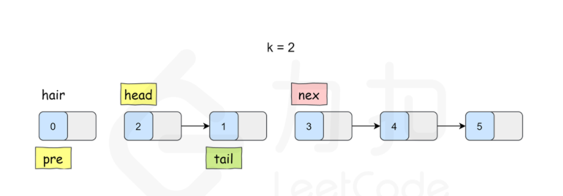
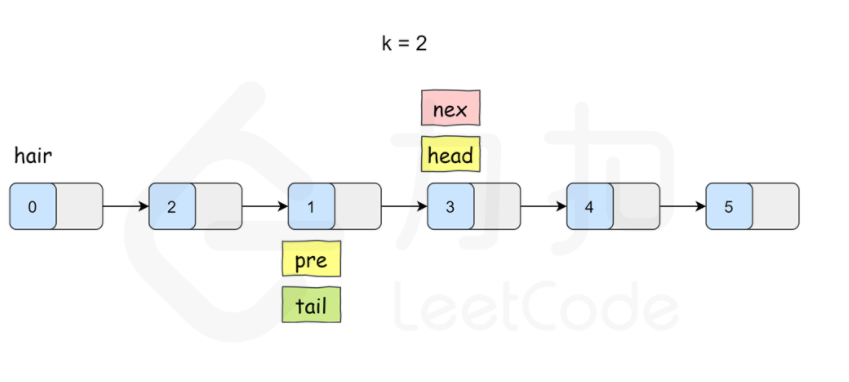
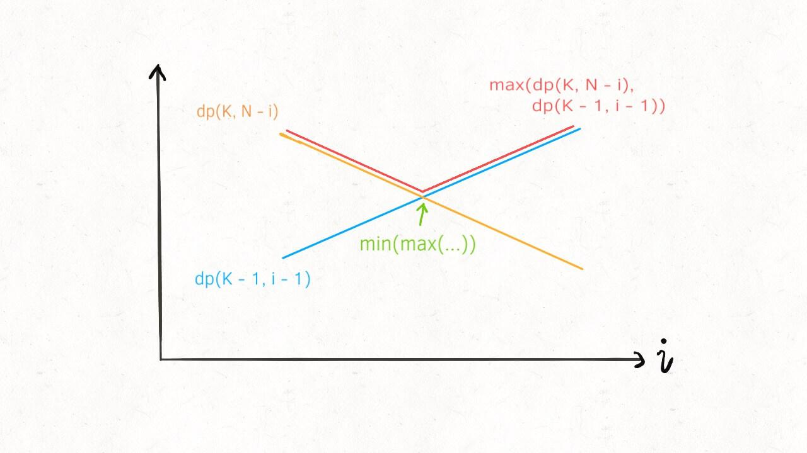
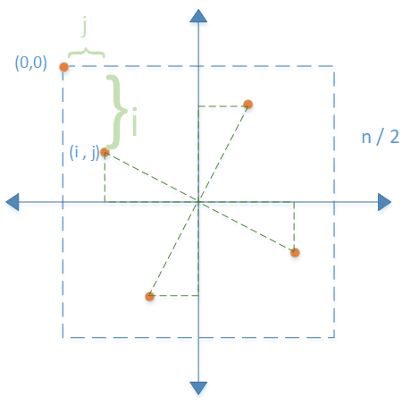
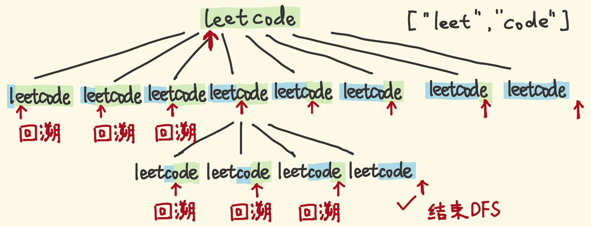

# leetcode 刷题笔记
[TOC]
## 题目
### [3.无重复的最长子串](https://leetcode-cn.com/problems/longest-substring-without-repeating-characters/)
<div id="3"></div>

#### 双指针
vector存储对应ASCII码字符是否出现，双指针，无重复时右指针右移，更新最大值 left - right.一旦hash[right] != 0，左指针左移并将对应字符hash位置次数--，直到hash[right] 为0.


### [25.K 个一组翻转链表](https://leetcode-cn.com/problems/reverse-nodes-in-k-group/)
<div id="25"></div>

#### 链表指针操作
组内进行反转操作，之后把头结点连到前面一组的末尾，把尾结点连到后面一组的首部。
指针：pre tail 
增加伪头指针phead
判断走k步期间tail是否提前结束（即不够k个结点），如果是直接返回phead->next.



### [215.数组中第K个最大元素](https://leetcode-cn.com/problems/kth-largest-element-in-an-array/)
<div id="215"></div>

#### 快排判断下标
基本思想：第K大那么排序后它的下标应该为size - k。
加速排序：随机选择一个下标与最右元素交换。
> random() % ( R - L  + 1) + L 返回的是[L,R]之间的数

以最右元素为标杆，将比它小的都放到左侧，最后再把最右元素与最终下标处交换，返回下标位置。
若下标位置在左侧，小了，在右区间搜索，否则在左区间搜索。

### [103.二叉树的锯齿形层序遍历](https://leetcode-cn.com/problems/binary-tree-zigzag-level-order-traversal/)
<div id="103"></div>

#### 双端队列+方向标记
层序遍历：队列
锯齿状：每层用一个双端队列，若正序则push_back，若逆序则push_front
每层结束后至标志位为反向

### [160.相交链表](https://leetcode-cn.com/problems/intersection-of-two-linked-lists/)
<div id="160"></div>

#### 双指针相遇即交点
基本思想： A和B两个链表长度可能不同，但是A+B和B+A的长度是相同的，所以遍历A+B和遍历B+A一定是同时结束。 如果A,B相交的话A和B有一段尾巴是相同的，所以两个遍历的指针一定会同时到达交点 如果A,B不相交的话两个指针就会同时到达A+B（B+A）的尾节点。

p、q指针分别指向A、B链表头，当走到尾部时指向另一个链表的首部，直到p=q即为交点

### [146.LRU 缓存机制](https://leetcode-cn.com/problems/lru-cache/)
<div id="146"></div>

#### 哈希表 + 双端链表
哈希表存储链表的引用，get时从哈希表取，并且将结点moveToHead，put时检查是否存在，存在则moveToHead并更新值，不存在时若有空闲则addToHead并加入哈希表，无空闲则删除尾结点并删除哈希表引用，再addToHead并加入哈希表。

### [15.三数之和](https://leetcode-cn.com/problems/3sum/)
<div id="15"></div>

#### 双指针
排序，固定一个数，左右指针移动。
去重：当前一个数=当前数时继续移动指针

### [121.买卖股票的最佳时机](https://leetcode-cn.com/problems/best-time-to-buy-and-sell-stock/)
<div id="121"></div>

#### 保存最低价格，计算最大差值

### [53.最大子序和](https://leetcode-cn.com/problems/maximum-subarray/)
<div id="53"></div>

#### 动规
dp[i] = max(dp[i - 1] + nums[i],nums[i]);

### [236.二叉树的最近公共祖先](https://leetcode-cn.com/problems/lowest-common-ancestor-of-a-binary-tree/)
<div id="236"></div>

#### 递归
p、q结点在root异侧则为root，p=root且q在左或右，则为p，同理，则为q。
递归，当碰到p或q结点时返回。
```c++
TreeNode* lowestCommonAncestor(TreeNode* root, TreeNode* p, TreeNode* q) {
        if(root == NULL || root == p || root == q)return root;
        TreeNode * L = lowestCommonAncestor(root->left,p,q);
        TreeNode * R = lowestCommonAncestor(root->right,p,q);
        if(L == NULL && R == NULL)return NULL;
        if(L == NULL)return R;
        if(R == NULL)return L;
        return root;
    }
```

### [42.接雨水](https://leetcode-cn.com/problems/trapping-rain-water/)
<div id="42"></div>

#### 双指针，低端移动，小于最高累加，否则更新最高
双指针，左右各记录最高柱子，当左柱低于右柱时，左指针右移，期间若小于左最高，累加差值，大于则更新左最高，反之右边对称操作。

### [54.螺旋矩阵](https://leetcode-cn.com/problems/spiral-matrix/)
<div id="54"></div>

#### 维护判断边界
用top right left bottom四个变量维护，当超出边界的时候结束

### [33.搜索旋转排列数组](https://leetcode-cn.com/problems/search-in-rotated-sorted-array/)
<div id="33"></div>

#### 二分
二分搜索，当左边有序（**num[0]** <= nums[mid] ）: 若target 在 nums[0]和nums[mid]的值之间，r = mid - 1，否则在右边搜索 l = mid + 1。 右边有序（nums[mid] <= **nums[n - 1]**）同理。


### [200.岛屿数量](https://leetcode-cn.com/problems/number-of-islands/)
<div id="200"></div>

#### dfs
深度优先搜索，从有岛屿（1）的**每一个地方**开始，把与之相连的置为0. 
若题目不允许修改原数组，要增加标记数组。

### [46.全排列](https://leetcode-cn.com/problems/permutations/)
<div id="46"></div>

#### dfs 
有标记数组：标记访问过的元素为true，从0开始遍历
```c++
 for(int i = 0; i < n; ++i){
            if(mark[i])continue;
            cur.push_back(nums[i]);
            mark[i] = true;
            dfs(nums,cur,mark,k+1,n);
            cur.pop_back();
            mark[i] = false;
        }
```
无标记数组：从当前深度k开始，每次交换nums[k] 和 nums[i]，重置状态再交换回来。
```c++
for(int i = k; i < n; ++i){
            
            swap(nums[k],nums[i]);
            dfs(nums,k+1,n);
            swap(nums[k],nums[i]);
        }
```

### [47.全排列II](https://leetcode-cn.com/problems/permutations-ii/)
<div id="47"></div>

#### 去重的常用解法：排序，不是第一个且与前一个相等时continue
```c++
 for(int i = 0; i < n; ++i){
            if(mark[i])continue;
            //mark[i-1]为true时说明相等的那个数在当前选取列表中，那么是否选取当前数字不会造成重复情况
            //当mark[i]为false时，是否选取当前数字和其重复的数字的情况才是重复判断的，地位等同的，而前一个数的情况已经判断过，所以跳过
            if(i != 0 && nums[i] == nums[i - 1] && !mark[i - 1])continue;
            mark[i] = 1;
            res.push_back(nums[i]);
            backtrack(nums,n,k+1,mark,res,ans);
            res.pop_back();
            mark[i] = 0;

        }
```

### [39.组合总和](https://leetcode-cn.com/problems/combination-sum/)
<div id="39"></div>

#### 组合问题，不关心顺序，顺序不同不是不同的答案。排序后设置搜索起点。
```c++
for(int i = k; i < n; ++i){
            if(target < candidates[i])break;
            res.push_back(candidates[i]);
            //注意这里从i位置开始搜索，也就是当前数的位置
            //排列问题是从下一层开始搜索，即k+1
            backtrack(candidates,n,i ,target - candidates[i],res,ans);
            res.pop_back();
        }
```

### [40.组合总和II](https://leetcode-cn.com/problems/combination-sum-ii/)
<div id="40"></div>

#### 多了一个去重，搜索起始位置变为当前数之后的位置


### [60.排列序列](https://leetcode-cn.com/problems/permutation-sequence/)
<div id="60"></div>

#### 将全排列求解过程看做一颗树，要定位第k个排列，则子树小于k的一定不包含答案
在每一层，基于该结点的子节点个数为(n - depth)!，同一层的兄弟节点，其子树规模相等，由于多次计算阶乘，先计算并把结果保存在数组中。
```c++
    void backtrack(int n,int k,int depth,vector<int>&res,vector<int>&mark){
        if(res.size() == n)return;
        //当前子树的规模
        int cnt = F[n - depth ];
        for(int i = 1; i <= n;++i){
            if(mark[i])continue;
            //子树规模<k，必然不在当前分支中，k减去子节点个数，判断下一个分支
            if(cnt < k){
                //同一层，叶子节点数相等
                k -= cnt;
                continue;
            }
            //必然在当前分支内
            mark[i] = true;
            res.push_back(i);
            //求解下一层深度
            backtrack(n,k,depth + 1,res,mark);
            //直接返回，不再回溯
            return;

        }
    }
```
实际上没有回头恢复状态的过程，只有剪枝和深度遍历。


### [93.复原IP地址](https://leetcode-cn.com/problems/restore-ip-addresses/)
#### 回溯每次三位一判断，善用substr()函数，剪枝：0只能单独作为一段，每段不能大于255
```c++
void backtrack(string s, int n, int index,int seg,vector<string> &ans,string &res){
       if(index == n || seg == 4){
           //遍历完且4段则是结果之一
           if(index == n && seg == 4){
               //最后一位多一个‘.’，要截掉
               ans.push_back(res.substr(0,res.size() - 1));
           }
           //否则不计入，但也结束遍历
           return;
       }
       //一个ip段
       for(int i = 1; i <= 3 ;++i){
           if(index + i > n)return;
           //0特判
           if(s[index] == '0' && i != 1)return;
           if(i == 3 && s.substr(index,i) > "255")return;
           res += s.substr(index,i);
           res.push_back('.');
           backtrack(s,n,index + i,seg + 1,ans,res);
           res = res.substr(0,res.size() - i - 1);
       }
       
    }
```

### [130.被围绕的区域](https://leetcode-cn.com/problems/surrounded-regions/)
#### 不方便直接查找被围绕的区域，又知直接或间接与边缘的‘O’相连的一定不会被改变，那么从边缘O深搜，与之相连的都打上标记，最后遍历图，改变没有标记的O


### [124.二叉树中的最大路径和](https://leetcode-cn.com/problems/binary-tree-maximum-path-sum/)
<div id="124"></div>

#### 递归更新最大值，返回左右子树最大值+root
递归，每层的最大值等于左右结点的最大值和当前结点值的和（因为可以从左子树-> 根 -> 右子树），递归返回值为当前值加max（左子树，右子树），因为只能选择一条路径。

### [23.合并K个升序链表](https://leetcode-cn.com/problems/merge-k-sorted-lists/)
<div id="23"></div>

#### 归并，两两合并
先写出合并两个有序链表的函数，然后按照归并算法两两合并。
```c++
ListNode * merge(vector<ListNode *> & list ,int l,int r){
        if(l == r)return list[l];
        if(l > r)return nullptr;
        int mid = (l + r) / 2;
        return mergeTwoLists(merge(list,l,mid),merge(list,mid + 1,r));
    }
```

### [76.最小覆盖子串](https://leetcode-cn.com/problems/minimum-window-substring/)
<div id="76"></div>

#### 双指针
双指针，数组存储目标子串每个字符的出现次数，变量count保存还需几个字符，右指针扩张时判断count是否为0，为0则移动左指针（当l<r且当前字符多余时），之后更新最小值。

### [143.重排链表](https://leetcode-cn.com/problems/reorder-list/)
<div id="143"></div>

#### 快慢指针找到中点，反转后半部分，合并前后两部分

### [31.下一个排列](https://leetcode-cn.com/problems/next-permutation/)
<div id="31"></div>

#### 从尾部起找到第一个升序对（i,j），再从尾部起找到第一个大于i的数，交换并将i之后重排为升序

### [300.最长递增子序列](https://leetcode-cn.com/problems/longest-increasing-subsequence/)
<div id="300"></div>

#### 动规
dp[i] : 以nums[i] 结尾的最长子序列的长度
dp[i] = max(dp[j] + 1)  if i > j && nums[i] > nums[j]  
#### 贪心+二分
要使上升子序列尽可能的长，则我们需要让序列上升得尽可能慢，因此我们希望每次在上升子序列最后加上的那个数尽可能的小。
基于上面的贪心思路，我们维护一个数组 d[i] ，表示**长度为 i 的最长上升子序列的末尾元素的最小值**，用len 记录目前最长上升子序列的长度，起始时 len为 1，d[1] = nums[0]。
同时我们可以注意到 d[i] 是关于 i **单调递增**的。
- 设当前已求出的最长上升子序列的长度为 len（初始时为 1），从前往后遍历数组nums，在遍历到 nums[i] 时：

  - 如果nums[i]>d[len] ，则直接加入到 dd 数组末尾，并更新 len=len+1；

  - 否则，在 d数组中二分查找，找到第一个比 nums[i] 小的数 d[k] ，并更新 d[k+1]=nums[i]。

### [84.柱状图中最大的矩形](https://leetcode-cn.com/problems/largest-rectangle-in-histogram/)
<div id="84"></div>

#### 单调栈
以每个柱子为扩展点，向左向右划等高线，一旦遇到比它低的就不能再扩展，以此柱为中心的最大矩形就确定了。即要寻找以当前柱为中心的，**左右两边第一个低于它的柱子**。
从前向后遍历，当后面的柱子更高的时候，当前结点仍能扩展。
维护一个单调递增的栈，当当前数小于栈顶，则栈顶元素左右第一个小数找到，左右边界确定，更新最大矩形。出栈直到当前数大于栈顶。
遍历结束后，若栈非空，则依次出栈。出栈过程中，左边界确定为栈顶，右边界为数组末尾。
```c++
 int largestRectangleArea(vector<int> &heights) {
        unsigned long size = heights.size();
        if (size == 1) {
            return heights[0];
        }
        int res = 0;
        stack<int> stk;
        for (int i = 0; i < size; ++i) {
            while (!stk.empty() && heights[stk.top()] > heights[i]) {
                int length = heights[stk.top()];
                stk.pop();
                int weight = i;
                if (!stk.empty()) {
                    weight = i - stk.top() - 1;
                }
                res = max(res, length * weight);
            }
            stk.push(i);
        }
        while (!stk.empty()) {
            int length = heights[stk.top()];
            stk.pop();
            int weight = size;
            if (!stk.empty()) {
                weight = size - stk.top() - 1;
            }
            res = max(res, length * weight);
        }
        return res;
    }
```

> **哨兵**：可以在原数组两端加入高度为0的元素当做哨兵，简化代码。这样栈中至少有两个元素，且不会存在遍历结束之后仍有有效元素残留在栈中的情况。不用对栈是否非空做出分类讨论。

### [739.每日温度](https://leetcode-cn.com/problems/daily-temperatures/)
<div id="739></div>
#### 单调递减栈

### [51.N皇后](https://leetcode-cn.com/problems/n-queens/)
#### 按行dfs，内部按列循环，维护列、主对角线(i -j相等)、副对角线(i + j相等)数组

### [71.简化路径](https://leetcode-cn.com/problems/simplify-path/)
####  按'/'分割字符串，挨个判断。
若是"./"或者""则忽略，若是"../"当有上级目录时弹出上级，若是其他情况入栈。
> getline(输入流，存储区，分隔符)
```c++
class Solution {
public:
    string simplifyPath(string path) {
        stringstream str(path);
        vector<string> ans;
        string cur;
        while(getline(str,cur,'/')){
            if(cur != "" && cur != "."){
                if(cur != ".."){
                    ans.push_back(cur);
                }
                else if(!ans.empty()){
                    ans.pop_back();
                }
            }
        }
        string res = "";
        if(!ans.empty()){
            for(string s : ans){
                res.append("/");
                res.append(s);
            }
            return res;
        }
        return "/";
    }
};
```
[C++使用stringstream和getline实现split](https://blog.csdn.net/qq_36743440/article/details/91999615)

### [470.用rand7实现rand10](https://leetcode-cn.com/problems/implement-rand10-using-rand7/)
####  (randX() - 1)*Y + randY() 可以等概率的生成[1, X * Y]范围的随机数


  思路：
  
  （1）由大的随机数 生成小的随机数是方便的，如 rand10 -> rand7
       只需要用 rand10 生成等概率的 1 ~ 10 ，然后判断生成的随机数 num ，如果 num <= 7 ，则返回即可
       
  （2）如何由小的随机数生成大的随机数呢？
       考虑这样一个事实：
       randX() 生成的随机数范围是 [1...X]
      **(randX - 1) * Y + randY() 可以等概率的生成的随机数范围是 [1, X*Y]**
      因此， 可以通过 (rand7 - 1) * 7 + rand7() 等概率的生成 [1...49]的随机数
      我们可以选择在 [1...10] 范围内的随机数返回。
   
  （3）上面生成 [1...49] 而 我们需要 [1...10]，[11...49]都要被过滤掉，效率有些低
       可以通过减小过滤掉数的范围来提高效率。
       比如我们保留 [1...40]， 剩下 [41...49]
       为什么保留 [1...40] 呢？ 因为对于要生成 [1...10]的随机数，那么可以等概率的转换为 1 + num % 10 , suject to num <= 40
       **因为 1 ... 40 可以等概率的映射到 [1...10]**

那么如果生成的数在 41...49 怎么办呢？，这些数因为也是等概率的。
我们可以重新把 41 ... 49 通过 num - 40 映射到 1 ... 9，可以把 1...9 重新看成一个**通过 rand9 生成 rand10 的过程。**
      **(num - 40 - 1) * 7 + rand7() -> [1 ... 63]**
       if(num <= 60) return num % 10 + 1;
       类似的，[1...63] 可以 划分为 [1....60] and [61...63]
       [1...60] 可以通过 1 + num % 10 等概率映射到 [1...10]
       而 [61...63] 又可以重新重复上述过程，先映射到 [1...3]
       **然后看作 rand3 生成 rand10**       
       (num - 60 - 1) * 7 + rand7() -> [1 ... 21]
       if( num <= 20) return num % 10 + 1;       
> 注意：这个映射的范围需要根据**待生成随机数**的大小而定的。比如我要用 rand7 生成 rand9
       (rand7() - 1) * 7 + rand7() -> [1...49]
       则等概率映射范围调整为 [1...45]， 1 + num % 9
       if(num <= 45) return num % 9 + 1;

```c++
class Solution {
public:
    int rand10() {
        while(true){
        //1~49
        int num = (rand7() - 1) * 7 + rand7();
        if(num <= 40){
            //这里加一是防止出现0
            return 1 + num  % 10;
        }
        //1~63
        num = (num - 40 - 1) * rand7() + rand7();
        if(num <= 60) {
            return 1 + num  % 10;
        }
        //1~21
        num = (num - 60 - 1) * rand7() + rand7();
        if(num <= 20){
            return 1 + num  % 10;
        }
        }
    }
};
```


### [198.打家劫舍I](https://leetcode-cn.com/problems/house-robber/)
#### 动态规划，每个房子分为劫或者不劫两种状态，dp[i] = max{dp[i - 2] + v[i],dp[i - 1]}

### [213.打家劫舍II](https://leetcode-cn.com/problems/house-robber-ii/)
#### 变成环形之后，因为首部是否取影响到尾部，那么分两种情况，取第一个，和不取第一个。取第一个，则必然不取最后一个，动规的区间是(0,length - 2)。不取第一个，则动规区间是(1,length - 1)。最后取两者最大值。

### [337.打家劫舍III](https://leetcode-cn.com/problems/house-robber-iii/)
#### 二叉树结构，每个节点也有两种状态，分别可以转移自子节点：偷，则子节点不能偷：dp1 = l.dp0 + r.dp0 + v[i];不偷，则子节点取最大值：dp0 = max(max(l.dp0,l.dp1) + max(r.dp0,r.dp1)，最后取两者最大值


### [887.鸡蛋掉落](https://leetcode-cn.com/problems/super-egg-drop/)
#### 动规+二分  或  转化状态定义
1. **dp[k][n] = m 表示k个鸡蛋n层楼，最少扔m次能完全确定f的值。**
  - 假设只有一个鸡蛋，那么只能从第一层开始试，直到第x层它碎了，就能确定f = x - 1.（因为如果第一次就从中间某层扔，万一碎了，无法确定f具体是哪，只能把范围缩减到x-1. ）最坏情况下，f = n，即到最高层都不碎，那么我们需要扔n次。
  - 也就是说，**无论f是多少，都可以在少于等于m次操作后确定它的值，哪怕是最坏情况**。多于m次没有必要，而少于m次，可能出现无法确定的情况。
  - 现在假设有k个鸡蛋，先选择在x层扔下去，操作一次，在这层碎了，说明f < x，状态转移到dp[k-1][x-1] ;没有碎，f >= x，状态转移到dp[k][n-x].那么最坏情况要取这两种状态的最大值，加上在这层扔的一次，即dp[k][x] = max(dp[k-1][x-1],dp[k][n-x]) + 1.
  - 但是究竟在哪一层扔呢？哪一层能尽快确定f，也就是在哪层扔第一次能使得操作次数最少呢？
  **枚举。**
  每一层都试试当做第一次扔，哪一层操作次数最少，就在哪一层扔第一次。令x从1取到n，取最小值作为本次状态的操作数。
  ```c++
   for(int i = 2; i <= k; ++i){
            for(int j = 1; j <= n; ++j){
                int maxCur = n*n;
                //在第x层扔
                for(int x = 1; x <= j; ++x){
                    maxCur = min(maxCur , 1+max(dp[i - 1][x - 1],dp[i][j-x]));
                }
                dp[i][j] = maxCur;
            }
        }
  ```
2. 方法1中，在确定第一次从哪一层开始时，我们遍历了所有的楼层去找最小值，即固定k和n的状态下，枚举x。但是仔细看这个状态转移：dp[k][x] = max(dp[k-1][x-1],dp[k][n-x]) + 1.  k和n不变的情况下，随着x的增大，x-1增大,n-x减小。且可以确定，**当楼层数变高时，需要最少的操作次数不可能变少**。那么这个递推方程是关于x单调递增的。则两个状态，一个在增大，一个在变小，要使它们的最大值最小，就要取交点，即dp[k-1][x-1] == dp[k][n-x]的时候。



也就是：
```c++
for (int i = 1; i <= N; i++) {
    if (dp(K - 1, i - 1) == dp(K, N - i))
        return dp(K, N - i);
}
```
那就可以把中间那层枚举x变成二分查找了
```c++
 int res = INT_MAX;
        //用二分搜索代替线性搜索
        int lo = 1, hi =  N;
        while (lo <= hi){
            int mid = (lo + hi) / 2;
            int broken = dp[K - 1, mid - 1] ;// 碎
            int not_broken = dp[K, N - mid] ;// 没碎
            // res = min(max(碎，没碎) + 1)
            if (broken > not_broken){
                hi = mid - 1;
                res = min(res, broken + 1);
            }
            else
            {
                lo = mid + 1;
                res = min(res, not_broken + 1);
            }
```

3. 换个思路
之所以遍历楼层x是因为我们的状态方程与楼高是有关系的，那么把它变成无关的：
假设给定K个鸡蛋，最多扔T次就能确定出f，那么楼高是？
> - 1个鸡蛋，扔1次：
在 1 层扔，碎了，因为楼层高于 F 才会碎，所以 F < 1 。又因为 0 <= F <= N ，所以能确定 F = 0；
在 1 层扔，没碎，因为从 F 楼层或比它低的楼层落下的鸡蛋都不会碎，所以 F >= 1 。
此时，若只有一层楼，因为 0 <= F <= N ，所以能确定 F = 1。楼层再高，这种状态就无法确定F了。
> - 1个鸡蛋，扔2次：
在 1 层扔，碎了，F < 1，所以确定 F = 0
在 1 层扔，没碎，但在 2 层扔，碎了， F >= 1 && F < 2，所以确定 F = 1
在 2 层扔，没碎，F >= 2，此时，只有N = 2 才能确定 F = 2

也就是把状态方程变成：**dp[k][m] = n 表示k个鸡蛋，最多扔m次能确定f，此时楼高n。**
终止条件就变成了：dp[k][m]  == n时，返回m。
  - 这个状态怎么转移呢？
假设我们有k个鸡蛋第m步时，在第X层扔鸡蛋。这时候，会有两种结果，鸡蛋碎了，或者没碎。
如果鸡蛋没碎，我们接下来会在更高的楼层扔，最多能确定 X + dp[k][m-1] 层的结果；
如果鸡蛋碎了，我们接下来会在更低的楼层扔，最多能确定 Y + dp[k-1][m-1]层的结果 (假设在第X层上还有Y层)。
因此，这次扔鸡蛋，我们最多能测出 dp[k-1][m-1] (摔碎时能确定的层数) + dp[k][m-1] (没摔碎时能确定的层数) + 1 (本层) 层的结果。
则：
dp[k][0] = 0
dp[1][m] = m (m > 0)
dp[k][m] = dp[k-1][m-1] + dp[k][m-1] + 1 (k > 0, m>0)

### [113.路径总和II](https://leetcode-cn.com/problems/path-sum-ii/)
#### 从根到叶节点总和为目标和。回溯。
树的遍历，遍历到叶节点时判断是否加入结果集，注意状态恢复。

### [437.路径总和III](https://leetcode-cn.com/problems/path-sum-iii/)
#### 从某结点向下路径和为目标和。回溯+前缀和
基本思路：当前结点的前缀和curSum(包含当前结点)，如果在之前经过的结点中有前缀和为target - curSum的，那么他们之间的路径的和就是target。
用一个map保存前缀和，key为前缀和,value为有几条路，每次进入和离开结点的时候要更新和恢复状态。
**注意**开始要把前缀和为0的置1.
```c++

    void dfs(TreeNode * root,int target,int sum){
        if(root == nullptr) return ;
        int cur = sum + root->val;
        if(prefix.find(cur - target) != prefix.end()){
            ans += prefix[cur - target];
        }
        prefix[cur]++;
        dfs(root->left,target,cur);
        dfs(root->right,target,cur);
        prefix[cur]--;
        return;
    }

```
### [114.二叉树展开为链表](https://leetcode-cn.com/problems/flatten-binary-tree-to-linked-list/)
#### 后序遍历，把右指针指向pre

### [剑指 Offer 51. 数组中的逆序对](https://leetcode-cn.com/problems/shu-zu-zhong-de-ni-xu-dui-lcof/)
#### 本质：归并排序。
在合并的过程中，左半边要并入时，即arr[l] <= arr[r]，又知在r之前的位置上的元素已经并入，即arr[l]大于r之前的元素，而l位置在前面，说明：在前面的元素大于在后面的元素，产生逆序对，个数为 r之前的元素个数。

```c++
class Solution {
public:
int ans = 0;
    int reversePairs(vector<int>& nums) {
        int n = nums.size();
        vector<int> tmp(n,0);
        merge(nums,tmp,0,n-1);
        return ans;
    }

    void merge(vector<int> & nums,vector<int>& tmp, int start,int end){
        if(start >= end)return;
        int mid = (start + end) / 2;
        merge(nums,tmp, start,mid);
        merge(nums,tmp,  mid + 1, end);
        mergeSort(nums,tmp,start,end,mid);
    }
    void mergeSort(vector<int> &nums,vector<int> &tmp, int start,int end,int mid){
        int i = start,j = mid + 1;
        int idx = 0;
        while(i <= mid && j <= end){
            if(nums[i] <= nums[j]){
                ans += (j - (mid + 1));
                tmp[idx++] = nums[i++];
            }
            else {
                tmp[idx++] = nums[j++];
            }
        }
        while(i <= mid){
            ans += (j - (mid + 1));
            tmp[idx++] = nums[i++];
        }
        while(j <= end){
            tmp[idx++] = nums[j++];
        }
        int k = 0;
        while(start <= end){
            nums[start++] = tmp[k++];
        }
    }
};
```


### [264.丑数II](https://leetcode-cn.com/problems/ugly-number-ii/)
#### 动态规划
第i 个丑数来自之前某个丑数乘以2或3或5，如果它来自第x个丑数乘以某个factor，即dp[i] = dp[x] * factor，那么下一个丑数一定不可能再来自于x之前的丑数乘以这个factor，因为dp数组是递增的，dp[0...x] * factor <= dp[x] * factor ，先标记住这个位置，下一次与该factor相乘要从这个位置之后的元素中选择。但下一个丑数仍可能来自于之前的丑数与其他因子相乘，基于同样的原理，我们可以为每个factor都维护一个指针，也就是标记与2、3、5相乘最小位置的三个指针。同样的，在得到当前丑数之后，更新对应的最小位置。
```c++
 int nthUglyNumber(int n) {
        vector<int>dp(n+1);
        int p2 = 1,p3 = 1,p5 = 1;
        dp[1] = 1;
        for(int i = 2; i <= n;++i){
            int num2 = dp[p2] * 2,num3 = dp[p3] * 3,num5 = dp[p5] * 5;
            dp[i] = min(num2,min(num3,num5));
            //注意下面不能用else if，如果相等指针都要移动
            if(dp[i] == num2) p2++;
            if(dp[i] == num3) p3++;
            if(dp[i] == num5) p5++;
        }
        return dp[n];
    }
```

### 堆排序
[堆排序演示](http://www.benfrederickson.com/heap-visualization/)
```c++
/**
 * 下沉操作
 * @param {array} arr 待调整的堆 
 * @param {number} parentIndex 要下沉的父节点
 * @param {number} length 堆的有效大小
 */
void downAdjust(vector<int>&arr, int parentIndex, int length) {
    // temp保存父节点的值，用于最后赋值
    int temp = arr[parentIndex]
    int childrenIndex = 2 * parentIndex + 1
    while(childrenIndex < length) {
        // 如果有右孩子，且右孩子大于左孩子的值，则定位到右孩子
        // 这里其实是比较左、右子树的大小，选择更大的
        if (childrenIndex + 1 < length && arr[childrenIndex + 1] > arr[childrenIndex]) {
            childrenIndex++
        }
        // 如果父节点大于任何一个孩子得值，则直接跳出
        if (temp >= arr[childrenIndex]) {
            break
        }
        // 当左、右子树比父节点更大，进行交换
        arr[parentIndex] = arr[childrenIndex]
        parentIndex = childrenIndex
        childrenIndex = 2 * childrenIndex + 1
    }
    arr[parentIndex] = temp
}

/**
 * 堆排序(升序)
 * @param {array} arr 待调整的堆 
 */
void heapSort(vector<int> &arr) {
    // 把无序数组构建成最大堆, 这里-2,是因为从索引0开始、另外就是叶子节点【最后一层是不需要堆化的】
    for(int i = (arr.length - 2)/2; i >= 0; i--) {
        downAdjust(arr, i, arr.size())
    }
   
    // 循环删除堆顶元素，并且移到集合尾部，调整堆产生新的堆顶
    for(int i = arr.size() - 1; i > 0; i--) {
        // 交换最后一个元素与第一个元素
        let temp = arr[i]
        arr[i] = arr[0]
        arr[0] = temp
        // 下沉调整最大堆
        downAdjust(arr, 0, i)
    }
    return arr
}
// test case
heapSort([4, 4, 6, 5, 3, 2, 8, 1]);
```
### [878.第N个神奇数字](https://leetcode-cn.com/problems/nth-magical-number/)
#### x / a = l，则<= x 的数中有l个含有因子a
设L为a、b的最小公倍数，f(x)为<=x的神奇数字的个数。f(x) =  x/a + x/b - x/L.
从0~max(a,b) * n之间二分搜索每个数字f(i)
```c++
  int nthMagicalNumber(int n, int a, int b) {
        int MOD = 1e9 + 7;
        long lo = 0,hi = (long)1e15;
        //最小公倍数
        int L = a / gcd(a,b) * b;
        while(lo < hi){
            long mid = lo + (hi - lo) / 2;
            if(mid / a + mid / b - mid/L < n)lo = mid + 1;
            else hi = mid;
        }
        return (int)(hi % MOD);
    }
    int gcd(int a,int b){
        if(a == 0)return b;
        return gcd(b % a, a);
    }
```
同理，[1201.丑数III](https://leetcode-cn.com/problems/ugly-number-iii/)是有3个因子，一样用二分


### [48.旋转图像](https://leetcode-cn.com/problems/rotate-image/)
#### 找坐标关系


旋转后的位置关于矩阵中心对称，可以推断出坐标分别为(i,j),(j,n-1-i),(n-1-i,n-1-j),(n-1-j,i)

顺时针旋转则按照顺时针顺序swap，逆时针旋转则按逆时针顺序swap

```c++
void rotate(vector<vector<int>>& matrix) {
        int m = matrix.size();
        int n = matrix[0].size();
        for(int i = 0; i < m / 2; ++i){
            for(int j =0; j < (n+1)/2; ++j){
                swap(matrix[i][j],matrix[n - 1 - j][i]);
                swap(matrix[i][j],matrix[n - 1 - i][n - 1 -j]);
                swap(matrix[i][j],matrix[j][n - 1 - i]);
            }
        }

    }

```
#### 顺时针旋转 =  上下翻转 + 沿主对角线翻转

### [139.单词拆分](https://leetcode-cn.com/problems/word-break/)
#### DFS/BFS/DP
DFS思路：判断已选择字符是否在单词表，在的话继续搜索剩余的子串。


DP思路：dp[i]表示**前i个**是否能拆分，(注意和数组下标不是对应的)
如果dp[i]为true，则把其后包含单词表的单词的位置都标为true。如果为false则continue(因为之前没有任何一个位置开始将它标记，说明这个位置不能拆分，和标记寻找质数是一种思路)

```c++
bool wordBreak(string s, vector<string>& wordDict) {
        int n = wordDict.size();
        int length = s.length();
        vector<bool> dp(length + 1, false);
        dp[0] = true;
        for(int i = 0; i < length; ++i){
            if(!dp[i])continue;
            for(auto & word : wordDict){
                if(word.size() + i  <= length && s.substr(i,word.size()) == word){
                    dp[i + word.size()] = true;
                }
            }
        }

        return dp[length];
    }
```

### [523.连续的子数组和](https://leetcode-cn.com/problems/continuous-subarray-sum/)
#### 同余定理，哈希表保存（（前缀和%k），下标）
设位置 j < i : 
0 到 j 的前缀和 preSum1 = 某常数1 * k + 余数1
0 到 i 的前缀和 preSum2 = 某常数2 * k + 余数2
当找到 余数1 等于 余数2时， 则 j + 1 到 i 的连续和 = preSum2 - preSum1 = (某常数2 - 某常数1) * k， 必为 k 的倍数， 返回true


## 思想
### 单调栈

- [84. 柱状图中最大的矩形](#84)
- [42. 接雨水](#42)
- [739. 每日温度（中等）](https://leetcode-cn.com/problems/daily-temperatures/)
- [496. 下一个更大元素 I（简单）](https://leetcode-cn.com/problems/next-greater-element-i/)
- [316. 去除重复字母（困难）](https://leetcode-cn.com/problems/remove-duplicate-letters/)
- [901. 股票价格跨度（中等）](https://leetcode-cn.com/problems/online-stock-span/)
- [402. 移掉K位数字](https://leetcode-cn.com/problems/remove-k-digits/)
- [581. 最短无序连续子数组](https://leetcode-cn.com/problems/shortest-unsorted-continuous-subarray/)

### 回溯
回溯其实就是一颗n叉树的遍历，先序遍历就是进入某结点前要做的工作，后序遍历就是离开某结点时要做的工作。
- [46.全排列](#46)
- [47.全排列II](#47)
- [39.组合总和](#39)
- [40.组合总和II](#40)
- [60.排序序列](#60)


> [回溯法集合](https://leetcode-cn.com/problems/permutations/solution/hui-su-suan-fa-python-dai-ma-java-dai-ma-by-liweiw/)

### 股票问题
<ul>
<li><a href="https://leetcode-cn.com/problems/best-time-to-buy-and-sell-stock/" target="_blank">121. 买卖股票的最佳时机</a></li>
<li><a href="https://leetcode-cn.com/problems/best-time-to-buy-and-sell-stock-ii/" target="_blank">122. 买卖股票的最佳时机 II</a></li>
<li><a href="https://leetcode-cn.com/problems/best-time-to-buy-and-sell-stock-iii/" target="_blank">123. 买卖股票的最佳时机 III</a></li>
<li><a href="https://leetcode-cn.com/problems/best-time-to-buy-and-sell-stock-iv/" target="_blank">188. 买卖股票的最佳时机 IV</a></li>
<li><a href="https://leetcode-cn.com/problems/best-time-to-buy-and-sell-stock-with-cooldown/" target="_blank">309. 最佳买卖股票时机含冷冻期</a></li>
<li><a href="https://leetcode-cn.com/problems/best-time-to-buy-and-sell-stock-with-transaction-fee/" target="_blank">714. 买卖股票的最佳时机含手续费</a></li>
</ul>

[股票问题系列通解](https://leetcode-cn.com/circle/article/qiAgHn/)

除去每个问题的特解，动态规划可以作为通解。


<strong>给定一个表示每天股票价格的数组，什么因素决定了可以获得的最大收益？</strong>

<ul>
<li>用 <code>n</code> 表示股票价格数组的长度；</li>
<li>用 <code>i</code> 表示第 <code>i</code> 天（<code>i</code> 的取值范围是 <code>0</code> 到 <code>n - 1</code>）；</li>
<li>用 <code>k</code> 表示允许的最大交易次数；</li>
<li>用 <code>T[i][k]</code> 表示在第 <code>i</code> 天结束时，<strong>最多</strong>进行 <code>k</code> 次交易的情况下可以获得的最大收益。</li>
</ul>

第 <code>i</code> 天可能的操作。有多少个选项？答案是三个：<strong>买入</strong>、<strong>卖出</strong>、<strong>休息</strong>。应该选择哪个操作？答案是：并不知道哪个操作是最好的，但是可以通过计算得到选择每个操作可以得到的最大收益。题目中有限制条件，规定不能同时进行多次交易，因此如果决定在第 <code>i</code> 天<strong>买入</strong>，在买入之前必须持有 <code>0</code> 份股票，如果决定在第 <code>i</code> 天<strong>卖出</strong>，在卖出之前必须恰好持有 <code>1</code> 份股票。持有股票的数量是隐藏因素，该因素影响第 <code>i</code> 天可以进行的操作，进而影响最大收益。

<p>因此对 <code>T[i][k]</code> 的定义需要分成两项：</p>
<ul>
<li><code>T[i][k][0]</code> 表示在第 <code>i</code> 天结束时，<strong>最多</strong>进行 <code>k</code> 次交易且在进行操作后持有 <code>0</code> 份股票的情况下可以获得的最大收益；</li>
<li><code>T[i][k][1]</code> 表示在第 <code>i</code> 天结束时，<strong>最多</strong>进行 <code>k</code> 次交易且在进行操作后持有 <code>1</code> 份股票的情况下可以获得的最大收益。</li>
</ul>

<p>使用新的状态表示之后，可以得到基准情况和状态转移方程。</p>
<p>基准情况：</p>
<pre><code>T[-1][k][0] = 0, T[-1][k][1] = -Infinity
T[i][0][0] = 0, T[i][0][1] = -Infinity
</code></pre>
<p>状态转移方程：</p>
<pre><code>T[i][k][0] = max(T[i - 1][k][0], T[i - 1][k][1] + prices[i])
T[i][k][1] = max(T[i - 1][k][1], T[i - 1][k - 1][0] - prices[i])
</code></pre>
<p>基准情况中，<code>T[-1][k][0] = T[i][0][0] = 0</code> 的含义和上文相同，<code>T[-1][k][1] = T[i][0][1] = -Infinity</code> 的含义是在没有进行股票交易时不允许持有股票。</p>
<p>对于状态转移方程中的 <code>T[i][k][0]</code>，第 <code>i</code> 天进行的操作只能是<strong>休息</strong>或<strong>卖出</strong>，因为在第 <code>i</code> 天结束时持有的股票数量是 <code>0</code>。<code>T[i - 1][k][0]</code> 是<strong>休息</strong>操作可以得到的最大收益，<code>T[i - 1][k][1] + prices[i]</code> 是<strong>卖出</strong>操作可以得到的最大收益。注意到允许的最大交易次数是不变的，因为每次交易包含两次成对的操作，<strong>买入</strong>和<strong>卖出</strong>。只有<strong>买入</strong>操作会改变允许的最大交易次数。</p>
<p>对于状态转移方程中的 <code>T[i][k][1]</code>，第 <code>i</code> 天进行的操作只能是<strong>休息</strong>或<strong>买入</strong>，因为在第 <code>i</code> 天结束时持有的股票数量是 <code>1</code>。<code>T[i - 1][k][1]</code> 是<strong>休息</strong>操作可以得到的最大收益，<code>T[i - 1][k - 1][0] - prices[i]</code> 是<strong>买入</strong>操作可以得到的最大收益。注意到允许的最大交易次数减少了一次，因为每次<strong>买入</strong>操作会使用一次交易。</p>
<p>为了得到最后一天结束时的最大收益，可以遍历股票价格数组，根据状态转移方程计算 <code>T[i][k][0]</code> 和 <code>T[i][k][1]</code> 的值。最终答案是 <code>T[n - 1][k][0]</code>，因为结束时持有 <code>0</code> 份股票的收益一定大于持有 <code>1</code> 份股票的收益。</p>

### 跳跃游戏
- [55.跳跃游戏](https://leetcode-cn.com/problems/jump-game/)
每次更新最远位置，大于n就说明成功，在此期间若当前位置已超过前面能跳到的最远位置，则返回false。
- [45.跳跃游戏II](https://leetcode-cn.com/problems/jump-game-ii/)
到达最后位置的最少跳跃次数，记录当前位置能跳到的最大位置end，在此期间更新最大位置maxPos，在抵达当前结点最大位置end的时候，把end更新为maxPos，并跳一次。
- [1306.跳跃游戏III](https://leetcode-cn.com/problems/jump-game-iii/)
给定起始位置，可以向左向右跳。DFS+标记数组。。


### n数之和
- [1.两数之和](https://leetcode-cn.com/problems/two-sum/)
固定一个数，二分求第二个数。
二分框架：
```c++
//1. r = n - 1
//2. l + (r-l)/2 这里防止l和r直接相加 太大溢出
//3. while(l <= r)
int l = 0, r = n - 1;
while(l <= r){
    int mid = l + (r - l) / 2;
    if(target == nums[mid]) return nums[mid];
    if(target < nums[mid]) r = mid - 1;
    else l = mid + 1;
}
return -1;
```
- [15.三数之和](https://leetcode-cn.com/problems/3sum/)
跟两数之和思路一样，多了一个去重

- [18.四数之和](https://leetcode-cn.com/problems/4sum/submissions/)
一样的思路，两重循环里面加双指针。


### 二叉树的公共祖先(LCA)问题
- 问题背景
以递归的方式单次查询两结点的LCA是可行的，但是不能作为多次查询的解决方案。
- 解决方案
  - **在线算法转化为RMQ**

  - **在线算法树上倍增[TODO]**
  在对树进行$O(n)$预处理后，每个询问用$O(log_2n)$复杂度回答。
  - **离线算法Tarjan**
离线算法其实就是将多个询问一次性解决。
离线的Tarjan算法是用$O(n+q)$时间将询问一次性全部回答。

#### 在线算法RMQ
  RMQ问题是只区间最小值问题，我们可以将LCA问题转化为RMQ问题，然后利用RMQ的解法来解决LCA问题。
  深度优先遍历，记录走过的路径（**包括重复结点**，即回溯路径也要记录），记录每个结点**第一次出现**的位置，并记录深度。
  求两个结点p、q的LCA时，P到q的路径已记录，期间**最小的深度**对应的结点即为最近祖。
  [LCA问题的RMQ解法解析](https://blog.csdn.net/jeryjeryjery/article/details/52862352)
#### 离线算法Tarjan
深度优先遍历，一边遍历，一边检查当前结点是否被查询。
- 如被查询，查看另一节点是否已被访问
  - 另一节点已被访问
  LCA必在已访问的节点中，同时满足：1.也是另一节点的祖先  2. **深度最大**
  - 另一节点还未被访问
  未知，继续遍历
- 未被查询继续遍历

**优化**
在dfs的过程中，在节点u的儿子遍历完毕回溯时，将儿子的fa指向点u，那么对于询问$LCA(u,v)$，只需要从u开始，不断往u的父亲跳，跳到的**深度最小**一个节点，就是$LCA(u,v)$。
“**将儿子的父亲指向点u**”这个操作用**并查集**完成，可以保证在常数复杂度。
对树进行遍历需要$O(n)$复杂度，而总共有q个询问，每个询问可以$O(1)$回答，复杂度为$O(n+q)$。

[离线LCA(Tarjan)算法详](https://segmentfault.com/a/1190000015145319)

### 组合问题
可以重复选取：不用标记数组，下一层还是从index开始
不可以重复选取：要标记数组，下一层从index+1开始
数组中有重复元素：if( i > 0 && !mark[i] && nums[i] == nums[i-1])continue;

### 背包问题 
**背包问题具备的特征**：
是否可以根据一个 **target**（直接给出或间接求出），target 可以是数字也可以是字符串，再给定一个数组 **arrs**，问：**能否使用 arrs 中的元素做各种排列组合得到 target**。

**背包问题解法**：
**01 背包问题**：
如果是 01 背包，即数组中的元素不可重复使用，外循环遍历 arrs，内循环遍历 target，且**内循环倒序**:

**完全背包问题**：
（1）如果是完全背包，即数组中的元素可重复使用并且不考虑元素之间顺序，arrs 放在外循环（保证 arrs 按顺序），**target在内循环**。且**内循环正序**。
（2）如果组合问题需考虑元素之间的顺序，需将 **target 放在外循环**，将 arrs 放在内循环，且**内循环正序**。

#### 01背包
- [416.分割等和子集](https://leetcode-cn.com/problems/partition-equal-subset-sum/)
- [494.目标和](https://leetcode-cn.com/problems/target-sum/)
有点技巧的：设不变的数之和A，添加负号的数和B。A + B = sum(总和),A - B = target. => A = (sum + target) / 2。即在数组中选数使其和为目标值。
且本题为求方案数，dp[i] = dp[i] + dp[i-num[j]]；
- [139.单词拆分](https://leetcode-cn.com/problems/word-break/)
转化为是否可以用 wordDict 中的词组合成 s，完全背包问题，并且为“考虑排列顺序的完全背包问题”，外层循环为 target ，内层循环为选择池 wordDict。
- [279.完全平方数](https://leetcode-cn.com/problems/perfect-squares/)
- [322.零钱兑换](https://leetcode-cn.com/problems/coin-change/)

### 环形链表
[环形链表问题](https://leetcode-cn.com/problems/linked-list-cycle/solution/yi-wen-gao-ding-chang-jian-de-lian-biao-wen-ti-h-2/)