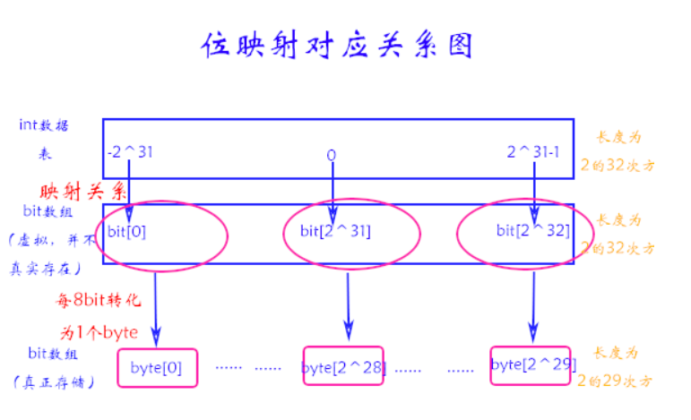
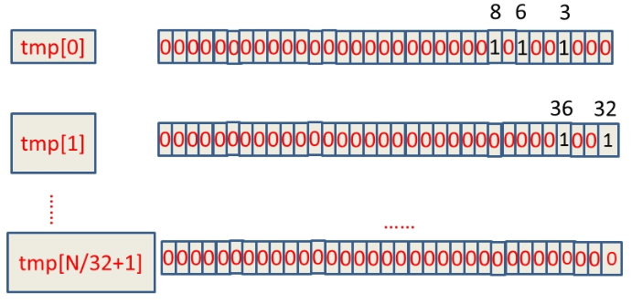
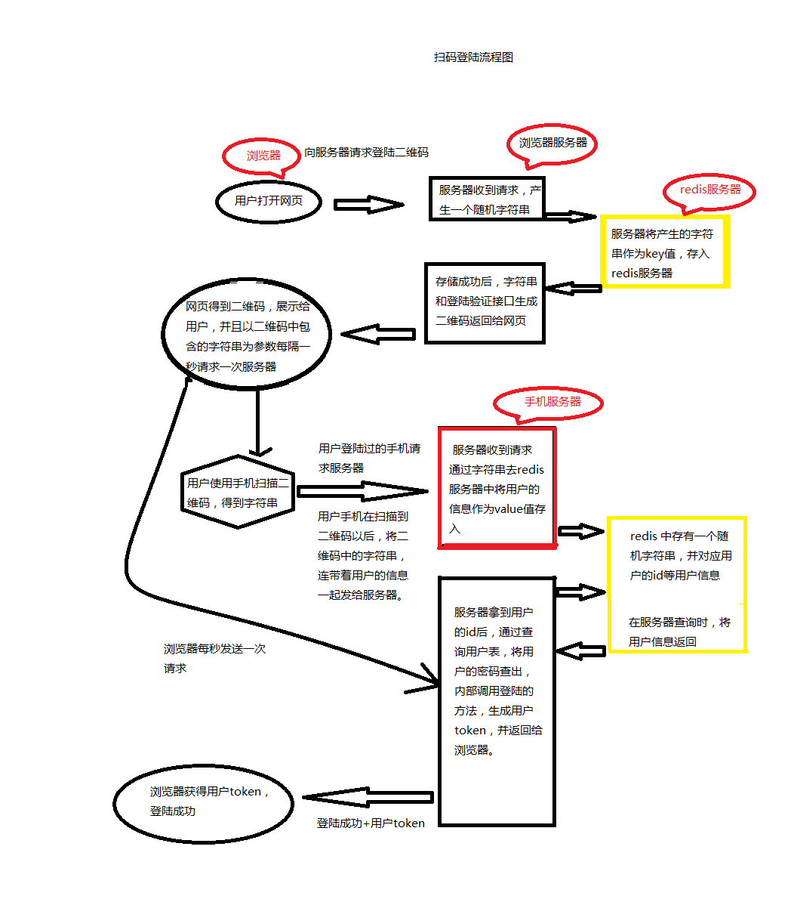

# 场景题

## 海量数据问题
### 原理
看了这么多解决方案，个人总结一般大数据的处理，可以从**分治**和**映射**两方面入手，分治是典型的把大化小的手段（在算法题中也是如此），而映射可以把变长的转为固定长度，也就是可以转化为能接受范围内的长度。
分治，一般使用hash的原理，把大数据或者大文件用hash函数计算出索引位置，存储到对应文件中去，再到各个小文件中处理，最后或者归并，或者用堆，解决TOPK问题。
映射，一般用Bitmap，主要针对int型，要定义每一位的映射关系。（内存分配空闲页也是用位图标识）
基于这两种思想，一般方法有：
1. 分而治之/hash映射 + hash统计 + 堆/快速/归并排序；
2. 双层桶划分
3. Bloom filter/Bitmap；
4. Trie树/数据库/倒排索引；
5. 外排序；
6. 分布式处理之Hadoop/Mapreduce。

[教你如何迅速秒杀掉：99%的海量数据处理面试题](https://blog.csdn.net/v_july_v/article/details/7382693)

#### 使用Bitmap
[利用位映射原理对大数据排重](https://www.iteye.com/blog/yacare-1969931)
- **问题提出**
M（如10亿）个int整数，只有其中N个数重复出现过，读取到内存中并将重复的整数删除。
- **问题分析**
我们肯定会先想到在计算机内存中开辟M个int整型数据数组，来one bye one读取M个int类型数组， 然后在一一比对数值，最后将重复数据的去掉。当然这在处理小规模数据是可行的。
我们考虑大数据的情况：例如在java语言下，对10亿个int类型数据排重。
java中一个 int 类型在内存中占4 byte。那么10亿个int类型数据共需要开辟10 ^ 9次方 *4 byte ≈ 4GB 的连续内存空间。以 32 位操作系统电脑为例，最大支持内存为 4G， 可用内存更是小于4G。所以上述方法在处理大数据时根本行不通。
- **思维转化**
既然我们不能为所有 int 类型的数据开辟 int 类型数组，那么可以采取更小的数据类型来读取缓存 int 类型数据。考虑到计算机内部处理的数据都是 01 序列的bit，那么我们是否可以用 1bit 来表示一个 int 类型数据。
- **位映射的引出**
**使用较小的数据类型指代较大的数据类型**。如上所说的问题，我们可以用1个 bit 来对应一个int 整数。假如对应的 int 类型的数据存在，就将其对应的 bit 赋值为1，否则，赋值为0（boolean类型）。java中 int 范围为 -2^31  到  2^31-1. 那么所有可能的数值组成的长度为2^32. 对应的 bit 长度也为 2^32.  那么可以用这样处理之后只需要开辟2^32 bit  = 2^29 byte = 512M 大小的 内存空间 。显然，这样处理就能满足要求了。虽然对内存的消耗也不太小，暂时这样处理吧。
- **问题解决方案**
 首先定义如下图的int - byte 映射关系，当然，映射关系可以自定义。但前提要保证你的数组上下标不能越界。
 

1. **在2.5亿个整数中找出不重复的整数，注，内存不足以容纳这2.5亿个整数。**
用一个位图，每一位代表一个数，采用2-Bitmap（每个数分配2bit，00表示不存在，01表示出现一次，10表示多次，11无意义）进行。然后扫描这2.5亿个整数，查看Bitmap中相对应位，如果是00变01，01变10，10保持不变。所描完事后，查看bitmap，把对应位是01的整数输出即可。

2. **给40亿个不重复的unsigned int的整数，没排过序的，然后再给一个数，如何快速判断这个数是否在那40亿个数当中？**
    - **位图法**是基于int型数的表示范围这个概念的，用一个bit位来标识一个int整数，若该位为1，则说明该数出现；若该位为0，则说明该数没有出现。一个int整型数占4字节（Byte），也就是32位（bit）。那么把所有int整型数字表示出来需要2^32 bit位的空间，为了方便，我们可以把这些信息每8bit分割保存为byte数组，换算成字节单位也就是2^32 bit/8 = 2^29 Byte，大约等于512MB
接下来我们只需要申请一个int数组长度为 int tmp[N/32+1]即可存储完这些数据，其中N代表要进行查找的总数（这里也就是2^32），tmp中的每个元素在内存在占32位可以对应表示十进制数0~31,所以可得到BitMap表:
<pre lang = "txt">tmp[0]:可表示0~31
tmp[1]:可表示32~63
tmp[2]可表示64~95
~~
</pre>

(1). 如何判断int数字放在哪一个tmp数组中：将数字直接除以32取整数部分(x/32)，例如：整数8除以32取整等于0，那么8就在tmp[0]上；

(2). 如何确定数字放在32个位中的哪个位：将数字mod32取模(x%32)。上例中我们如何确定8在tmp[0]中的32个位中的哪个位，这种情况直接mod上32就ok，又如整数8，在tmp[0]中的第8 mod上32等于8，那么整数8就在tmp[0]中的第八个bit位（从右边数起）。

然后我们怎么统计只出现一次的数呢？每一个数出现的情况我们可以分为三种：0次、1次、大于1次。也就是说我们需要用2个bit位才能表示每个数的出现情况。此时则三种情况分别对应的bit位表示是：00、01、11
可以用双bit也可以用两个bitmap实现
我们顺序扫描这10亿的数，在对应的双bit位上标记该数出现的次数。最后取出所有双bit位为01的int型数就可以了。
  - 分治
    这里我们把40亿个数中的每一个用32位的二进制来表示
假设这40亿个数开始放在一个文件中。
    然后将这40亿个数分成两类:
      1.最高位为0
      2.最高位为1
    并将这两类分别写入到两个文件中，其中一个文件中数的个数<=20亿，而另一个>=20亿（这**相当于折半**了）；
与要查找的数的最高位比较并接着进入相应的文件再查找

    再然后把这个文件为又分成两类:
      1.次最高位为0
      2.次最高位为1

    并将这两类分别写入到两个文件中，其中一个文件中数的个数<=10亿，而另一个>=10亿（这相当于折半了）；
    与要查找的数的次最高位比较并接着进入相应的文件再查找。
    .......
    以此类推，就可以找到了,而且时间复杂度为O(logn)

3. **已知某个文件内包含一些电话号码，每个号码为8位数字，统计不同号码的个数**
8位最多99 999 999，大概需要99m个bit，大概10几m字节的内存即可。可以理解为从0-99 999 999的数字，每个数字对应一个Bit位，所以只需要99M个Bit==1.2MBytes，这样，就用了小小的1.2M左右的内存表示了所有的8位数的电话。

#### 哈希表
基本思路就是hash(key)计算index，存储到对应index的文件中，每个文件分别处理
[十一、从头到尾解析Hash表算法](https://blog.csdn.net/v_JULY_v/article/details/6256463)

1. **海量日志数据，提取出某日访问百度次数最多的那个IP**
 首先是这一天，并且是访问百度的日志中的IP取出来，逐个写入到一个大文件中。注意到IP是32位的，最多有个2^32个IP。同样可以采用映射的方法，比如模1000，把整个大文件映射为1000个小文件，再找出每个小文中出现频率最大的IP（可以采用hash_map进行频率统计，然后再找出频率最大的几个）及相应的频率。然后再在这1000个最大的IP中，找出那个频率最大的IP，即为所求。

或者如下阐述：
算法思想：**分而治之+Hash**
1.IP地址最多有2^32=4G种取值情况，所以不能完全加载到内存中处理； 
2.可以考虑采用“分而治之”的思想，按照IP地址的Hash(IP)%1024值，把海量IP日志分别存储到1024个小文件中。这样，每个小文件最多包含4MB个IP地址； 
3.对于每一个小文件，可以构建一个IP为key，出现次数为value的Hash map，同时记录当前出现次数最多的那个IP地址；
4.可以得到1024个小文件中的出现次数最多的IP，再依据常规的排序算法得到总体上出现次数最多的IP；

>    Hash取模是一种等价映射，不会存在同一个元素分散到不同小文件中的情况，即这里采用的是mod1000算法，那么**相同的IP在hash取模后，只可能落在同一个文件中**，不可能被分散的。因为如果两个IP相等，那么经过Hash(IP)之后的哈希值是相同的，将此哈希值取模（如模1000），必定仍然相等。

2. **海量数据分布在100台电脑中，想个办法高效统计出这批数据的TOP10。**
- **如果每个数据元素只出现一次，而且只出现在某一台机器中**，那么可以采取以下步骤统计出现次数TOP10的数据元素：
**堆排序**：在每台电脑上求出TOP10，可以采用包含10个元素的堆完成（TOP10小，用最大堆，TOP10大，用最小堆，比如求TOP10大，我们首先取前10个元素调整成最小堆，如果发现，然后扫描后面的数据，并与堆顶元素比较，如果比堆顶元素大，那么用该元素替换堆顶，然后再调整为最小堆。最后堆中的元素就是TOP10大）。
求出每台电脑上的TOP10后，然后**把这100台电脑上的TOP10组合起来**，共1000个数据，再利用上面类似的方法求出TOP10就可以了。
- 但如果**同一个元素**重复出现在**不同的电脑**中呢
  - **遍历一遍所有数据，重新hash取摸**
  如此使得同一个元素只出现在单独的一台电脑中，然后采用上面所说的方法，统计每台电脑中各个元素的出现次数找出TOP10，继而组合100台电脑上的TOP10，找出最终的TOP10。
  - 或者，**暴力求解**
  直接统计统计每台电脑中各个元素的出现次数，然后把同一个元素在不同机器中的出现次数相加，最终从所有数据中找出TOP10。
#### 双层桶划分
多层划分----其实本质上还是分而治之的思想，重在“分”的技巧上！
　　适用范围：第k大，中位数，不重复或重复的数字
　　基本原理及要点：因为元素范围很大，不能利用直接寻址表，所以通过多次划分，逐步确定范围，然后最后在一个可以接受的范围内进行。

**5亿个int找它们的中位数。**

 - 思路一
 首先我们将int划分为2^16个区域，然后读取数据统计落到各个区域里的数的个数，之后我们根据统计结果就可以判断中位数落到那个区域，同时知道这个区域中的第几大数刚好是中位数。然后第二次扫描我们只统计落在这个区域中的那些数就可以了。
 实际上，如果不是int是int64，我们可以经过3次这样的划分即可降低到可以接受的程度。即可以先将int64分成2^24个区域，然后确定区域的第几大数，在将该区域分成2^20个子区域，然后确定是子区域的第几大数，然后子区域里的数的个数只有2^20，就可以直接利用direct addr table进行统计了。
- 思路二
同样需要做两遍统计，如果数据存在硬盘上，就需要读取2次。
 方法同基数排序有些像，开一个大小为65536的Int数组，第一遍读取，统计Int32的高16位的情况，也就是0-65535，都算作0,65536 - 131071都算作1。就相当于用该数除以65536。Int32 除以 65536的结果不会超过65536种情况，因此开一个长度为65536的数组计数就可以。
 每读取一个数，数组中对应的计数+1，考虑有负数的情况，需要将结果加32768后，记录在相应的数组内。
 第一遍统计之后，遍历数组，逐个累加统计，看中位数处于哪个区间，比如处于区间k，那么0- k-1的区间里数字的数量sum应该< n/2（2.5亿）。而k+1 - 65535的计数和也< n/2，第二遍统计同上面的方法类似，但这次只统计处于区间k的情况，也就是说(x / 65536) + 32768 = k。统计只统计低16位的情况。并且利用刚才统计的sum，比如sum = 2.49亿，那么现在就是要在低16位里面找100万个数(2.5亿-2.49亿)。这次计数之后，再统计一下，看中位数所处的区间，最后将高位和低位组合一下就是结果了。

#### 双堆法
先分治，再用双堆法：
首先将int划分为2^16个区域，然后读取数据统计落到各个区域里的数的个数，之后我们根据统计结果就可以判断中位数落到那个区域。然后第二次扫描我们只统计落在这个区域中的那些数就可以了。
双堆法的思路：
所有比中位数大的组成一个最小堆，比中位数小的组成一个最大堆，每次插入只进行一个堆的插入，然后中位数一定是原中位数、最大堆的最大值和最小堆最小值中产生，再进行堆的调整就可以了，不过复杂度也是NlogN
序列中的元素，前一半存储在一个最大堆中，后一半存储在一个最小堆中。控制MaxHeap与MinHeap的大小差不能超过1。具体操作如下：
<pre lang = "txt">
1.如果 num < MaxHeapTop，则
    1.1 如果 MaxHeapSize <= MinHeapSize，将num插入最大堆；
    1.2 如果 MaxHeapSize >  MinHeapSize，将MaxHeapTop从最大堆中移到最小堆，然后将num插入最大堆。
2.如果 MaxHeapTop <= num <= MinHeapTop，则
    2.1 如果 MaxHeapSize <  MinHeapSize，将num插入最大堆；
    2.2 如果 MaxHeapSize >  MinHeapSize，将num插入最小堆；
    2.3 如果 MaxHeapSize == MinHeapSize，随意插，看心情。
3.如果 num > MinHeapTop，则
    3.1 如果 MaxHeapSize >= MinHeapSize，将num插入最小堆；
    3.2 如果 MaxHeapSize <  MinHeapSize，将MinHeapTop从最小堆中移到最大堆，然后将num插入最小堆。

</pre>

上面的插入情况会保证最大堆和最小堆的元素个数差小于1，中位数就只在最大堆和最小堆的顶部元素中产生：如果最大堆和最小堆的元素个数相等，则中位数为最大堆和最小堆的顶部元素的平均值；否则，中位数为元素个数多的那个堆的堆顶元素。

### 问题

#### 词频统计
1. **有一个1G大小的一个文件，里面每一行是一个词，词的大小不超过16字节，内存限制大小是1M。返回频数最高的100个词。**

2. **一个文本文件，大约有一万行，每行一个词，要求统计出其中最频繁出现的前10个词，请给出思想，给出时间复杂度分析。**
用trie树统计每个词出现的次数，时间复杂度是O(n * le)（le表示单词的平准长度）。然后是找出出现最频繁的前10个词，可以用堆来实现，前面的题中已经讲到了，时间复杂度是O(n* lg10)。所以总的时间复杂度，是O(n*le)与O(n*lg10)中较大的哪一个。

3. **寻找热门查询**：搜索引擎会通过日志文件把用户每次检索使用的所有检索串都记录下来，每个查询串的长度为1-255字节。假设目前有一千万个记录，这些查询串的重复度比较高，虽然总数是1千万，但是如果去除重复，不超过3百万个。一个查询串的重复度越高，说明查询它的用户越多，也就越热门。请你统计最热门的10个查询串，要求使用的内存不能超过1G。

##### 无内存限制：哈希表/Trie树 + K小/大根堆
- 先用Hash表统计每个Query出现的次数，O（N）；
- 采用堆数据结构找出Top 10，N * O（logK）。所以，我们最终的时间复杂度是：O（N） + N * O（logK）。（N为1000万，N’为300万）。

维护一个**Key为Query字串，Value为该Query出现次数**的HashTable，每次读取一个Query，如果该字串不在Table中，那么加入该字串，并且将Value值设为1；如果该字串在Table中，那么将该字串的计数加一即可。最终我们在O(N)的时间复杂度内完成了对该海量数据的处理。
维护一个K(该题目中是10)大小的**小根堆**，然后遍历300万的Query，分别和根元素进行对比。

##### 有内存限制：将数据分段，分段时对每个词hash
hash值在一个范围中的词语分到一个段中，然后对于每个分段统计的hash结果直接都写入一个文件即可。**使用hash分段，保证各小段没有重复的词**。
如题2：顺序读文件，对于每个词x，取hash(x)%5000，然后按照该值存到5000个小文件（记为x0,x1,...x4999）中。这样每个文件大概是200k左右。
如果其中的有的文件超过了1M大小，还可以按照类似的方法继续往下分，直到分解得到的小文件的大小都不超过1M。 
对每个小文件，统计每个文件中出现的词以及相应的频率（可以采用trie树/hash_map等），并取出出现频率最大的100个词（可以用含100个结点的最小堆），并把100个词及相应的频率存入文件，这样又得到了5000个文件。
下一步就是把这5000个文件进行归并（类似与归并排序）的过程了。

#### 字符串检索
事先将已知的一些字符串（字典）的有关信息保存到trie树里，查找另外一些未知字符串是否出现过或者出现频率。

1. **给出N 个单词组成的熟词表，以及一篇全用小写英文书写的文章，请你按最早出现的顺序写出所有不在熟词表中的生词。**
2. **给出一个词典，其中的单词为不良单词。单词均为小写字母。再给出一段文本，文本的每一行也由小写字母构成。判断文本中是否含有任何不良单词。例如，若rob是不良单词，那么文本problem含有不良单词。**
3. **1000万字符串，其中有些是重复的，需要把重复的全部去掉，保留没有重复的字符串。**
4. **给定a、b两个文件，各存放50亿个url，每个url各占64字节，内存限制是4G，让你找出a、b文件共同的url**
    - 遍历文件a，对每个url求取hash(url)%1000，然后根据所取得的值将url分别存储到1000个小文件（记为a0,a1,...,a999）中。这样每个小文件的大约为300M。
    - 遍历文件b，采取和a相同的方式将url分别存储到1000小文件（记为b0,b1,...,b999）。这样处理后，所有可能相同的url都在对应的小文件（a0vsb0,a1vsb1,...,a999vsb999）中，不对应的小文件不可能有相同的url。然后我们只要求出1000对小文件中相同的url即可。
    - 求每对小文件中相同的url时，可以把其中一个小文件的url存储到hash_set中。然后遍历另一个小文件的每个url，看其是否在刚才构建的hash_set中，如果是，那么就是共同的url，存到文件里面就可以了。

#### 排序

Trie树是一棵多叉树，只要先序遍历整棵树，输出相应的字符串便是按字典序排序的结果。
比如给你N 个互不相同的仅由一个单词构成的英文名，让你将它们按字典序从小到大排序输出。

 

#### 字符串最长公共前缀
Trie树利用多个字符串的公共前缀来节省存储空间，当我们把大量字符串存储到一棵trie树上时，我们可以快速得到某些字符串的公共前缀。
举例：
给出N 个小写英文字母串，以及Q 个询问，即询问某两个串的最长公共前缀的长度是多少？
解决方案：首先对所有的串建立其对应的字母树。此时发现，对于两个串的最长公共前缀的长度即它们所在结点的公共祖先个数，于是，问题就转化为了离线（Offline）的最近公共祖先（Least Common Ancestor，简称LCA）问题。
而最近公共祖先问题同样是一个经典问题，可以用下面几种方法：
1. 利用并查集（Disjoint Set），可以采用采用经典的Tarjan 算法；
2. 求出字母树的欧拉序列（Euler Sequence ）后，就可以转为经典的最小值查询（Range Minimum Query，简称RMQ）问题了；

 

#### 字符串搜索的前缀匹配
trie树常用于搜索提示。如当输入一个网址，可以自动搜索出可能的选择。当没有完全匹配的搜索结果，可以返回前缀最相似的可能。
Trie树检索的时间复杂度可以做到n，n是要检索单词的长度，
如果使用暴力检索，需要指数级O(n2)的时间复杂度。

## 设计题
#### 设计一个本地缓存？
- 存储的数据结构
key,value
- 存储上限、过期时间
- 清除策略
- 持久化
- 线程安全

#### 数据库连接池
需要考虑的问题：

1. 限制连接池中最多、可以容纳的连接数目，避免过度消耗系统资源。
2. 当客户请求连接，而连接池中所有连接都已被占用时，该如何处理呢？一种方式是让客户一直等待，直到有空闲连接，另一种方式是为客户分配一个新的临时连接。
3. 当客户不再使用连接，需要把连接重新放回连接池。
4. 连接池中允许处于空闲状态的连接的最大项目。假定允许的最长空闲时间为十分钟，并且允许空闲状态的连接最大数目为5，
那么当连接池中有n个(n>5)连接处于空闲状态的时间超过十分钟时，就应该把n-5个连接关闭，并且从连接池中删除，这样才能更有效的利用系统资源。

#### 扫码登录

